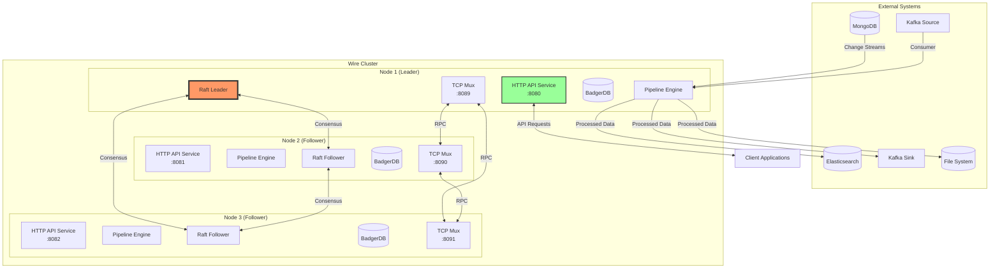
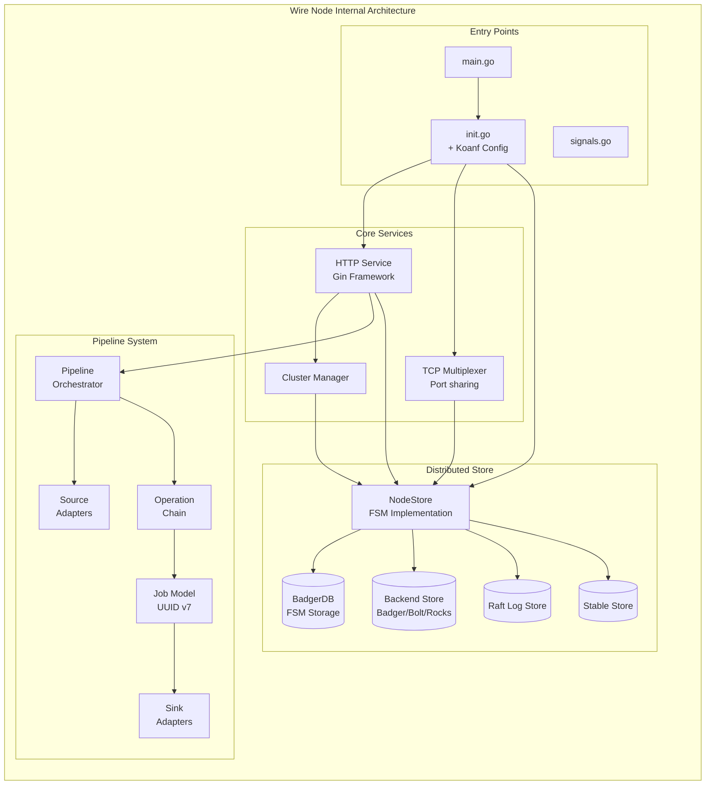
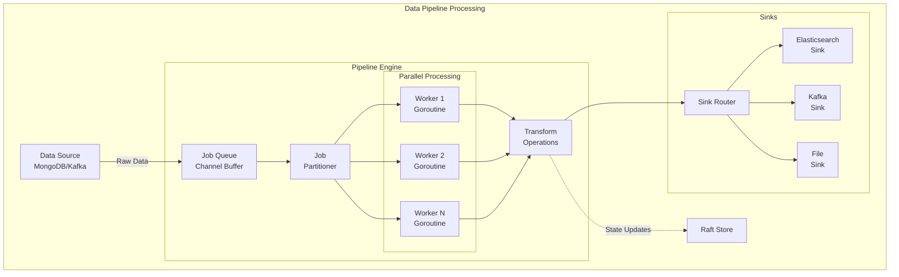
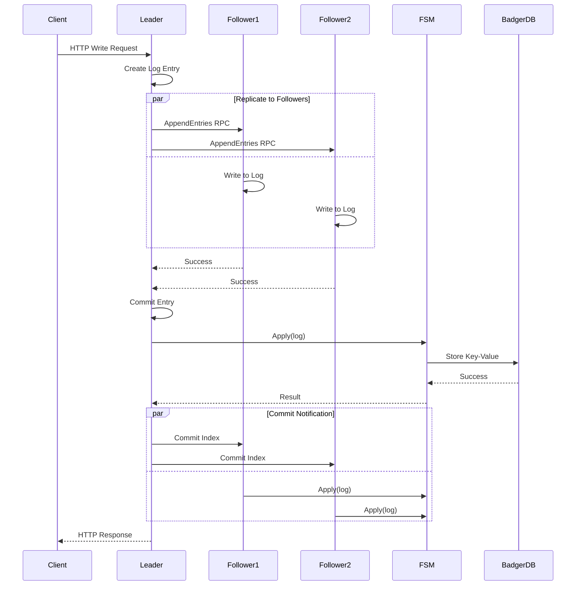
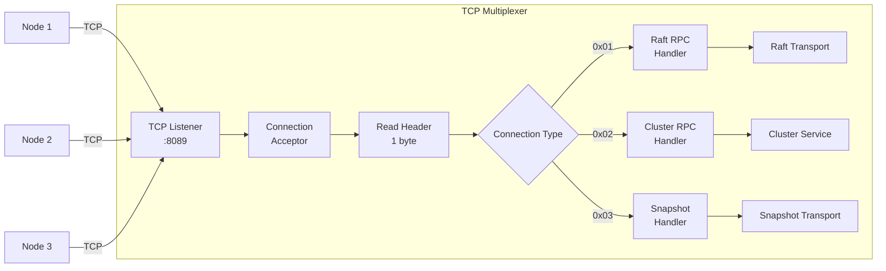
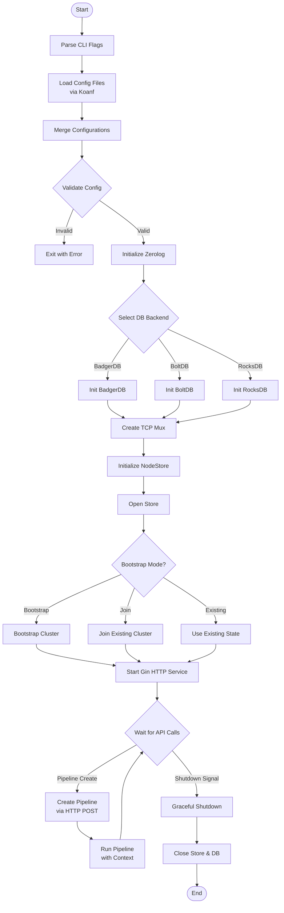
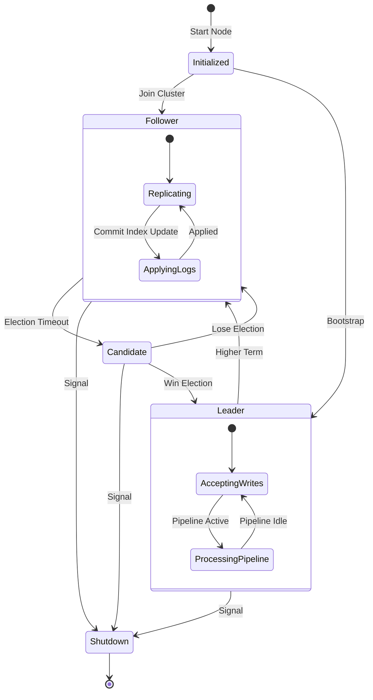

# Wire Architecture Diagrams

## 1. High-Level System Architecture



## 2. Internal Component Architecture



## 3. Pipeline Processing Flow



## 4. Raft Consensus Implementation



## 5. Store Layer Architecture

```mermaid
classDiagram
    class NodeStore {
        -raft: *raft.Raft
        -db: *badgerdb.DB
        -dbStore: db.DbStore
        -storeDb: string
        -fsmIndex: *atomic.Uint64
        -fsmTerm: *atomic.Uint64
        +Bootstrap(servers)
        +Join(nodeID, httpAddr, addr)
        +StoreInDatabase(key, value)
        +GetFromDatabase(key)
        +Apply(log) interface{}
        +Snapshot() FSMSnapshot
        +Restore(io.ReadCloser)
    }

    class FSM {
        <<interface>>
        +Apply(log) interface{}
        +Snapshot() FSMSnapshot
        +Restore(io.ReadCloser)
    }

    class StableStore {
        <<interface>>
        +Set(key, val []byte)
        +Get(key []byte) []byte
        +SetUint64(key []byte, val uint64)
        +GetUint64(key []byte) uint64
    }

    class LogStore {
        <<interface>>
        +FirstIndex() uint64
        +LastIndex() uint64
        +GetLog(index, log)
        +StoreLog(log)
        +StoreLogs(logs)
        +DeleteRange(min, max)
    }

    class DbStore {
        <<interface>>
        +Get(key []byte) []byte
        +Set(key, val []byte)
        +Delete(key []byte)
        +FirstIndex() uint64
        +LastIndex() uint64
        +Close()
    }

    class BadgerDB {
        +Update(fn)
        +View(fn)
        +NewTransaction(update)
        +Backup(w io.Writer)
    }

    class BoltDB {
        +Update(fn)
        +View(fn)
        +Begin(writable)
    }

    class RocksDB {
        +Put(key, val)
        +Get(key)
        +Delete(key)
    }

    NodeStore ..|> FSM : implements
    NodeStore ..|> StableStore : implements
    NodeStore ..|> LogStore : implements
    NodeStore --> BadgerDB : FSM storage
    NodeStore --> DbStore : backend storage
    DbStore <|-- BadgerDB : implements
    DbStore <|-- BoltDB : implements
    DbStore <|-- RocksDB : implements
```

## 6. HTTP API Request Flow

```mermaid
flowchart TD
    Client[HTTP Client] --> Router{Gin Router}
    
    Router --> Status[/status]
    Router --> Join[/join]
    Router --> Key[/key/*]
    Router --> Connector[/connector/*]
    Router --> Ready[/readyz]
    
    Status --> CheckLeader1{Is Leader?}
    CheckLeader1 -->|Yes| ReturnStatus[Return Status]
    CheckLeader1 -->|No| GetLeaderStatus[Get Leader Status]
    
    Join --> CheckLeader2{Is Leader?}
    CheckLeader2 -->|Yes| ExecuteJoin[Execute Join]
    CheckLeader2 -->|No| ForwardToLeader1[Forward to Leader]
    
    Key --> ParseOp{GET/POST/DELETE?}
    ParseOp -->|GET| ReadDB[Read from DB]
    ParseOp -->|POST| CheckLeader3{Is Leader?}
    ParseOp -->|DELETE| CheckLeader3
    
    CheckLeader3 -->|Yes| WriteQueue[Queue Write Op]
    CheckLeader3 -->|No| ForwardToLeader2[Forward to Leader]
    
    WriteQueue --> ProcessQueue[Process Queue]
    ProcessQueue --> RaftApply[Raft Apply]
    RaftApply --> FSMApply[FSM Apply]
    FSMApply --> BadgerWrite[Badger Write]
    
    Connector --> PipelineOp{Operation?}
    PipelineOp --> ManagePipeline[Manage Pipeline]
```

## 7. Job Processing Architecture

```mermaid
graph TB
    subgraph "Job Model"
        Job[Job Structure]
        JobID[ID: UUID v7]
        JobData[Data: any]
        JobTime[EventTime: time.Time]
        JobMutex[mu: sync.RWMutex]
        
        Job --> JobID
        Job --> JobData
        Job --> JobTime
        Job --> JobMutex
    end
    
    subgraph "Pipeline Processing"
        Source[DataSource] -->|Read()| JobChannel[chan *models.Job]
        
        JobChannel --> Pipeline[DataPipeline]
        
        Pipeline --> Op1[Operation 1]
        Op1 --> Op2[Operation 2]
        Op2 --> OpN[Operation N]
        
        OpN --> Sink[DataSink]
    end
    
    subgraph "Available Sinks"
        SinkRouter[Sink Router]
        ESSink[Elasticsearch<br/>Sink]
        KafkaSink[Kafka<br/>Sink]
        FileSink[File<br/>Sink]
        
        Sink --> SinkRouter
        SinkRouter --> ESSink
        SinkRouter --> KafkaSink
        SinkRouter --> FileSink
    end
    
    subgraph "Concurrency Control"
        WaitGroup[sync.WaitGroup]
        Context[context.Context]
        
        Pipeline -.-> WaitGroup
        Pipeline -.-> Context
    end
```

## 8. TCP Multiplexing Architecture



## 9. Configuration and Initialization Flow



## 10. State Machine Transitions



## Summary

These diagrams illustrate the Wire distributed stream processing framework's architecture:

1. **System Architecture**: Shows the distributed nature with leader/follower nodes
2. **Component Architecture**: Internal structure of each node
3. **Pipeline Flow**: How data flows through the processing pipeline
4. **Raft Consensus**: The consensus protocol implementation
5. **Store Layer**: Class structure of the storage system
6. **HTTP API Flow**: Request routing and processing
7. **Job Processing**: Parallel job execution model
8. **TCP Multiplexing**: Network protocol handling
9. **Initialization**: Startup and configuration flow
10. **State Machine**: Raft state transitions

The architecture demonstrates a robust, scalable system designed for high-throughput stream processing with strong consistency guarantees through Raft consensus.