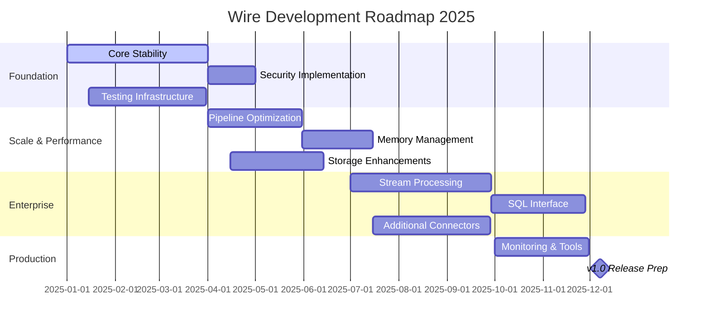
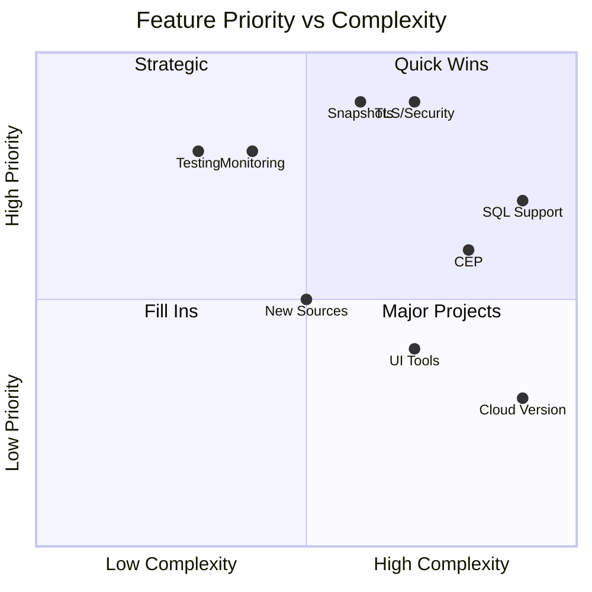
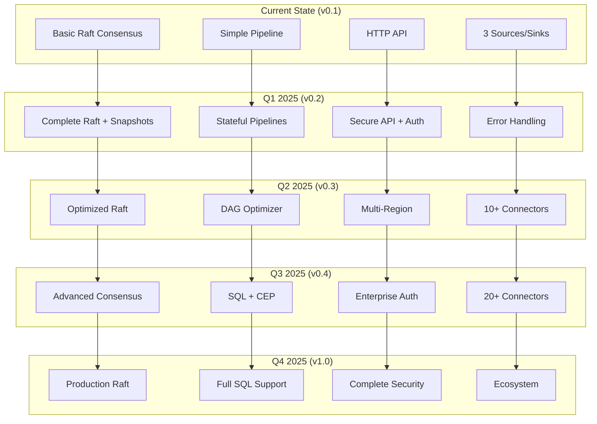
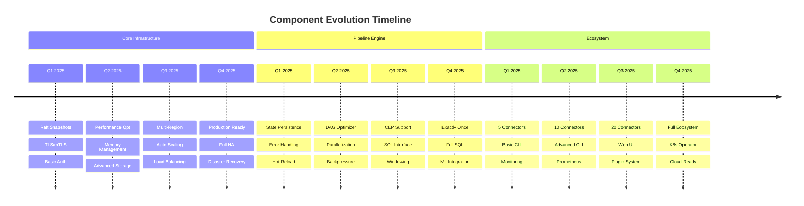
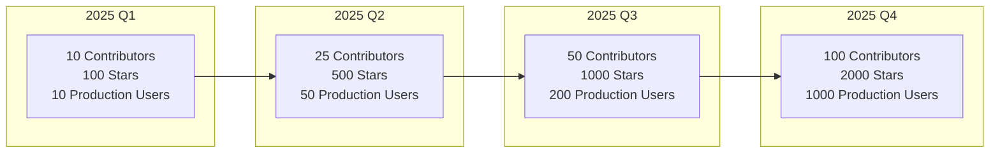
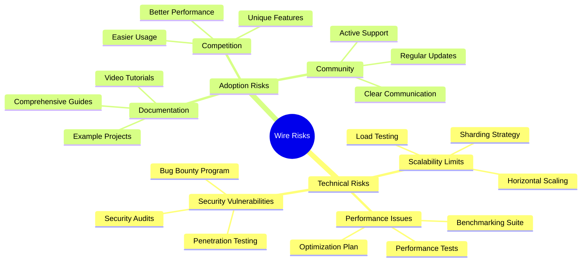

# Wire Project Visual Roadmap

## Timeline Overview

## Feature Priority Matrix

## Architecture Evolution

## Component Development Timeline

## Adoption Metrics Target

## Risk Mitigation Strategy

---

*Visual roadmap showing the progression and relationships between different development phases of the Wire project.*