# Wire Architecture Diagrams

**Status:** Canon
**Version:** 1.0.0
**Context:** Visual reference for Wire's architecture, execution model, and operational flows

---

## 1. High-Level Cluster Architecture

The Master-Worker topology showing the Control Plane (Coordinator) and Data Plane (Workers).

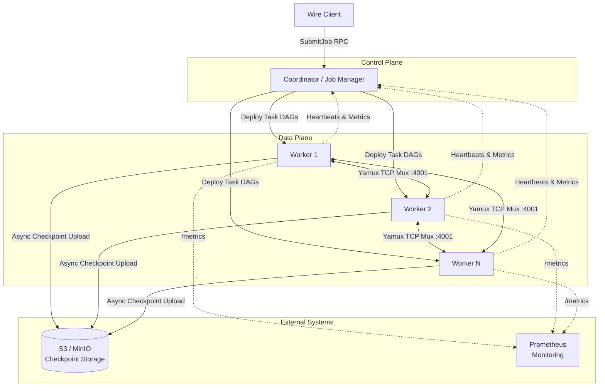

---

## 2. Execution Graph Transformation Pipeline

How user code transforms through three stages: Logical → Optimized → Physical.

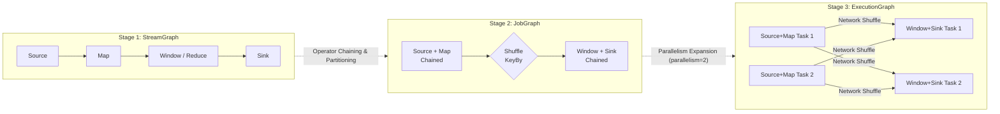

---

## 3. Data Flow Through a Pipeline

An example pipeline showing events, watermarks, and barriers flowing through operators.

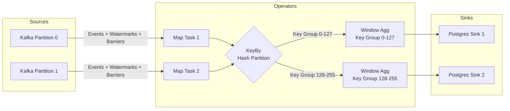

---

## 4. Distributed Checkpointing & Barrier Alignment

The Asynchronous Barrier Snapshot (ABS) algorithm — a Chandy-Lamport variant.

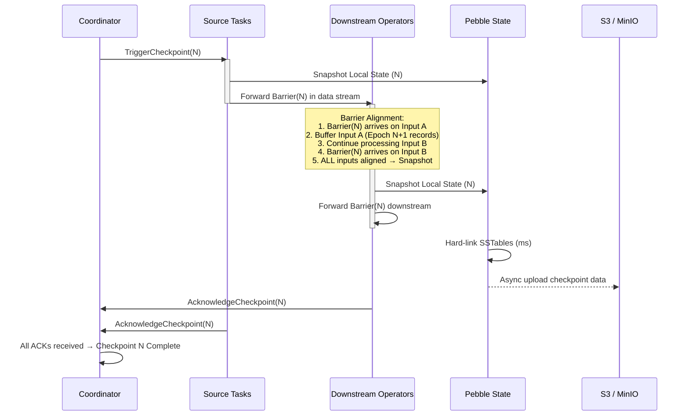

---

## 5. Fault-Tolerance & Recovery Flow

The full recovery sequence when a Worker fails.

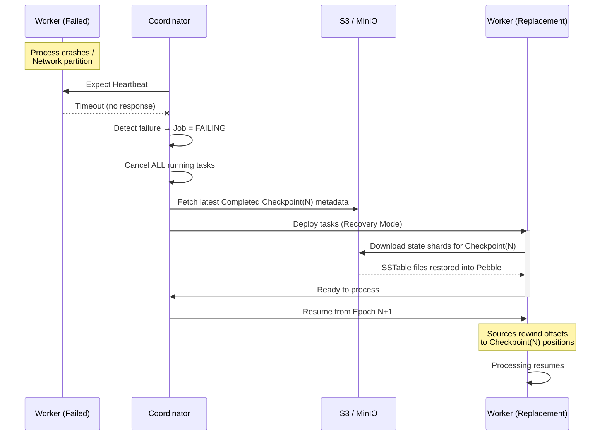

---

## 6. Task Slot Internal Architecture

What lives inside a single Task Slot on a Worker node.

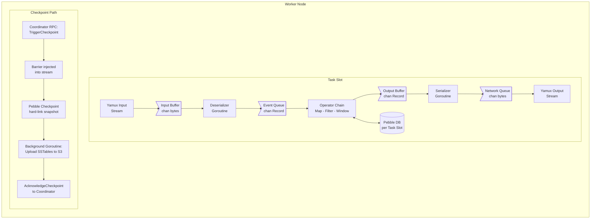

---

## 7. Backpressure Cascade

How backpressure propagates backwards through the entire pipeline — no unbounded buffering, no silent data drops.

```mermaid
flowchart RL
    KAFKA["Kafka Source<br/>stops fetching"] -->|blocked| SRC_CH>"Source Output<br/>Channel FULL"]
    SRC_CH -->|blocked| MAP["Map Operator<br/>blocked on write"]
    MAP -->|blocked| YAMUX_OUT["Yamux Stream<br/>window closes"]
    YAMUX_OUT -->|blocked| NET["Network send<br/>pauses"]
    NET -->|blocked| YAMUX_IN["Yamux Stream<br/>stops reading"]
    YAMUX_IN -->|blocked| WIN_CH>"Window Input<br/>Channel FULL"]
    WIN_CH -->|blocked| WIN["Window Operator<br/>blocked on write"]
    WIN -->|blocked| SINK_CH>"Sink Input<br/>Channel FULL"]
    SINK_CH -->|blocked| SINK["Slow Sink<br/>ROOT CAUSE"]

    style SINK fill:#f66,stroke:#333,color:#fff
    style KAFKA fill:#ff9,stroke:#333,color:#333
```

---

## 8. Watermark Propagation

How watermarks flow through multi-input operators using the min-watermark rule.

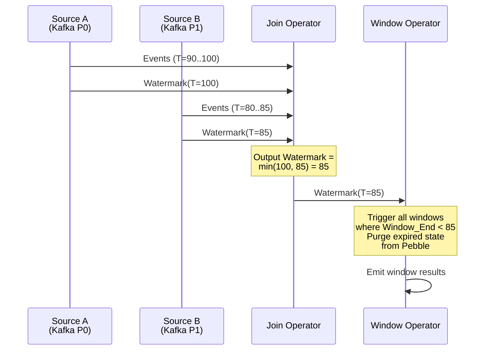

---

## 9. State Backend & Checkpoint Lifecycle

The Pebble checkpoint mechanics and durable storage layout.

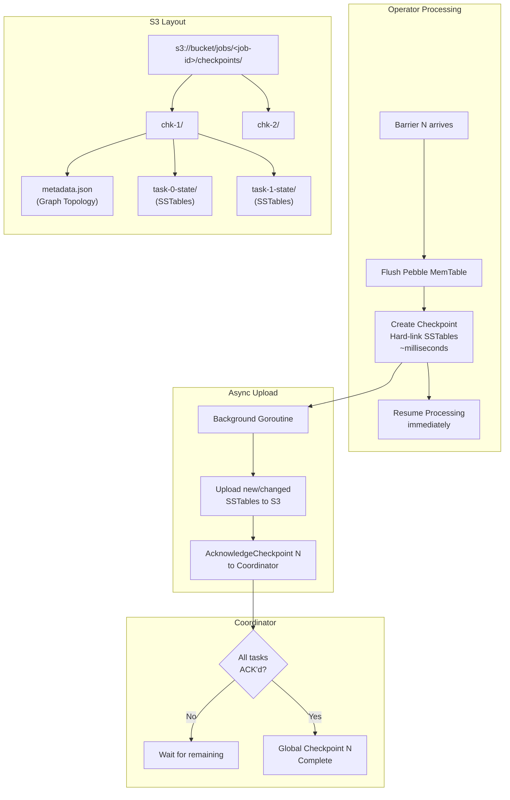

---

## 10. Task Lifecycle State Machine

The state transitions for a Task during its lifetime.

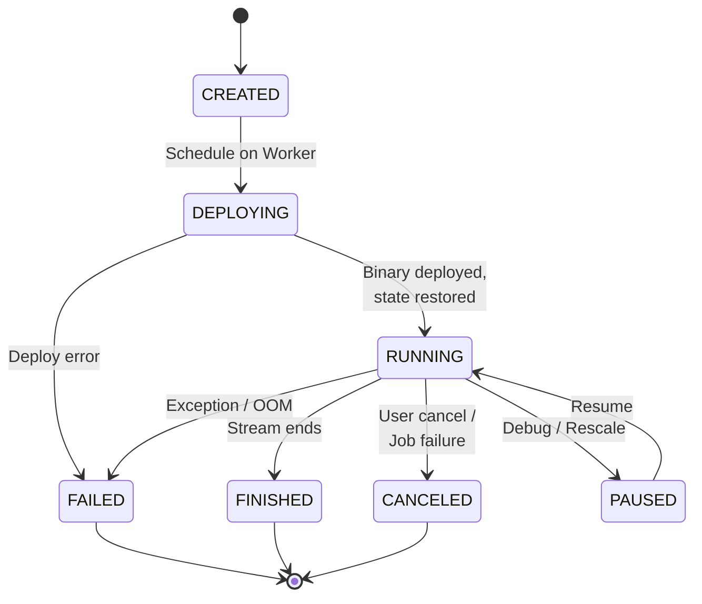

---

## 11. Rescaling Process

How Wire handles changing parallelism (stop-start, not hot scaling).

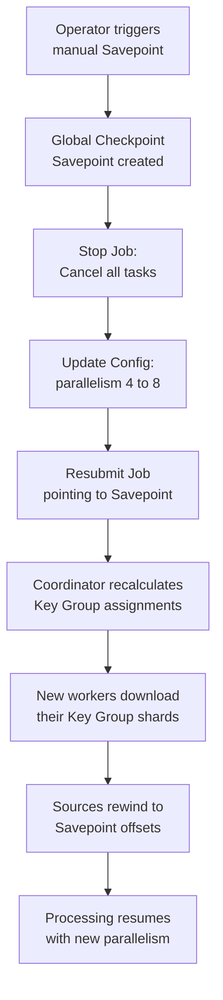

---

## 12. Connector Ecosystem

Sources and Sinks available in Wire.

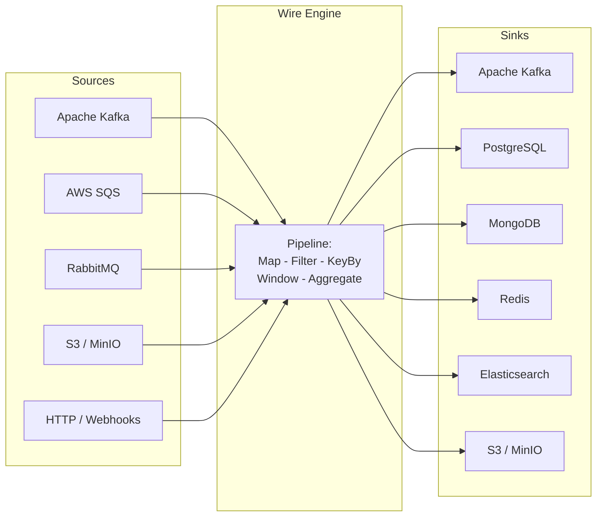
