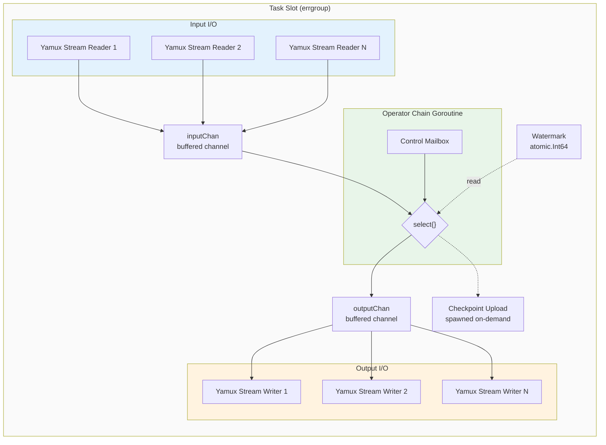

# Goroutine & Concurrency Model

> **Feature/Project:** `Goroutine & Concurrency Model`
>
> **WIP ID:** `WIP-02`
>
> **Author:** `Tarun Ashok`
>
> **Status:** `Draft`
>
> **Created:** `2026-02-22`
>
> **Last Updated:** `2026-02-24`

### Revision History

| Version | Date | Author | Changes |
| -- | -- | -- | -- |
| 0.1 | 2026-02-22 | Tarun Ashok | Initial draft |
| 0.2 | 2026-02-24 | Tarun Ashok | Fix watermark channel semantics, clarify event/batch channel model, add barrier alignment topology, add deserialization decision, add error handling strategy, add observability metrics, resolve automaxprocs. Based on Gemini 2.5 Pro review. |

---

## 1. Overview

### 1.1 Problem Statement

Wire's architecture.md states that "each Operator runs as a lightweight Goroutine chain within a slot" and that "Operator Chaining fuses sequential operators into a single Goroutine." But the **exact goroutine topology is never specified**: how many goroutines per Task Slot? Is the pool bounded or unbounded? How are async operations (checkpoint upload, Pebble compaction) managed? This affects memory consumption, scheduling behavior, and performance tuning.

### 1.2 Proposed Solution (Technical Summary)

Define the goroutine model per Task Slot: one main processing goroutine per operator chain, bounded input/output channel buffers, dedicated goroutines for async checkpoint upload and Yamux I/O, and a bounded worker pool for Pebble background operations. All goroutines within a Task Slot are managed via `errgroup` for coordinated lifecycle and error propagation.

---

## 2. Architecture & System Design

### 2.1 Goroutine Topology per Task Slot

```
┌──────────────────────────────────────────────────────────────────┐
│                          Task Slot                                │
│                                                                   │
│  ┌───────────────────────────────────────────────────────────┐   │
│  │ Operator Chain Goroutine (1 per chain)                     │   │
│  │                                                            │   │
│  │  select {                                                  │   │
│  │    case event := <-inputChan:                              │   │
│  │        Map(event) → Filter(event) → outputChan             │   │
│  │    case ctrl := <-controlMailbox:                           │   │
│  │        handleBarrier / handleAbort / handleShutdown         │   │
│  │  }                                                         │   │
│  │                                                            │   │
│  │  watermark: atomic.Int64 (read on demand, lock-free)       │   │
│  └───────────────────────────────────────────────────────────┘   │
│                                                                   │
│  ┌──────────────┐  ┌──────────────┐  ┌──────────────────────┐   │
│  │ Yamux Read   │  │ Yamux Write  │  │ Checkpoint           │   │
│  │ Goroutine    │  │ Goroutine    │  │ Upload Goroutine     │   │
│  │ (1 per input │  │ (1 per output│  │ (0-1, on-demand)     │   │
│  │  stream)     │  │  stream)     │  │                      │   │
│  │              │  │              │  │                      │   │
│  │ Deserialize  │  │ Serialize    │  │                      │   │
│  │ + barrier    │  │ + frame      │  │                      │   │
│  │   detect     │  │   encode     │  │                      │   │
│  └──────────────┘  └──────────────┘  └──────────────────────┘   │
│                                                                   │
│  ┌───────────────────────────────────────────────────────────┐   │
│  │ Pebble Background Goroutines (bounded pool)                │   │
│  │ - Compaction (1-2)                                         │   │
│  │ - WAL sync (1)                                             │   │
│  └───────────────────────────────────────────────────────────┘   │
│                                                                   │
│  ┌───────────────────────────────────────────────────────────┐   │
│  │ errgroup manages all goroutines — first error cancels all  │   │
│  └───────────────────────────────────────────────────────────┘   │
└──────────────────────────────────────────────────────────────────┘
```



### 2.2 Goroutine Inventory per Task Slot

| Goroutine | Count | Lifecycle | Purpose |
|-----------|-------|-----------|---------|
| **Operator Chain** | 1 per chain | Entire task lifetime | Execute fused operators sequentially. `select`s on input data channel and control mailbox. |
| **Yamux Stream Reader** | 1 per input stream | Entire task lifetime | Read and deserialize frames from upstream tasks (WIP-01). Detect barriers and route to control mailbox. |
| **Yamux Stream Writer** | 1 per output stream | Entire task lifetime | Serialize and write frames to downstream tasks |
| **Checkpoint Uploader** | 0-1 | Created on checkpoint, exits on completion | Upload state snapshot to S3/MinIO |
| **Watermark Emitter** | 1 per source task | Entire task lifetime (sources only) | Periodically compute and publish watermark via `atomic.Int64` (WIP-04) |
| **Pebble Compaction** | 1-2 | Managed by Pebble | Background LSM compaction |
| **Pebble WAL Sync** | 1 | Managed by Pebble | Write-ahead log synchronization |

**Typical total per Task Slot:** 5-10 goroutines (varies with number of input/output streams).

**Design Constraint:** Source operator implementations MUST be internally thread-safe with respect to `ReadBatch()` (called by operator chain goroutine) and `GenerateWatermark()` (called by watermark emitter goroutine). These methods access shared state (e.g., `MaxObservedTimestamp`) from separate goroutines. Implementations should use `sync.Mutex` or atomic operations for shared fields.

### 2.3 Channel & Shared State Model

| Name | Type | Purpose |
|------|------|---------|
| Operator input | `chan Event`, buffer 1024 | Buffer between Yamux reader and operator chain. Carries deserialized Go structs, not raw bytes. |
| Operator output | `chan Event`, buffer 1024 | Buffer between operator chain and Yamux writer |
| Control mailbox | `chan ControlMsg`, buffer 16 | Checkpoint triggers, barrier notifications, abort signals, shutdown. Operator chain `select`s on this alongside data input. |
| Current watermark | `atomic.Int64` | Latest watermark timestamp (Unix millis). Updated by Watermark Emitter (source tasks) or Yamux Reader (non-source tasks, on receiving a Watermark frame). Read by operator chain on demand. Lock-free. |

**Why `atomic.Int64` for watermarks (not a channel):** A Go channel of buffer size 1 blocks on send when full — it does NOT overwrite. Watermarks have natural "latest value wins" semantics: only the most recent watermark matters. An `atomic.Int64` provides true overwrite semantics with zero contention and zero allocation.

**Why `chan Event` (not `chan []Event`):** Channels carry individual deserialized events, not batches. `Source.ReadBatch()` returns a slice that the Yamux reader (or source goroutine) fans out into the channel one event at a time. This keeps channel sizing predictable: 1024 events × ~1 KB = ~1 MB per channel.

### 2.4 Backpressure Propagation

```
Sink slow → output channel full → operator chain blocks on write →
input channel full → Yamux reader blocks on write →
Yamux window closes → upstream writer blocks →
... propagates to Source → Source stops fetching
```

All channels are **bounded**. No unbounded buffering anywhere in the pipeline. Backpressure is propagated via channel blocking + Yamux flow control (WIP-01 Section 3.7).

### 2.5 Barrier Alignment in the Goroutine Topology

This section describes how the barrier alignment protocol (specified in WIP-05) maps onto the goroutine model. See WIP-05 for timeout and abort semantics.

```
                          Barrier N arrives on Input A
                                    │
Yamux Reader A ─────────────────────┤
  1. Detect CheckpointBarrier(N)    │
  2. Send BarrierReceived{A, N}  ──▶│──▶ Control Mailbox
     to control mailbox             │
  3. Divert subsequent events    ──▶│──▶ Side Buffer A (bounded)
     to side buffer                 │
                                    │
Yamux Reader B ─────────────────────┤  (Barrier N not yet arrived)
  Still sending events to        ──▶│──▶ Input Channel (normal path)
  input channel normally            │
                                    │
                          Barrier N arrives on Input B
                                    │
Yamux Reader B ─────────────────────┤
  1. Detect CheckpointBarrier(N)    │
  2. Send BarrierReceived{B, N}  ──▶│──▶ Control Mailbox
  3. Divert to Side Buffer B     ──▶│──▶ Side Buffer B (bounded)
                                    │
Operator Chain Goroutine ───────────┤
  Receives BarrierReceived from     │
  ALL inputs → alignment complete:  │
  1. Snapshot state: Checkpoint(N)  │
  2. Drain side buffers → input     │
  3. Forward barrier downstream     │
```

**Side buffer semantics:**

- Each input stream has a dedicated side buffer: `[]Event` with capacity `task_slot.alignment_buffer_size` (default 4096 events).
- When the side buffer is full, the Yamux reader blocks on write, propagating backpressure upstream. This is bounded and safe.
- If `AbortCheckpoint(N)` arrives via the control mailbox (WIP-05), side buffers are drained into the main input channel immediately and alignment state is discarded.
- Side buffers are only allocated when a barrier is received (lazy allocation).

### 2.6 Deserialization Point

Deserialization of wire protocol frames (WIP-01) happens in the **Yamux Stream Reader** goroutine. The reader:

1. Reads a frame via `io.ReadFull` (length-prefixed per WIP-01 Section 3.1).
2. Validates CRC32C checksum.
3. Dispatches on `MsgType`:
   - `DataRecord (0x01)`: Deserializes msgpack payload into an `Event` struct, sends to operator input channel.
   - `CheckpointBarrier (0x02)`: Sends `BarrierReceived` to control mailbox, switches to side buffer mode (Section 2.5).
   - `Watermark (0x03)`: Updates the `atomic.Int64` watermark via `Store()`.
   - `EndOfPartition (0x04)`: Signals EOF to operator chain.

This means **input channels carry deserialized Go structs**, not raw `[]byte`. Deserialization is parallelized across N input readers (one per upstream stream), keeping the operator chain goroutine focused on business logic.

### 2.7 Error Handling & Goroutine Lifecycle

All goroutines within a Task Slot are managed via `golang.org/x/sync/errgroup`:

```go
g, ctx := errgroup.WithContext(taskCtx)

// Launch all goroutines via g.Go()
g.Go(func() error { return runOperatorChain(ctx, ...) })
g.Go(func() error { return runYamuxReader(ctx, inputStream, ...) })
g.Go(func() error { return runYamuxWriter(ctx, outputStream, ...) })
// ...

// First error cancels ctx, triggering shutdown of all siblings
if err := g.Wait(); err != nil {
    reportTaskFailure(err)
}
```

**Error scenarios:**

1. **Operator panic:** The operator chain goroutine wraps user code (`Map()`, `Filter()`, `Process()`) in `recover()`. Panics are caught, logged with stack trace, and converted to a task failure error. The task is restarted from the last checkpoint — not a process crash.

2. **Yamux I/O error:** Reader or writer goroutines return the error, which cancels the errgroup context. All sibling goroutines observe context cancellation and exit cleanly. The task is restarted from the last checkpoint.

3. **Graceful shutdown:** On context cancellation (job cancel, node shutdown), goroutines drain in-flight events up to a 5-second timeout, then exit. Each goroutine uses `defer` for cleanup (channel close, Pebble close, side buffer release).

4. **Checkpoint upload failure:** The uploader goroutine returns an error. The checkpoint is marked failed (not the task). The next checkpoint attempt will produce a new full snapshot. Only if `max_consecutive_failures` (WIP-05) is exceeded does the task fail.

---

## 3. API Design

### 3.1 Configuration

| Parameter | Default | Description |
|-----------|---------|-------------|
| `task_slot.input_buffer_size` | `1024` | Events buffered per input channel |
| `task_slot.output_buffer_size` | `1024` | Events buffered per output channel |
| `task_slot.alignment_buffer_size` | `4096` | Per-input side buffer for barrier alignment (events) |
| `task_slot.checkpoint_upload_concurrency` | `1` | Max concurrent checkpoint uploads per task |
| `pebble.max_compaction_concurrency` | `2` | Max concurrent Pebble compaction goroutines |

### 3.2 GOMAXPROCS

Wire imports `go.uber.org/automaxprocs` in `cmd/main.go`. This sets `GOMAXPROCS` to match the Linux cgroup CPU quota, which is essential for containerized deployments (Kubernetes, Docker). For bare-metal, it defaults to `runtime.NumCPU()` (same as Go default). No manual override is needed.

### 3.3 Observability

| Metric | Type | Description |
|--------|------|-------------|
| `wire_task_input_channel_usage` | Gauge | Current fill level of input channel (0 to `input_buffer_size`) per task |
| `wire_task_output_channel_usage` | Gauge | Current fill level of output channel per task |
| `wire_task_backpressure_time_ms` | Counter | Cumulative time the operator chain was blocked writing to output channel |
| `wire_task_goroutine_count` | Gauge | Active goroutines per task slot |
| `wire_task_checkpoint_upload_duration_ms` | Histogram | Checkpoint upload time per task |
| `wire_task_alignment_buffer_bytes` | Gauge | Current bytes buffered in barrier alignment side buffers per task |

---

## 4. Data Model & Storage

No persistent storage for goroutine model. All concurrency state is ephemeral.

---

## 5. Design Decisions & Trade-offs

### Decision 1: One goroutine per operator chain (not per operator)

|  |  |
| -- | -- |
| **Context** | Fused operators (Source → Map → Filter) could each have their own goroutine, or share one. |
| **Options Considered** | (A) One goroutine per chain, (B) One goroutine per operator with channels between them |
| **Decision** | Option A |
| **Rationale** | Eliminates channel overhead between chained operators. A `Map → Filter` chain becomes a single function call, not a channel send/receive pair. Matches Flink's operator chaining model. |
| **Trade-offs Accepted** | A slow operator in the chain blocks the entire chain. No per-operator parallelism within a chain. |
| **Revisit Trigger** | If specific operators become bottlenecks within chains. If control message handling (timers, barrier alignment, async callbacks) grows complex enough that `select` multiplexing across data + control channels becomes unwieldy, consider Flink's single-threaded mailbox model where all messages flow through one queue. |

### Decision 2: Bounded channels (not unbounded)

|  |  |
| -- | -- |
| **Context** | Channel buffer sizing affects latency, throughput, and memory. |
| **Options Considered** | (A) Bounded channels (default 1024), (B) Unbounded channels (linked list), (C) Ring buffer with overwrite |
| **Decision** | Option A |
| **Rationale** | Bounded channels provide natural backpressure. Unbounded channels risk OOM. Ring buffer loses data. 1024 is large enough to absorb micro-bursts but small enough to limit memory (1024 events × ~1KB = ~1MB per channel). |
| **Trade-offs Accepted** | Under extreme load, producers block. Tail latency increases under backpressure. |
| **Revisit Trigger** | If 1024 proves too small for high-throughput pipelines. Make configurable. |

### Decision 3: Deserialize in Yamux Reader (not operator chain)

|  |  |
| -- | -- |
| **Context** | Wire protocol frames (WIP-01) arrive as msgpack-encoded bytes on Yamux streams. Deserialization could happen in the reader goroutine or the operator chain goroutine. |
| **Options Considered** | (A) Deserialize in Yamux Reader, (B) Deserialize in Operator Chain, (C) Lazy deserialization (pass raw bytes, decode on access) |
| **Decision** | Option A: Deserialize in Yamux Reader |
| **Rationale** | Parallelizes deserialization across N input streams (1 reader goroutine per stream). Keeps the operator chain focused on business logic. Matches Flink's model where network threads deserialize. Channel memory is higher (Go structs vs `[]byte`) but bounded by the 1024-event buffer (~1 MB). |
| **Trade-offs Accepted** | Higher per-channel memory (deserialized structs are larger than raw bytes). If deserialization is cheap relative to operator logic, the parallelization benefit is small. |
| **Revisit Trigger** | If profiling shows channel memory is a bottleneck. Consider lazy deserialization for large payloads (> 10 KB). |

---

## 6. Edge Cases & Failure Modes

| # | Scenario | Handling | Impact | Severity |
| -- | -- | -- | -- | -- |
| 1 | Goroutine leak (e.g., Yamux reader not cleaned up on shutdown) | `errgroup` context cancellation propagated to all goroutines. `defer` cleanup in each. | Resource leak if buggy | Medium |
| 2 | Pebble compaction goroutines compete with operator chain | Pebble compaction is bounded (max 2). Under cgroup CPU limits, compaction can cause noticeable latency spikes (~ms). Mitigated by Go 1.21+ cooperative preemption at function prologues. | Throughput reduction during compaction | Medium |
| 3 | Checkpoint upload goroutine blocks on slow S3 | Upload is async — doesn't block the operator chain. If upload takes longer than checkpoint interval, next checkpoint may be delayed. | Checkpoint interval effectively increases | Medium |
| 4 | Channel deadlock (circular dependency) | Wire's DAG structure prevents circular data flow. Control mailbox uses bounded buffer (16) — sufficient for infrequent control messages. | Should not occur by design | Low |
| 5 | Operator user code panics | Recovered via `recover()` in operator chain goroutine. Task marked FAILED, restarted from last checkpoint. Stack trace logged. | Task restarts | Medium |
| 6 | Alignment side buffer overflow during checkpoint | If side buffer reaches `alignment_buffer_size`, Yamux reader blocks. Backpressure propagates upstream. If alignment doesn't complete within `checkpoint.timeout` (WIP-05), checkpoint is aborted and buffers drained. | Checkpoint aborted | Medium |

---

## 7. Security & Compliance

No additional security considerations.

---

## 8. Testing Strategy

| Test Type | Scope | Tools | Coverage Target |
| -- | -- | -- | -- |
| Unit Tests | Channel buffer behavior, backpressure propagation, control mailbox routing | Go `testing` | Core data path |
| Unit Tests | Barrier alignment side buffer logic, drain behavior | Go `testing` | Alignment state machine |
| Benchmark Tests | Throughput per goroutine model, channel overhead, deserialization placement | Go `testing.B` | Baseline established |
| Race Detection | All concurrent paths including barrier alignment, watermark updates | `go test -race` | Zero race conditions |

### 8.1 Key Test Scenarios

1. **Backpressure:** Slow sink → verify source stops reading (not OOM)
2. **Shutdown:** Cancel context → all goroutines exit within 5 seconds (errgroup)
3. **Checkpoint:** Async upload doesn't block operator chain processing
4. **Source thread safety:** Concurrent ReadBatch + GenerateWatermark on source → no races (design constraint)
5. **Barrier alignment:** 2 inputs, barrier arrives on input A first → verify input A events buffered → barrier arrives on input B → verify snapshot triggered → verify side buffers drained
6. **Barrier abort:** Barrier arrives on 1 of 2 inputs → AbortCheckpoint arrives → verify side buffer drained, no snapshot taken
7. **Operator panic:** Map function panics → verify task marked FAILED, other goroutines exit cleanly, no process crash
8. **Watermark atomicity:** Concurrent watermark updates from emitter goroutine → verify operator chain always reads a valid (non-torn) value
9. **Control mailbox priority:** Verify that control messages (checkpoint, abort) are processed promptly even when the data channel is full

---

## 9. Open Questions & Risks

| # | Question / Risk | Owner | Status |
| -- | -- | -- | -- |
| 1 | Should channel buffer sizes be auto-tuned based on throughput? | Tarun | Open |
| 2 | ~~Should we use `uber/automaxprocs` for container-aware GOMAXPROCS?~~ **Resolved:** Adopted. See Section 3.2. | Tarun | Resolved |
| 3 | Risk: Too many Task Slots per worker = too many goroutines = Go scheduler overhead | — | Acknowledged |
| 4 | Should checkpoint uploads use a worker-wide bounded pool instead of per-task goroutines? If 10 tasks checkpoint simultaneously, 10 concurrent S3 uploads may contend. A shared pool (`worker.checkpoint_upload_concurrency`) would provide better resource control. | Tarun | Open |
| 5 | Should timer delivery (event-time timers for windowed operators) use the control mailbox channel? This would unify all non-data signals into one path. Depends on window operator design (future TRD). | Tarun | Open |
| 6 | Risk: Alignment side buffers add memory overhead during checkpoints. With 4 inputs × 4096 events × ~1 KB = ~16 MB per task during alignment. Should this be bounded by bytes rather than event count? | — | Acknowledged |
