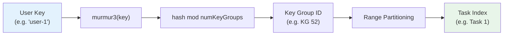
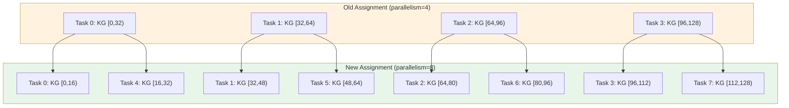

# Key Group Assignment & State Sharding

> **Feature/Project:** `Key Group Assignment & State Sharding`
>
> **WIP ID:** `WIP-03`
>
> **Author:** `Tarun Ashok`
>
> **Status:** `Draft`
>
> **Created:** `2026-02-22`
>
> **Last Updated:** `2026-02-22`

### Revision History

| Version | Date | Author | Changes |
| -- | -- | -- | -- |
| 0.1 | 2026-02-22 | Tarun Ashok | Initial draft |

---

## 1. Overview

### 1.1 Problem Statement

Wire's state-backend.md mentions Key Groups as "the atomic unit for redistribution" and the key encoding includes a `KeyGroupPrefix`, but the **assignment algorithm is never specified**. How many Key Groups exist? What hash function maps keys to groups? How are groups assigned to parallel task instances? How does rebalancing work during rescaling? This is critical for correctness — an incorrect assignment means state lookups return wrong data, and rescaling loses state.

### 1.2 Proposed Solution (Technical Summary)

Define a static Key Group model: the number of Key Groups is fixed at job creation time (default 128, configurable up to 32768). Keys are assigned to groups via `murmur3(key) mod numKeyGroups`. Groups are assigned to parallel task instances via range partitioning: task `i` of `n` owns groups `[i * numKeyGroups/n, (i+1) * numKeyGroups/n)`. On rescaling, groups are redistributed to new ranges and the corresponding Pebble key ranges are transferred.

### 1.3 Goals & Non-Goals

| Goals (In Scope) | Non-Goals (Explicitly Out) |
| -- | -- |
| Define Key Group count and its lifecycle | Dynamic Key Group splitting |
| Specify key-to-group hash function | Consistent hashing (virtual nodes) |
| Specify group-to-task assignment algorithm | Weighted assignment based on load |
| Define rescaling state transfer protocol | Hot rescaling without savepoint |

---

## 2. Architecture & System Design

### 2.1 Key Group Model

```
Keys:        [user-1] [user-2] [user-3] ... [user-N]
               │         │         │
        murmur3(key) mod 128
               │         │         │
               ▼         ▼         ▼
Key Groups:  [0]  [1]  [2] ... [63] [64] [65] ... [127]
              ├─── Task 0 ────┤     ├──── Task 1 ────┤
              (groups 0-63)         (groups 64-127)
              (parallelism = 2)
```



### 2.2 Component Breakdown

**Component 1:** Key Group Assigner
* **Responsibility:** Map user keys to Key Groups via hash function.
* **Technology:** `murmur3` hash (fast, good distribution, deterministic)
* **Interactions:** Called by KeyBy operator for every event to determine routing.

**Component 2:** Task Range Calculator
* **Responsibility:** Assign Key Group ranges to parallel task instances.
* **Technology:** Simple range partitioning: `startGroup = taskIndex * numGroups / parallelism`
* **Interactions:** Called by Coordinator when building the ExecutionGraph.

**Component 3:** State Transfer (Rescaling)
* **Responsibility:** During rescale, transfer Pebble key ranges between workers.
* **Technology:** Pebble range scan + network transfer
* **Interactions:** Coordinator calculates old and new assignments. Workers download relevant Key Group ranges from the savepoint.

### 2.3 Key Encoding in Pebble

From state-backend.md, the composite key format:

```
[KeyGroupPrefix (2 bytes)][OperatorID (4 bytes)][UserKey (N bytes)][Namespace/Window (M bytes)]
```

- **KeyGroupPrefix:** `uint16` big-endian. Allows Pebble range scans to extract all state for a Key Group range.
- Range scan for groups [64, 128): `Scan(prefix=0x0040, end=0x0080)`.

---

## 3. API Design

### 3.1 Configuration

| Parameter | Default | Constraints | Description |
|-----------|---------|-------------|-------------|
| `key_groups` | `128` | Must be power of 2. Range: [1, 32768]. | Number of Key Groups. Fixed at job creation. |

```yaml
# pipeline.yaml
name: "my-job"
parallelism: 4
key_groups: 256      # Optional, default 128
```

### 3.2 Key-to-Group Function

```go
func KeyGroup(key []byte, numKeyGroups int) uint16 {
    hash := murmur3.Sum32(key)
    return uint16(hash % uint32(numKeyGroups))
}
```

### 3.3 Group-to-Task Assignment

```go
func AssignedTask(keyGroup uint16, numKeyGroups int, parallelism int) int {
    return int(keyGroup) * parallelism / numKeyGroups
}

func TaskKeyGroupRange(taskIndex int, numKeyGroups int, parallelism int) (start, end uint16) {
    start = uint16(taskIndex * numKeyGroups / parallelism)
    end = uint16((taskIndex + 1) * numKeyGroups / parallelism)
    return
}
```

**Example:** 128 Key Groups, parallelism = 4:

| Task | Key Groups |
|------|-----------|
| 0 | [0, 32) |
| 1 | [32, 64) |
| 2 | [64, 96) |
| 3 | [96, 128) |

### 3.4 Rescaling Protocol

When parallelism changes (e.g., 4 → 8) via savepoint-based rescale:

1. Old assignment: Task 0 owned [0, 32).
2. New assignment: Task 0 owns [0, 16), Task 4 owns [16, 32).
3. Task 0 downloads its state from the savepoint and retains groups [0, 16).
4. Task 4 downloads state from the savepoint and extracts groups [16, 32).
5. Each task opens a Pebble instance with only its assigned key range.

State transfer is via the durable store (replicated PebbleDB). During rescaling, tasks restore state from local or peer-replicated checkpoints.



---

## 4. Data Model & Storage

### 4.1 Key Group Metadata

Stored in checkpoint metadata (see WIP-06):

```json
{
  "num_key_groups": 128,
  "task_assignments": {
    "task-0": { "start": 0, "end": 32 },
    "task-1": { "start": 32, "end": 64 },
    "task-2": { "start": 64, "end": 96 },
    "task-3": { "start": 96, "end": 128 }
  }
}
```

### 4.2 Pebble Key Layout

```
[0x0000][op-id][user-key]  ← Key Group 0
[0x0001][op-id][user-key]  ← Key Group 1
...
[0x007F][op-id][user-key]  ← Key Group 127
```

Range scans are efficient because Key Group is the prefix.

---

## 5. Design Decisions & Trade-offs

### Decision 1: Fixed Key Group count (not dynamic)

|  |  |
| -- | -- |
| **Context** | Key Group count affects rescale granularity and overhead. |
| **Options Considered** | (A) Fixed at job creation, (B) Dynamic splitting (like HBase regions), (C) Per-operator Key Group count |
| **Decision** | Option A: Fixed |
| **Rationale** | Simple. Deterministic. No runtime overhead for splitting. numKeyGroups >> max parallelism ensures fine-grained rescaling. Flink uses the same model (default 128). |
| **Trade-offs Accepted** | Cannot increase Key Group count without reprocessing all state. Must be set high enough at creation. |
| **Revisit Trigger** | If users need to rescale beyond initial Key Group count. |

### Decision 2: murmur3 hash (not SHA or CRC)

|  |  |
| -- | -- |
| **Context** | Need a fast, well-distributed hash for key routing. |
| **Options Considered** | (A) murmur3, (B) xxhash, (C) CRC32, (D) SHA-256 |
| **Decision** | Option A: murmur3 |
| **Rationale** | Good distribution, fast, widely used for partitioning in distributed systems. Non-cryptographic (no need for crypto here). |
| **Trade-offs Accepted** | Not cryptographically secure (irrelevant for partitioning). |
| **Revisit Trigger** | If hash collision hotspots are observed with real-world key distributions. |

### Decision 3: Range partitioning (not consistent hashing)

|  |  |
| -- | -- |
| **Context** | Assigning Key Groups to tasks. |
| **Options Considered** | (A) Contiguous range partitioning, (B) Consistent hashing with virtual nodes |
| **Decision** | Option A: Range partitioning |
| **Rationale** | Deterministic — task assignment is a pure function of (keyGroup, parallelism). No lookup table needed. Contiguous ranges enable efficient Pebble prefix scans. Consistent hashing adds complexity for no benefit when Key Group count is fixed. |
| **Trade-offs Accepted** | Rescaling moves contiguous blocks (may cause temporary load imbalance if key distribution is skewed). |
| **Revisit Trigger** | If skewed key distributions cause persistent load imbalance. |

---

## 6. Edge Cases & Failure Modes

| # | Scenario | Handling | Impact | Severity |
| -- | -- | -- | -- | -- |
| 1 | parallelism > numKeyGroups | Error at job submission: "parallelism cannot exceed key_groups" | Job rejected | Low |
| 2 | numKeyGroups not power of 2 | Error at job submission: "key_groups must be a power of 2" | Job rejected | Low |
| 3 | Key is nil/empty | Assigned to Key Group 0 (murmur3 of empty bytes). Consistent. | Hotspot on group 0 if many nil keys | Medium |
| 4 | Rescale from 4→3 (not evenly divisible) | Range partitioning handles this: groups distributed as [0,42), [42,85), [85,128). Unequal but correct. | Slight imbalance | Low |
| 5 | Savepoint has different numKeyGroups than new job | Error: "Key Group count mismatch (savepoint: 128, job: 256)" | Job rejected | Medium |

---

## 7. Security & Compliance

No additional security considerations.

---

## 8. Testing Strategy

| Test Type | Scope | Tools | Coverage Target |
| -- | -- | -- | -- |
| Unit Tests | Hash function, range assignment, rescale calculation | Go `testing` | 100% |
| Property Tests | Uniform distribution of random keys across groups | Go `testing/quick` | Distribution within 10% of uniform |
| Integration Tests | Rescale: write state → savepoint → rescale → verify state | MiniCluster | 4→8, 8→4, 4→3 |

### 8.1 Key Test Scenarios

1. Hash distribution: 1M random keys → verify each Key Group has ~7800 keys (128 groups, within 20%)
2. Assignment: 128 groups, parallelism 4 → task 0 gets [0,32), task 3 gets [96,128)
3. Rescale 4→8: State in Key Group 50 (originally task 1) now in task 3 → verify state accessible
4. Rescale 8→4: State from two old tasks merged into one → verify all state present
5. Nil key: Consistently routed to the same task

---

## 9. Open Questions & Risks

| # | Question / Risk | Owner | Status |
| -- | -- | -- | -- |
| 1 | Should default numKeyGroups be 128 or 256? Higher = finer rescale granularity but more overhead. | Tarun | Open |
| 2 | Should we support changing numKeyGroups via state migration (rekey)? | Tarun | Open — likely No for v1 |
| 3 | Risk: Highly skewed key distributions (e.g., 50% of events have key "null") cause hotspots. Should we detect and warn? | — | Acknowledged |
