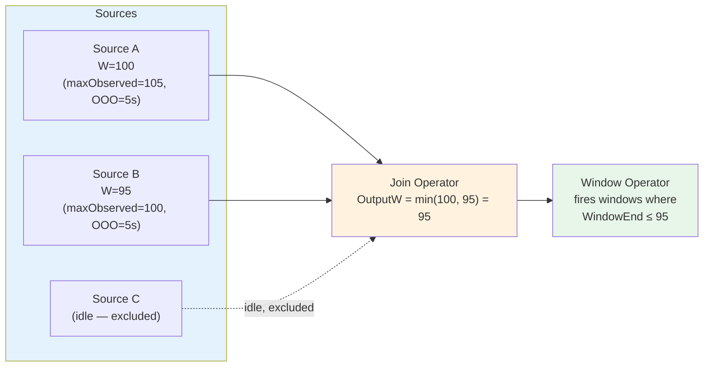

# Watermark Generation Algorithm

> **Feature/Project:** `Watermark Generation Algorithm`
>
> **WIP ID:** `WIP-04`
>
> **Author:** `Tarun Ashok`
>
> **Status:** `Draft`
>
> **Created:** `2026-02-22`
>
> **Last Updated:** `2026-02-22`

### Revision History

| Version | Date | Author | Changes |
| -- | -- | -- | -- |
| 0.1 | 2026-02-22 | Tarun Ashok | Initial draft |

---

## 1. Overview

### 1.1 Problem Statement

Wire's execution-model.md states that "Source Connectors generate watermarks based on observed data (monotonically increasing)" but provides **no algorithm specification**. Is it periodic or per-record? What about bounded out-of-orderness? What happens when a source is idle? Watermarks drive window closures and timer firings — incorrect watermarks cause either premature data loss (watermark too aggressive) or unbounded latency (watermark too conservative). This is critical for correctness.

### 1.2 Proposed Solution (Technical Summary)

Define three watermark generation strategies: `BoundedOutOfOrderness` (default — watermark = max observed timestamp minus a configured tolerance), `MonotonicTimestamps` (assumes perfectly ordered input), and `IngestionTime` (uses processing time). Additionally define watermark propagation rules for multi-input operators, idle source detection, and the relationship between watermarks and window closures.

### 1.3 Goals & Non-Goals

| Goals (In Scope) | Non-Goals (Explicitly Out) |
| -- | -- |
| Define watermark generation strategies | Custom user-defined watermark generators (v1) |
| Specify watermark propagation rules | Watermark-based load balancing |
| Define idle source handling | Watermark compression/optimization |
| Document relationship with window closures | Per-key watermarks |

---

## 2. Architecture & System Design

### 2.1 Watermark Flow

```
Source A ──(W=100)──▶ ┌──────────┐
                      │  Join    │──(W=95)──▶ Window ──▶ Sink
Source B ──(W=95)───▶ │ Min(A,B) │
                      └──────────┘
```



**Propagation rule:** Each operator outputs `Watermark = Min(all input watermarks)`.

### 2.2 Strategies

**Strategy 1: BoundedOutOfOrderness (default)**

```
Watermark(t) = MaxObservedTimestamp - MaxOutOfOrderness
```

- `MaxObservedTimestamp` tracks the highest event time seen so far.
- `MaxOutOfOrderness` is a user-configured duration (e.g., 5 seconds).
- Events arriving with timestamp < Watermark are considered "late."

**Strategy 2: MonotonicTimestamps**

```
Watermark(t) = MaxObservedTimestamp
```

- Equivalent to BoundedOutOfOrderness with `MaxOutOfOrderness = 0`.
- Only safe when the source guarantees strict ordering.

**Strategy 3: IngestionTime**

```
Watermark(t) = CurrentProcessingTime
```

- Event timestamps are overwritten with wall-clock time at ingestion.
- Eliminates out-of-orderness but loses event-time semantics.

### 2.3 Watermark Emission

Watermarks are emitted **periodically** (not per-record) to avoid overwhelming downstream operators:

| Parameter | Default | Description |
|-----------|---------|-------------|
| `watermark.emit_interval` | `200ms` | How often the source emits a watermark |

Between emissions, the source updates `MaxObservedTimestamp` with every record but only emits a new Watermark control record every `emit_interval`.

### 2.4 Idle Source Handling

If a source partition produces no events for a configurable duration, it is marked **idle**. Idle sources are excluded from the `Min()` watermark calculation to prevent them from holding back the entire pipeline.

| Parameter | Default | Description |
|-----------|---------|-------------|
| `watermark.idle_timeout` | `1m` | Mark source idle after this duration of no events |

When an idle source produces a new event, it is immediately un-idled and its watermark re-enters the `Min()` calculation.

---

## 3. API Design

### 3.1 SDK Configuration

```go
// On a Source
source.SetWatermarkStrategy(sdk.BoundedOutOfOrderness(5 * time.Second))
source.SetWatermarkStrategy(sdk.MonotonicTimestamps())
source.SetWatermarkStrategy(sdk.IngestionTime())
```

### 3.2 YAML Configuration

```yaml
sources:
  - name: "events"
    type: "http-api"
    watermark:
      strategy: "bounded-ooo"      # bounded-ooo | monotonic | ingestion-time
      max_ooo: "5s"                # Only for bounded-ooo
      emit_interval: "200ms"
      idle_timeout: "1m"
    config:
      address: ":8080"
      path: "/ingest"
```

### 3.3 Watermark Control Record (Wire Protocol)

See WIP-01 for the binary format. The Watermark message contains:

```
Watermark {
    Timestamp  int64   // The watermark timestamp (Unix millis)
    SourceID   string  // Source operator that generated this watermark
}
```

### 3.4 Propagation Rules

For an operator with N inputs:

```
OutputWatermark = Min(InputWatermark_1, InputWatermark_2, ..., InputWatermark_N)
                  where idle inputs are excluded from Min()
```

If **all** inputs are idle, the operator does not advance its watermark.

---

## 4. Data Model & Storage

No persistent storage. Watermark state is ephemeral:
- `MaxObservedTimestamp` per source subtask (in memory)
- `CurrentInputWatermarks[]` per operator (in memory)
- These are reconstructed from source offsets on recovery.

---

## 5. Design Decisions & Trade-offs

### Decision 1: Periodic emission (not per-record)

|  |  |
| -- | -- |
| **Context** | Watermarks are control records that consume bandwidth and processing. |
| **Options Considered** | (A) Emit watermark per record, (B) Periodic emission at configurable interval |
| **Decision** | Option B: Periodic (200ms default) |
| **Rationale** | Per-record emission creates N watermark records for N data records — doubles traffic. 200ms is fast enough for most latency requirements and negligible overhead. |
| **Trade-offs Accepted** | Window closure latency increases by up to `emit_interval`. |
| **Revisit Trigger** | If sub-millisecond window closure latency is required. |

### Decision 2: Exclude idle sources from Min()

|  |  |
| -- | -- |
| **Context** | A source with 100 partitions where partition 99 has no data would hold the watermark at -∞ forever. |
| **Options Considered** | (A) Exclude idle sources from Min(), (B) Forward a special "idle" watermark, (C) Use max watermark instead of min |
| **Decision** | Option A |
| **Rationale** | Simple. Matches Flink's idle source behavior. Prevents one quiet partition from blocking the entire pipeline. |
| **Trade-offs Accepted** | If the idle source suddenly produces old events, they will be "late" and handled per allowed-lateness policy (WIP-12). |
| **Revisit Trigger** | If users report unexpected late data from sources that were temporarily idle. |

---

## 6. Edge Cases & Failure Modes

| # | Scenario | Handling | Impact | Severity |
| -- | -- | -- | -- | -- |
| 1 | Source produces events with event_time = 0 | Watermark stays at 0 - maxOOO. Windows never close. | Pipeline stalls | High |
| 2 | All source partitions idle | No watermark advancement. Windows don't close. | Expected behavior | Low |
| 3 | Clock skew between event producers | BoundedOutOfOrderness absorbs it (if maxOOO > skew) | Correct if configured properly | Medium |
| 4 | Event timestamps in the far future | Watermark jumps forward. All windows close prematurely. | Data loss | High |
| 5 | Source restored from old checkpoint (old MaxObservedTimestamp) | Watermark rewinds to checkpoint position. Windows re-open. Correct behavior. | Expected on recovery | Low |

---

## 7. Security & Compliance

No additional security considerations.

---

## 8. Testing Strategy

| Test Type | Scope | Tools | Coverage Target |
| -- | -- | -- | -- |
| Unit Tests | Each strategy, propagation rules, idle detection | Go `testing` | 100% |
| Integration Tests | Window closure driven by watermarks | MiniCluster | All 3 strategies |

### 8.1 Key Test Scenarios

1. BoundedOOO: Events arrive out of order within tolerance → correct window results
2. BoundedOOO: Late event beyond tolerance → dropped or sent to side output
3. Idle source: One source idle → watermark advances past it → windows close correctly
4. Recovery: Checkpoint → restore → watermark rewinds → no duplicate window firings

---

## 9. Open Questions & Risks

| # | Question / Risk | Owner | Status |
| -- | -- | -- | -- |
| 1 | Should users be able to write custom WatermarkGenerator implementations? | Tarun | Open |
| 2 | What is the right default for `max_ooo`? 0s (strict) or 5s (lenient)? | Tarun | Open |
| 3 | Should watermarks be per-key (not just per-partition)? | Tarun | Open — likely No for v1 |
