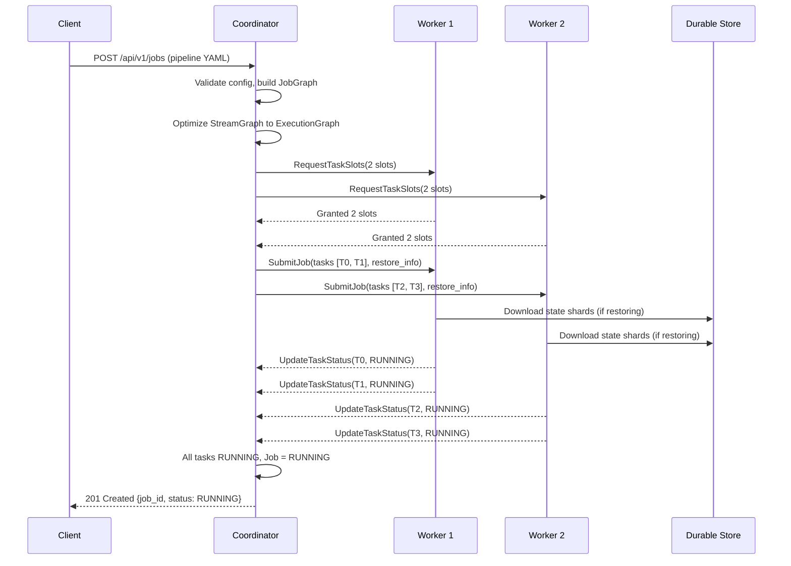
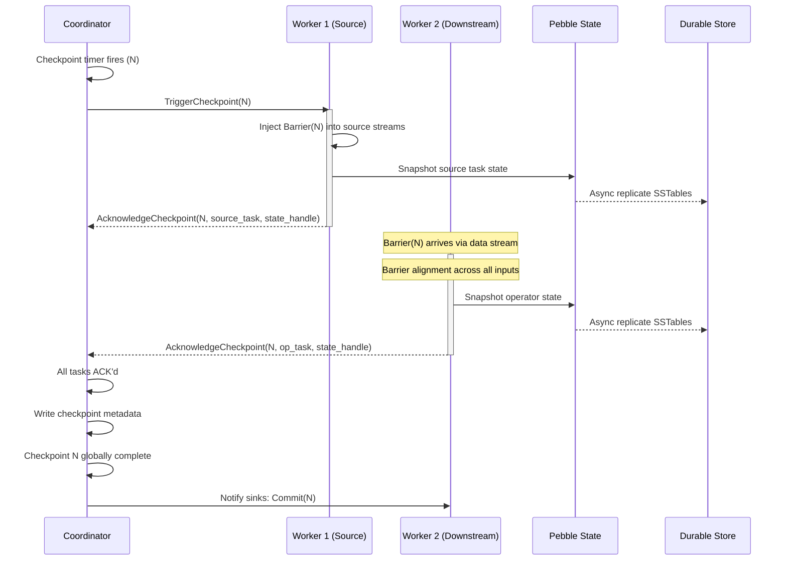
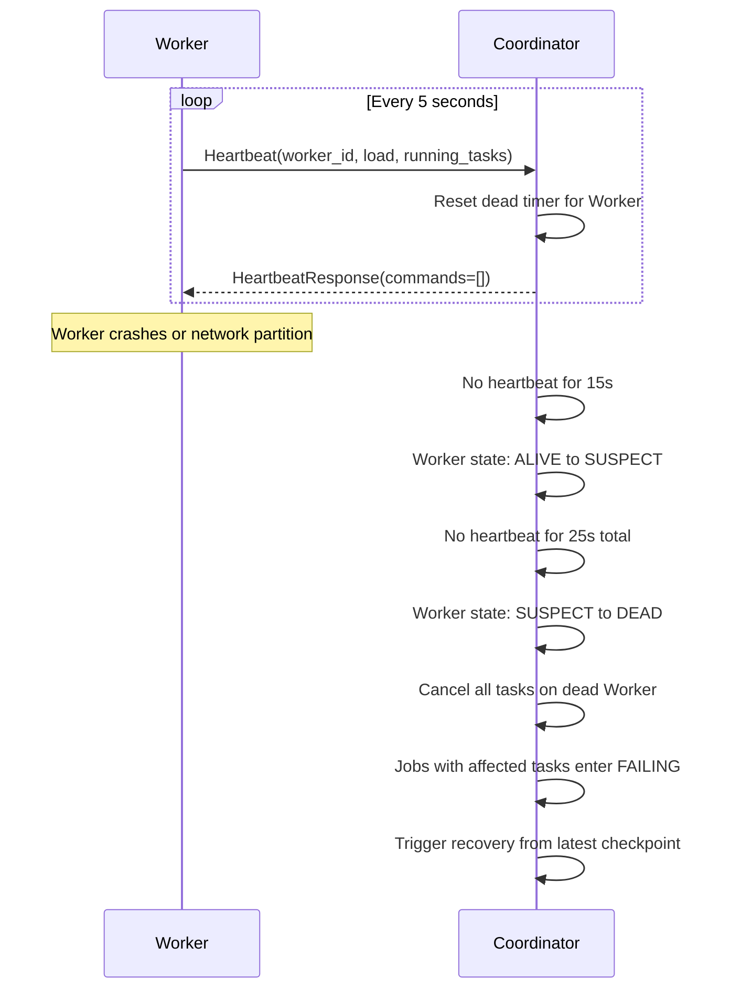

# RPC Interface Specification

> **Feature/Project:** `RPC Interface Specification`
>
> **WIP ID:** `WIP-07`
>
> **Author:** `Tarun Ashok`
>
> **Status:** `Draft`
>
> **Created:** `2026-02-22`
>
> **Last Updated:** `2026-02-22`

### Revision History

| Version | Date | Author | Changes |
| -- | -- | -- | -- |
| 0.1 | 2026-02-22 | Tarun Ashok | Initial draft |

---

## 1. Overview

### 1.1 Problem Statement

Wire's `architecture.md` identifies four RPC functions (`SubmitJob`, `UpdateTaskStatus`, `TriggerCheckpoint`, `AcknowledgeCheckpoint`) as the communication substrate between the Coordinator and Workers, but provides **no message signatures, no request/response types, no error codes, no timeout semantics, and no specification of the transport layer**. The codebase has `google.golang.org/grpc` and `google.golang.org/protobuf` in `go.mod`, a Yamux TCP multiplexer in `internal/tcp/mux.go`, and msgpack serialization helpers in `internal/utils/utils.go`, but there is no `.proto` file, no RPC handler registration, and no documentation connecting these components into a coherent RPC layer.

Without a formal RPC specification, it is impossible to implement the Coordinator or Worker, write integration tests, reason about failure modes, or build compatible tooling. Every other TRD (WIP-14 SDK submission, WIP-16 connector lifecycle, WIP-15 job lifecycle, WIP-10 two-phase commit) depends on well-defined RPC semantics that do not yet exist.

### 1.2 Proposed Solution (Technical Summary)

Define the complete RPC interface between Coordinator and Workers as a set of protobuf service definitions transported over Yamux-multiplexed TCP streams on port 4002. The specification covers six RPCs: `SubmitJob`, `UpdateTaskStatus`, `TriggerCheckpoint`, `AcknowledgeCheckpoint`, `RequestTaskSlots`, and `Heartbeat`. Each RPC is fully specified with protobuf message definitions, field types, error enums, timeout behavior, idempotency guarantees, and retry semantics. The wire format is length-prefixed msgpack-encoded protobuf-equivalent structs, consistent with the existing `EncodeMsgPack`/`DecodeMsgPack` helpers in `internal/utils/utils.go`.

### 1.3 Goals & Non-Goals

| Goals (In Scope) | Non-Goals (Explicitly Out) |
| -- | -- |
| Define all Coordinator-Worker RPCs with full message types | Worker-to-Worker data plane protocol (see WIP-01) |
| Specify error codes and failure semantics for each RPC | REST API for external clients (see WIP-15) |
| Document transport layer (Yamux streams, framing, serialization) | Authentication/authorization token format (see WIP-17) |
| Define Heartbeat protocol with load reporting and command dispatch | Coordinator HA leader election protocol (see WIP-09) |
| Specify timeout, retry, and idempotency contracts | Metrics collection and Prometheus exposition |
| Define RequestTaskSlots for resource negotiation | Dynamic rescaling protocol |

### 1.4 Success Metrics

| Metric | Current Baseline | Target | Measurement |
| -- | -- | -- | -- |
| RPC functions with complete message signatures | 0 / 6 | 6 / 6 | Doc review |
| Error codes documented per RPC | 0 | All error paths covered | Doc review |
| Implementer can build Coordinator RPC server from spec | Impossible | Possible | Manual walkthrough |
| Implementer can build Worker RPC client from spec | Impossible | Possible | Manual walkthrough |

---

## 2. Architecture & System Design

### 2.1 High-Level Architecture

```
┌─────────────────────────────────────────────────────────────────┐
│                        Coordinator                               │
│                                                                   │
│  ┌──────────────┐  ┌────────────────┐  ┌──────────────────────┐ │
│  │ Job Manager  │  │  Checkpoint    │  │  Resource Manager    │ │
│  │              │  │  Coordinator   │  │  (Task Slot Tracker) │ │
│  └──────┬───────┘  └───────┬────────┘  └──────────┬───────────┘ │
│         │                  │                       │             │
│         └──────────┬───────┴───────────────────────┘             │
│                    │                                             │
│              ┌─────▼──────┐                                      │
│              │ RPC Server │  ← Listens on Yamux streams          │
│              │ (port 4002)│                                      │
│              └─────┬──────┘                                      │
└────────────────────┼─────────────────────────────────────────────┘
                     │  Yamux TCP Mux
          ┌──────────┼──────────┐
          │          │          │
   ┌──────▼───┐ ┌───▼────┐ ┌──▼───────┐
   │ Worker 1 │ │Worker 2│ │ Worker N │
   │          │ │        │ │          │
   │ RPC      │ │ RPC    │ │ RPC      │
   │ Client   │ │ Client │ │ Client   │
   │          │ │        │ │          │
   │ Task     │ │ Task   │ │ Task     │
   │ Slots    │ │ Slots  │ │ Slots    │
   └──────────┘ └────────┘ └──────────┘
```

### 2.2 Component Breakdown

**Component 1:** RPC Server (`internal/rpc/server.go`)
* **Responsibility:** Accepts Yamux streams from the Mux, reads framed RPC requests, dispatches to the appropriate handler, and writes framed responses.
* **Technology:** Go, Yamux streams via `internal/tcp/mux.go`, msgpack serialization via `internal/utils/utils.go`.
* **Interactions:** Runs inside the Coordinator process. Delegates to Job Manager, Checkpoint Coordinator, and Resource Manager.

**Component 2:** RPC Client (`internal/rpc/client.go`)
* **Responsibility:** Opens Yamux streams to the Coordinator, sends framed RPC requests, and reads framed responses. Handles timeouts, retries, and connection recovery.
* **Technology:** Go, Yamux `Dial()` via `internal/tcp/mux.go`, msgpack serialization.
* **Interactions:** Runs inside each Worker process. Used by the Task runtime, Heartbeat loop, and Checkpoint handler.

**Component 3:** RPC Frame Codec (`internal/rpc/codec.go`)
* **Responsibility:** Encodes and decodes RPC frames (method ID + request ID + payload) over a Yamux stream. Provides the length-prefixed framing protocol.
* **Technology:** Go, `encoding/binary` for frame headers, `internal/utils/utils.go` for msgpack body encoding.
* **Interactions:** Used by both Server and Client for all RPC communication.

**Component 4:** Heartbeat Manager (`internal/rpc/heartbeat.go`)
* **Responsibility:** Periodic heartbeat loop on Workers (send) and deadline tracker on Coordinator (receive). Detects worker loss and dispatches commands back to workers.
* **Technology:** Go, `time.Ticker`, RPC Client.
* **Interactions:** Worker sends `Heartbeat` RPC every 5s. Coordinator marks worker dead after 3 missed heartbeats (15s).

### 2.3 Data Flow

**Job Submission (Coordinator-initiated):**
1. REST API handler receives job submission (see WIP-15).
2. Coordinator builds JobGraph and ExecutionGraph.
3. Coordinator calls `RequestTaskSlots` to each Worker to reserve capacity.
4. Coordinator calls `SubmitJob` to each Worker with its assigned task descriptors.
5. Workers deploy tasks, begin processing, and send `UpdateTaskStatus(RUNNING)`.



**Checkpoint Cycle (Coordinator-initiated):**
1. Checkpoint timer fires. Coordinator assigns `CheckpointID = epoch + 1`.
2. Coordinator sends `TriggerCheckpoint(CheckpointID)` to all Workers running source tasks.
3. Source tasks inject Checkpoint Barriers into the data stream.
4. Each task performs barrier alignment, snapshots Pebble state, uploads to durable storage.
5. Each task sends `AcknowledgeCheckpoint(CheckpointID, TaskID, StateHandle)` to Coordinator.
6. When all tasks ACK, Coordinator marks checkpoint globally complete.



**Heartbeat Loop (Worker-initiated):**
1. Worker sends `Heartbeat(WorkerID, load_metrics)` every 5 seconds.
2. Coordinator responds with `HeartbeatResponse(commands)`.
3. Commands may include: no-op, cancel specific tasks, or initiate graceful shutdown.
4. If Coordinator receives no heartbeat for 15s, Worker is marked dead, triggering job failover.



---

## 3. API Design

### 3.1 Transport Layer

All RPCs are transported over **Yamux-multiplexed TCP connections** on port 4002. Each RPC call opens a new Yamux stream (lightweight, ~100 bytes overhead), sends one request frame, receives one response frame, and closes the stream. This request-response pattern runs over the persistent Yamux session managed by `internal/tcp/mux.go`.

#### 3.1.1 Frame Format

Every RPC frame is transmitted as a length-prefixed message:

```
┌─────────────────────────────────────────────────────────┐
│  Frame Header (12 bytes, fixed)                         │
│  ┌──────────┬───────────┬──────────────┐                │
│  │ Length    │ Method ID │ Request ID   │                │
│  │ (uint32) │ (uint16)  │ (uint48/6B)  │                │
│  │ 4 bytes  │ 2 bytes   │ 6 bytes      │                │
│  └──────────┴───────────┴──────────────┘                │
│                                                          │
│  Frame Body (variable, msgpack-encoded)                  │
│  ┌──────────────────────────────────────┐                │
│  │ Payload                             │                │
│  │ (Length - 8 bytes of msgpack data)  │                │
│  └──────────────────────────────────────┘                │
└─────────────────────────────────────────────────────────┘
```

* **Length** (uint32, big-endian): Total size of Method ID + Request ID + Payload. Does not include the 4 bytes of the Length field itself.
* **Method ID** (uint16, big-endian): Identifies the RPC method. See Section 3.2 for assignments.
* **Request ID** (6 bytes, big-endian uint48): Unique per-stream request identifier for correlating responses with requests. Monotonically increasing per Worker.
* **Payload**: msgpack-encoded request or response struct, serialized via `utils.EncodeMsgPack()`.

Response frames use the same format. The Method ID is echoed back. The Request ID matches the originating request. The Payload contains either a success response or an `RPCError` struct.

#### 3.1.2 Method ID Assignments

| Method ID | RPC Name | Direction | Description |
|-----------|----------|-----------|-------------|
| `0x0001` | `SubmitJob` | Coordinator -> Worker | Deploy tasks to a worker |
| `0x0002` | `UpdateTaskStatus` | Worker -> Coordinator | Report task state transition |
| `0x0003` | `TriggerCheckpoint` | Coordinator -> Worker | Initiate checkpoint on source tasks |
| `0x0004` | `AcknowledgeCheckpoint` | Worker -> Coordinator | Confirm checkpoint completion for a task |
| `0x0005` | `RequestTaskSlots` | Coordinator -> Worker | Query/reserve available task slots |
| `0x0006` | `Heartbeat` | Worker -> Coordinator | Periodic liveness + load report |
| `0x00FF` | `Error` | Either | Error response (used in response frames) |

### 3.2 RPC Definitions

#### 3.2.1 SubmitJob

Deploys a set of task descriptors to a Worker. The Worker is responsible for initializing Task Slots, restoring state from a checkpoint (if provided), and beginning execution.

**Direction:** Coordinator -> Worker

**Idempotency:** Idempotent. If a Worker receives a `SubmitJob` for tasks already deployed (same `job_id` + `task_id`), it returns success without re-deploying.

**Timeout:** 30 seconds (task deployment may involve state download from durable storage).

```protobuf
message SubmitJobRequest {
  string job_id = 1;                         // Unique job identifier (UUID)
  string job_name = 2;                       // Human-readable job name
  JobGraph job_graph = 3;                    // Optimized execution graph
  repeated TaskDescriptor tasks = 4;         // Tasks assigned to this worker
  CheckpointRestoreInfo restore_info = 5;    // Optional: checkpoint to restore from
  JobConfig config = 6;                      // Job-level configuration
}

message JobGraph {
  repeated OperatorDescriptor operators = 1; // All operators in the graph
  repeated EdgeDescriptor edges = 2;         // Data flow edges between operators
  int32 max_parallelism = 3;                 // Maximum parallelism (key group count)
}

message OperatorDescriptor {
  string operator_id = 1;                    // Unique operator identifier
  string operator_name = 2;                  // Human-readable name (e.g., "api-source")
  OperatorType operator_type = 3;            // SOURCE, MAP, FILTER, KEY_BY, WINDOW, SINK
  int32 parallelism = 4;                     // Configured parallelism for this operator
  bytes operator_config = 5;                 // Operator-specific config (msgpack-encoded)
  repeated string chained_operators = 6;     // IDs of operators chained into this one
}

message EdgeDescriptor {
  string source_operator_id = 1;             // Upstream operator
  string target_operator_id = 2;             // Downstream operator
  ShuffleStrategy shuffle = 3;              // FORWARD, HASH, BROADCAST, REBALANCE
  string partition_key_expression = 4;       // For HASH: key extraction expression
}

message TaskDescriptor {
  string task_id = 1;                        // Globally unique task ID
  string operator_id = 2;                    // Which operator this task executes
  int32 subtask_index = 3;                   // Parallel instance index (0..parallelism-1)
  KeyGroupRange key_group_range = 4;         // Assigned key group range for this task
  repeated UpstreamChannelInfo input_channels = 5;   // Where to read input from
  repeated DownstreamChannelInfo output_channels = 6; // Where to send output to
}

message KeyGroupRange {
  int32 start_key_group = 1;                 // Inclusive start of key group range
  int32 end_key_group = 2;                   // Exclusive end of key group range
}

message UpstreamChannelInfo {
  string source_task_id = 1;                 // Task producing data
  string worker_address = 2;                 // host:port of the worker hosting the source task
  ShuffleStrategy shuffle = 3;              // Partitioning strategy
}

message DownstreamChannelInfo {
  string target_task_id = 1;                 // Task consuming data
  string worker_address = 2;                 // host:port of the worker hosting the target task
  ShuffleStrategy shuffle = 3;
}

message CheckpointRestoreInfo {
  int64 checkpoint_id = 1;                   // Checkpoint to restore from
  string base_path = 2;                      // Durable storage base path (e.g., "/var/lib/wire/jobs/...")
  map<string, StateHandle> task_state_handles = 3; // task_id -> state handle
}

message StateHandle {
  string state_path = 1;                     // Path to SSTable directory in durable storage
  int64 state_size_bytes = 2;                // Total size of state files
  bytes key_group_range_snapshot = 3;        // Serialized key group range at snapshot time
  string checksum = 4;                       // SHA-256 checksum for integrity verification
}

message JobConfig {
  int64 checkpoint_interval_ms = 1;          // Checkpoint interval in milliseconds
  int64 checkpoint_timeout_ms = 2;           // Max time for a checkpoint to complete
  RestartStrategy restart_strategy = 3;      // Failure recovery strategy
  int32 max_concurrent_checkpoints = 4;      // Max overlapping checkpoints (usually 1)
  map<string, string> properties = 5;        // Arbitrary key-value config properties
}

message RestartStrategy {
  RestartStrategyType type = 1;              // FIXED_DELAY, EXPONENTIAL_BACKOFF, NO_RESTART
  int32 max_attempts = 2;
  int64 delay_ms = 3;                        // Base delay for FIXED_DELAY
  int64 initial_delay_ms = 4;               // Initial delay for EXPONENTIAL_BACKOFF
  int64 max_delay_ms = 5;                   // Cap for EXPONENTIAL_BACKOFF
  double multiplier = 6;                     // Backoff multiplier
}

message SubmitJobResponse {
  bool success = 1;
  string message = 2;                        // Human-readable status message
  repeated TaskDeploymentStatus task_statuses = 3;
}

message TaskDeploymentStatus {
  string task_id = 1;
  TaskStatus status = 2;                     // DEPLOYING or FAILED
  string error_message = 3;                  // Set only if status == FAILED
}
```

**Error Responses:**

| Error Code | Name | Description |
|------------|------|-------------|
| `INSUFFICIENT_SLOTS` | Not enough free Task Slots on this Worker | Coordinator should re-schedule to another Worker |
| `INVALID_JOB_GRAPH` | JobGraph failed validation on Worker side | Corrupted or incompatible graph |
| `STATE_RESTORE_FAILED` | Failed to download/restore checkpoint state | Durable storage unavailable or checksum mismatch |
| `DUPLICATE_TASK` | Task ID already deployed (idempotent success) | Returned as success, no re-deployment |
| `WORKER_SHUTTING_DOWN` | Worker is in graceful shutdown, rejecting new work | Coordinator should re-schedule |

---

#### 3.2.2 UpdateTaskStatus

Workers report task lifecycle transitions to the Coordinator. This is the primary mechanism for the Coordinator to track the state of the distributed execution.

**Direction:** Worker -> Coordinator

**Idempotency:** Idempotent. Duplicate status updates for the same `(task_id, status, epoch)` are silently accepted.

**Timeout:** 5 seconds. On timeout, the Worker retries with exponential backoff (max 3 retries).

```protobuf
message UpdateTaskStatusRequest {
  string job_id = 1;
  string task_id = 2;
  string worker_id = 3;
  TaskStatus status = 4;                     // New task status
  int64 epoch = 5;                           // Monotonically increasing per task, prevents stale updates
  TaskMetrics metrics = 6;                   // Current performance metrics
  TaskFailureInfo failure_info = 7;          // Set only when status == FAILED
  int64 timestamp_ms = 8;                   // Wall-clock time of the status change
}

message TaskMetrics {
  int64 records_in = 1;                      // Total records received
  int64 records_out = 2;                     // Total records emitted
  int64 bytes_in = 3;                        // Total bytes received
  int64 bytes_out = 4;                       // Total bytes emitted
  double records_per_second = 5;             // Current throughput
  int64 current_watermark = 6;              // Current watermark timestamp (event time)
  double buffer_usage_ratio = 7;             // Input buffer fill ratio (0.0 - 1.0)
  int64 last_checkpoint_duration_ms = 8;     // Duration of most recent local checkpoint
  int64 state_size_bytes = 9;               // Current Pebble state size on disk
}

message TaskFailureInfo {
  string error_type = 1;                     // Exception/error type (e.g., "PebbleIOError")
  string error_message = 2;                  // Human-readable error description
  string stack_trace = 3;                    // Go stack trace at point of failure
  bool recoverable = 4;                      // Hint: can this task be retried?
  int64 failure_timestamp_ms = 5;
}

message UpdateTaskStatusResponse {
  bool acknowledged = 1;
  CoordinatorDirective directive = 2;        // Optional instruction back to the worker
}

message CoordinatorDirective {
  DirectiveType type = 1;                    // NONE, CANCEL_TASK, TRIGGER_SAVEPOINT
  string reason = 2;                         // Human-readable reason for directive
}
```

**Error Responses:**

| Error Code | Name | Description |
|------------|------|-------------|
| `UNKNOWN_JOB` | Job ID not recognized | Job may have been canceled or never existed |
| `UNKNOWN_TASK` | Task ID not recognized for this job | Stale update from a previous execution attempt |
| `STALE_EPOCH` | Epoch is less than or equal to the last recorded epoch | Duplicate/out-of-order update, silently dropped |
| `INVALID_TRANSITION` | Status transition is not valid (e.g., FINISHED -> RUNNING) | Programming error on Worker side |

---

#### 3.2.3 TriggerCheckpoint

The Coordinator instructs a Worker to begin a checkpoint by injecting Checkpoint Barriers into all source tasks on that Worker. Only tasks running source operators receive this RPC; downstream tasks participate in the checkpoint when they receive the barrier through the data stream.

**Direction:** Coordinator -> Worker

**Idempotency:** Idempotent per `(checkpoint_id, task_id)`. If a Worker receives a duplicate trigger for the same checkpoint, it ignores the duplicate.

**Timeout:** 10 seconds. If the Worker does not respond, the Coordinator marks the checkpoint as failed after the global checkpoint timeout (`checkpoint_timeout_ms` from `JobConfig`).

```protobuf
message TriggerCheckpointRequest {
  int64 checkpoint_id = 1;                   // Monotonically increasing checkpoint identifier
  string job_id = 2;
  repeated string task_ids = 3;              // Source task IDs on this worker to trigger
  CheckpointType type = 4;                   // CHECKPOINT or SAVEPOINT
  int64 trigger_timestamp_ms = 5;            // Coordinator wall-clock at trigger time
  CheckpointOptions options = 6;
}

message CheckpointOptions {
  bool force_alignment = 1;                  // Force barrier alignment even for unaligned checkpoints
  int64 alignment_timeout_ms = 2;            // Max time to wait for barrier alignment (0 = default)
  string target_path = 3;                    // Override storage path (used for savepoints)
}

message TriggerCheckpointResponse {
  bool accepted = 1;                         // Whether the trigger was accepted
  string message = 2;
  repeated CheckpointTriggerStatus trigger_statuses = 3;
}

message CheckpointTriggerStatus {
  string task_id = 1;
  bool triggered = 2;                        // true if barrier was successfully injected
  string error_message = 3;                  // Set if triggered == false
}
```

**Error Responses:**

| Error Code | Name | Description |
|------------|------|-------------|
| `CHECKPOINT_IN_PROGRESS` | A checkpoint is already in progress for this task | Previous barriers not yet drained; concurrent checkpoint limit reached |
| `TASK_NOT_RUNNING` | Target task is not in RUNNING state | Cannot inject barriers into a non-running task |
| `UNKNOWN_TASK` | Task ID not found on this Worker | Task may have been migrated or canceled |

---

#### 3.2.4 AcknowledgeCheckpoint

Workers notify the Coordinator that a specific task has completed its local checkpoint: Pebble state has been snapshotted and uploaded to durable storage. The Coordinator tracks these acknowledgments and marks the checkpoint globally complete when all tasks have reported.

**Direction:** Worker -> Coordinator

**Idempotency:** Idempotent per `(checkpoint_id, task_id)`. Duplicate ACKs are silently accepted.

**Timeout:** 5 seconds with 3 retries. If all retries fail, the Worker logs the failure. The Coordinator will eventually time out the global checkpoint, which is safe since the state has already been durably stored.

```protobuf
message AcknowledgeCheckpointRequest {
  int64 checkpoint_id = 1;
  string job_id = 2;
  string task_id = 3;
  string worker_id = 4;
  StateHandle state_handle = 5;              // Location and metadata of the persisted state
  CheckpointMetrics checkpoint_metrics = 6;
}

message CheckpointMetrics {
  int64 sync_duration_ms = 1;                // Time to create Pebble hard-link checkpoint
  int64 async_duration_ms = 2;               // Time to upload SSTables to durable storage
  int64 state_size_bytes = 3;                // Total size of checkpointed state
  int64 num_sstables = 4;                    // Number of SSTables in the checkpoint
  int64 alignment_duration_ms = 5;           // Time spent waiting for barrier alignment
  int64 bytes_buffered_alignment = 6;        // Bytes buffered during barrier alignment
  int64 start_timestamp_ms = 7;              // When this task started checkpoint processing
  int64 end_timestamp_ms = 8;               // When upload completed
}

message AcknowledgeCheckpointResponse {
  bool acknowledged = 1;
  bool checkpoint_complete = 2;              // true if this ACK completed the global checkpoint
  int64 completed_checkpoint_id = 3;         // Set when checkpoint_complete == true
}
```

**Error Responses:**

| Error Code | Name | Description |
|------------|------|-------------|
| `UNKNOWN_CHECKPOINT` | Checkpoint ID not recognized | Checkpoint may have timed out and been discarded |
| `CHECKPOINT_ALREADY_FAILED` | Global checkpoint already marked failed | Another task failed; this ACK is late |
| `UNKNOWN_JOB` | Job ID not recognized | Job canceled during checkpoint |

---

#### 3.2.5 RequestTaskSlots

The Coordinator queries a Worker for available Task Slot capacity and optionally reserves slots for an upcoming job deployment. This is the resource negotiation step that precedes `SubmitJob`.

**Direction:** Coordinator -> Worker

**Idempotency:** Non-idempotent for reservations (each call reserves additional slots). Query-only mode (count = 0) is idempotent.

**Timeout:** 5 seconds.

```protobuf
message RequestTaskSlotsRequest {
  string worker_id = 1;
  int32 requested_slots = 2;                 // Number of slots to reserve (0 = query only)
  string job_id = 3;                         // Job these slots are being reserved for
  int64 reservation_timeout_ms = 4;          // How long to hold the reservation (default: 30000)
}

message RequestTaskSlotsResponse {
  int32 total_slots = 1;                     // Total configured Task Slots on this Worker
  int32 available_slots = 2;                 // Currently free Task Slots
  int32 granted_slots = 3;                   // Number of slots actually reserved (may be < requested)
  string reservation_id = 4;                 // Opaque ID to reference this reservation in SubmitJob
  WorkerResourceInfo resource_info = 5;      // Detailed resource information
}

message WorkerResourceInfo {
  int64 memory_total_bytes = 1;              // Total Worker memory
  int64 memory_used_bytes = 2;               // Currently used memory
  double cpu_usage_percent = 3;              // Current CPU utilization
  int64 disk_total_bytes = 4;               // Total disk for Pebble state
  int64 disk_used_bytes = 5;                // Currently used disk
  int32 active_task_count = 6;              // Number of running tasks
  string worker_version = 7;                 // Wire binary version for compatibility checks
}
```

**Error Responses:**

| Error Code | Name | Description |
|------------|------|-------------|
| `INSUFFICIENT_RESOURCES` | Worker cannot grant requested slot count | Memory or disk pressure |
| `WORKER_SHUTTING_DOWN` | Worker is draining and not accepting new work | Coordinator should skip this Worker |

---

#### 3.2.6 Heartbeat

Workers send periodic heartbeat messages to the Coordinator to signal liveness and report load metrics. The Coordinator uses heartbeats to maintain the live Worker registry and can piggyback commands in the response.

**Direction:** Worker -> Coordinator

**Idempotency:** Idempotent (stateless liveness signal).

**Timeout:** 2 seconds. Heartbeats that do not complete within the timeout are silently dropped; the next heartbeat cycle will retry.

**Frequency:** Every 5 seconds (configurable via `wire.yaml` `heartbeat.interval`).

**Dead Detection:** Coordinator marks a Worker as dead after 3 missed heartbeats (15 seconds with default interval). Configurable via `heartbeat.dead_threshold`.

```protobuf
message HeartbeatRequest {
  string worker_id = 1;                      // Stable worker identifier
  string worker_address = 2;                 // Current reachable address (host:port)
  int64 timestamp_ms = 3;                   // Worker wall-clock time
  WorkerLoad load = 4;                       // Current resource utilization
  repeated RunningTaskSummary running_tasks = 5; // Summary of active tasks
}

message WorkerLoad {
  double cpu_usage_percent = 1;
  int64 memory_used_bytes = 2;
  int64 memory_total_bytes = 3;
  double network_rx_bytes_per_sec = 4;       // Network receive rate
  double network_tx_bytes_per_sec = 5;       // Network transmit rate
  int32 total_slots = 6;                     // Total configured slots
  int32 used_slots = 7;                      // Currently occupied slots
  int64 disk_used_bytes = 8;
  int64 disk_total_bytes = 9;
  int32 active_yamux_streams = 10;           // Number of active Yamux streams (data plane)
}

message RunningTaskSummary {
  string task_id = 1;
  string job_id = 2;
  TaskStatus status = 3;
  int64 records_per_second = 4;              // Current throughput
  double buffer_usage_ratio = 5;             // Input buffer saturation
}

message HeartbeatResponse {
  bool acknowledged = 1;
  int64 coordinator_timestamp_ms = 2;        // Coordinator wall-clock for clock drift detection
  repeated WorkerCommand commands = 3;       // Instructions for the Worker to execute
}

message WorkerCommand {
  CommandType type = 1;
  string job_id = 2;                         // Scope: which job (empty = worker-wide)
  string task_id = 3;                        // Scope: which task (empty = all tasks in job)
  string reason = 4;                         // Human-readable explanation
  map<string, string> parameters = 5;        // Command-specific parameters
}
```

**Coordinator Heartbeat Timeout State Machine:**

```
Worker registered
        │
  Heartbeat received (reset timer)
        │
   ┌────▼────┐
   │  ALIVE  │◄──── Heartbeat received (reset timer)
   └────┬────┘
        │
   3 missed heartbeats (15s default)
        │
   ┌────▼──────┐
   │  SUSPECT  │──── Heartbeat received ───► ALIVE
   └────┬──────┘
        │
   2 more missed (25s total)
        │
   ┌────▼────┐
   │  DEAD   │──── Triggers job failover for all tasks on this Worker
   └─────────┘
```

---

## 4. Data Model

### 4.1 Enums

```protobuf
enum TaskStatus {
  TASK_STATUS_UNKNOWN = 0;
  CREATED = 1;
  DEPLOYING = 2;
  INITIALIZING = 3;          // Restoring state from checkpoint
  RUNNING = 4;
  PAUSED = 5;                // Suspended (user-triggered via savepoint)
  FAILING = 6;               // Error detected, awaiting coordinator decision
  FAILED = 7;                // Terminal failure
  CANCELING = 8;             // Cancel requested, draining in progress
  CANCELED = 9;              // Terminal cancel
  FINISHED = 10;             // Bounded source exhausted, terminal success
}

enum OperatorType {
  OPERATOR_TYPE_UNKNOWN = 0;
  SOURCE = 1;
  MAP = 2;
  FLAT_MAP = 3;
  FILTER = 4;
  KEY_BY = 5;
  WINDOW = 6;
  PROCESS = 7;
  UNION = 8;
  CO_PROCESS = 9;
  SINK = 10;
}

enum ShuffleStrategy {
  SHUFFLE_UNKNOWN = 0;
  FORWARD = 1;               // 1:1 direct connection (same parallelism)
  HASH = 2;                  // Partition by key hash (KeyBy boundary)
  BROADCAST = 3;             // Send to all downstream instances
  REBALANCE = 4;             // Round-robin across downstream instances
}

enum CheckpointType {
  CHECKPOINT_TYPE_UNKNOWN = 0;
  PERIODIC = 1;              // Automatic, scheduled by checkpoint interval
  SAVEPOINT = 2;             // User-triggered, manually managed
}

enum RestartStrategyType {
  RESTART_UNKNOWN = 0;
  FIXED_DELAY = 1;
  EXPONENTIAL_BACKOFF = 2;
  NO_RESTART = 3;
}

enum CommandType {
  COMMAND_NONE = 0;
  CANCEL_TASK = 1;           // Stop a specific task
  CANCEL_JOB = 2;            // Stop all tasks for a job
  TRIGGER_SAVEPOINT = 3;     // Worker should initiate savepoint
  GRACEFUL_SHUTDOWN = 4;     // Drain all tasks and shut down
  UPDATE_CONFIG = 5;         // Hot-reload a configuration property
}

enum DirectiveType {
  DIRECTIVE_NONE = 0;
  CANCEL_TASK = 1;
  TRIGGER_SAVEPOINT = 2;
}
```

### 4.2 Error Envelope

All RPC error responses use a common envelope:

```protobuf
message RPCError {
  int32 code = 1;                            // Numeric error code (see per-RPC tables)
  string name = 2;                           // Machine-readable error name (e.g., "UNKNOWN_JOB")
  string message = 3;                        // Human-readable error description
  bool retryable = 4;                        // Hint: should the caller retry this RPC?
  int64 retry_after_ms = 5;                  // Suggested delay before retry (0 = immediate)
}
```

### 4.3 Numeric Error Code Registry

| Range | Category |
|-------|----------|
| 1000-1099 | General / Transport errors |
| 2000-2099 | Job management errors |
| 3000-3099 | Checkpoint errors |
| 4000-4099 | Resource errors |
| 5000-5099 | Worker lifecycle errors |

| Code | Name | Retryable | Used By |
|------|------|-----------|---------|
| 1000 | `INTERNAL_ERROR` | Yes | All RPCs |
| 1001 | `TIMEOUT` | Yes | All RPCs |
| 1002 | `INVALID_REQUEST` | No | All RPCs |
| 1003 | `UNKNOWN_METHOD` | No | Codec/dispatcher |
| 1004 | `SERIALIZATION_ERROR` | No | Codec |
| 2000 | `UNKNOWN_JOB` | No | UpdateTaskStatus, AcknowledgeCheckpoint |
| 2001 | `UNKNOWN_TASK` | No | UpdateTaskStatus, TriggerCheckpoint |
| 2002 | `INVALID_TRANSITION` | No | UpdateTaskStatus |
| 2003 | `STALE_EPOCH` | No | UpdateTaskStatus |
| 2004 | `INVALID_JOB_GRAPH` | No | SubmitJob |
| 2005 | `DUPLICATE_TASK` | No | SubmitJob (treated as success) |
| 3000 | `UNKNOWN_CHECKPOINT` | No | AcknowledgeCheckpoint |
| 3001 | `CHECKPOINT_ALREADY_FAILED` | No | AcknowledgeCheckpoint |
| 3002 | `CHECKPOINT_IN_PROGRESS` | Yes | TriggerCheckpoint |
| 3003 | `TASK_NOT_RUNNING` | No | TriggerCheckpoint |
| 4000 | `INSUFFICIENT_SLOTS` | Yes | SubmitJob, RequestTaskSlots |
| 4001 | `INSUFFICIENT_RESOURCES` | Yes | RequestTaskSlots |
| 5000 | `WORKER_SHUTTING_DOWN` | No | SubmitJob, RequestTaskSlots |
| 5001 | `STATE_RESTORE_FAILED` | Yes | SubmitJob |

---

## 5. Design Decisions & Trade-offs

### Decision 1: Yamux + msgpack over raw gRPC

|  |  |
| -- | -- |
| **Context** | Wire needs an internal RPC mechanism between Coordinator and Workers. gRPC and protobuf are in `go.mod`. Yamux and msgpack are already implemented in the codebase. |
| **Options Considered** | (A) gRPC over HTTP/2 on a dedicated port, (B) Custom framing over Yamux with msgpack serialization, (C) gRPC tunneled over Yamux |
| **Decision** | Option B: Custom framing over Yamux with msgpack |
| **Rationale** | Yamux is already the multiplexing layer for the data plane (Worker-to-Worker streams on port 4002). Using Yamux for control-plane RPC as well means a single TCP port, a single connection manager, and a single TLS configuration for all inter-node communication. gRPC would require either a second port or tunneling HTTP/2 over Yamux (complex, fragile). msgpack is already used for Raft log encoding via `hashicorp/go-msgpack`. The RPC surface is small (6 methods) and internal-only, so the benefits of gRPC (code generation, streaming, ecosystem tooling) do not outweigh the cost of a second transport stack. |
| **Trade-offs Accepted** | No automatic code generation from `.proto` files; message types are hand-written Go structs with msgpack tags. No bidirectional streaming (each RPC is request-response). No built-in load balancing or service mesh compatibility. Protobuf message definitions in this TRD are used as a specification language, not as literal code-generation input. |
| **Revisit Trigger** | If the RPC surface grows beyond ~15 methods, or if external tools need to speak the internal RPC protocol, migrate to gRPC with a Yamux-backed `net.Listener` adapter. |

### Decision 2: Request-response per Yamux stream (not multiplexed pipeline)

|  |  |
| -- | -- |
| **Context** | Need to decide whether each RPC call opens a new Yamux stream or reuses a persistent stream with request pipelining. |
| **Options Considered** | (A) One Yamux stream per RPC call, (B) Persistent stream with multiplexed request/response pairs, (C) Connection pool of reusable streams |
| **Decision** | Option A: One stream per RPC call |
| **Rationale** | Yamux streams are extremely lightweight (~100 bytes of state per stream). Opening and closing streams is fast (no TCP handshake; Yamux handles it with window frames). This eliminates head-of-line blocking, simplifies timeout handling (just close the stream), and avoids complex request-response correlation logic. The RPC call rate is low (heartbeats every 5s, task status updates on state transitions, checkpoint triggers every 10-30s), so stream creation overhead is negligible. |
| **Trade-offs Accepted** | Slightly more stream setup overhead per RPC compared to persistent streams. Not suitable if RPC call rate exceeds ~1000/s per connection (unlikely for control plane). |
| **Revisit Trigger** | If RPC call rate exceeds 100/s per Worker connection (profiling needed). |

### Decision 3: Msgpack over protobuf binary encoding

|  |  |
| -- | -- |
| **Context** | The codebase already has both `hashicorp/go-msgpack` and `google.golang.org/protobuf` as dependencies. Need to pick one serialization format for RPC payloads. |
| **Options Considered** | (A) Protobuf binary encoding, (B) Msgpack, (C) JSON |
| **Decision** | Option B: Msgpack |
| **Rationale** | Msgpack is already used throughout the codebase for Raft log entries and state serialization via `utils.EncodeMsgPack`/`utils.DecodeMsgPack`. Using the same format for RPC avoids introducing a second serialization path. Msgpack is self-describing (no schema compilation step), which simplifies development iteration. Performance is comparable to protobuf for the small message sizes in control-plane RPC (<10KB per message). The protobuf dependency in `go.mod` is retained for future use (external API, WIP-15 REST serialization, etc.). |
| **Trade-offs Accepted** | No schema enforcement at the codec level (validation must be done in application code). Slightly larger wire size than protobuf for numeric fields. No cross-language code generation. |
| **Revisit Trigger** | If a non-Go Worker implementation is needed (e.g., Python worker for ML pipelines), switch to protobuf for cross-language compatibility. |

### Decision 4: Heartbeat piggybacking for command dispatch

|  |  |
| -- | -- |
| **Context** | The Coordinator sometimes needs to send unsolicited commands to Workers (cancel task, trigger savepoint, graceful shutdown). |
| **Options Considered** | (A) Coordinator opens a Yamux stream to the Worker (reverse RPC), (B) Piggyback commands on heartbeat responses, (C) Dedicated long-poll command channel |
| **Decision** | Option B: Piggyback on heartbeat responses |
| **Rationale** | Workers already send heartbeats every 5s. Piggybacking commands on the response avoids the complexity of the Coordinator initiating connections to Workers (which complicates NAT traversal and firewall rules). The 5s latency for command delivery is acceptable for all current use cases (cancel, savepoint, shutdown). For time-critical operations like `TriggerCheckpoint`, the Coordinator already has a dedicated RPC (Section 3.2.3). |
| **Trade-offs Accepted** | Up to 5s delay for command delivery via heartbeat. Workers behind NAT cannot receive unsolicited RPCs (only `TriggerCheckpoint` and `SubmitJob` require Coordinator->Worker direction, and these use the existing Yamux session which the Worker initiated). |
| **Revisit Trigger** | If sub-second command delivery is needed for operations that cannot use a dedicated Coordinator->Worker RPC. |

---

## 6. Edge Cases & Failure Modes

| # | Scenario | Handling | Impact | Severity |
| -- | -- | -- | -- | -- |
| 1 | RPC timeout on `SubmitJob` (Worker slow to restore state) | Coordinator retries once after 30s. If second attempt fails, marks Worker as unhealthy and reschedules tasks to a different Worker. | Delayed job start | Medium |
| 2 | Worker disconnects mid-`SubmitJob` (Yamux session closed) | Coordinator detects session closure, marks all tasks on that Worker as FAILED, triggers failover. | Job enters FAILING state | High |
| 3 | Coordinator failover during active checkpoint | New Coordinator leader has no in-flight checkpoint state. Workers that already sent `AcknowledgeCheckpoint` get `UNKNOWN_CHECKPOINT` errors. Checkpoint is abandoned. Next periodic checkpoint restarts cleanly. | One checkpoint lost (no data loss, just delayed checkpoint) | Medium |
| 4 | Worker sends `AcknowledgeCheckpoint` after global checkpoint timeout | Coordinator returns `CHECKPOINT_ALREADY_FAILED`. Worker logs warning but continues processing (the local state snapshot can be garbage-collected). | Wasted upload bandwidth | Low |
| 5 | Heartbeat arrives at Coordinator after Worker marked DEAD | Coordinator sends `GRACEFUL_SHUTDOWN` command in HeartbeatResponse. Worker drains tasks and shuts down. If Worker is healthy, it re-registers on next heartbeat cycle. | Brief task disruption | Medium |
| 6 | Network partition: Worker cannot reach Coordinator | Worker continues processing (data plane is Worker-to-Worker). After 15s of missed heartbeats, Coordinator marks Worker dead and triggers failover. If partition heals, Worker receives `CANCEL_JOB` via heartbeat and stops stale tasks. | Duplicate processing during partition (resolved by checkpoint rollback) | High |
| 7 | Coordinator sends `TriggerCheckpoint` to a Worker that has already canceled the task | Worker returns `TASK_NOT_RUNNING` error. Coordinator marks the checkpoint as failed for that task and triggers global checkpoint failure. | Checkpoint failure | Medium |
| 8 | Two `UpdateTaskStatus(RUNNING)` for the same task (duplicate due to retry) | Coordinator checks epoch field. If epoch matches, the duplicate is silently accepted (idempotent). If epoch is stale, returns `STALE_EPOCH`. | No impact | Low |
| 9 | Worker sends `UpdateTaskStatus(FAILED)` but Coordinator is unreachable | Worker retries 3 times with exponential backoff. If all retries fail, Worker continues running (the task is already failed locally). Coordinator detects the failure via missed heartbeats or next successful status update. | Delayed failure detection (up to 15s) | Medium |
| 10 | `RequestTaskSlots` reserves slots but `SubmitJob` never arrives (Coordinator crashed) | Reservations have a timeout (default 30s). After timeout, reserved slots are released automatically. | Temporary capacity reduction | Low |
| 11 | Msgpack deserialization failure (corrupted payload) | Codec returns `SERIALIZATION_ERROR` (code 1004). Caller retries once. If repeated, connection is closed and re-established. | Single RPC failure | Low |
| 12 | Clock skew between Coordinator and Worker | Heartbeat response includes `coordinator_timestamp_ms` for drift detection. Epoch-based ordering (not wall-clock) is used for all state transitions. Clock skew does not affect correctness, only monitoring accuracy. | Misleading timestamps in logs | Low |

---

## 7. Security & Compliance

### 7.1 Transport Encryption (mTLS)

All RPC communication between Coordinator and Workers is encrypted using mutual TLS (mTLS) over the Yamux TCP connection.

* **TLS Version:** TLS 1.3 minimum (enforced in `internal/tcp/mux.go` via `tls.Config{MinVersion: tls.VersionTLS13}`).
* **Certificate Distribution:** Each node (Coordinator and Worker) is provisioned with:
  * An X.509 certificate signed by a shared CA.
  * A private key.
  * The CA certificate for verifying peer certificates.
* **Client Authentication:** Workers present their certificate when connecting to the Coordinator. The Coordinator validates the certificate chain against the CA. Enabled via `--node-verify-client` flag (see WIP-13).
* **Server Authentication:** The Coordinator presents its certificate. Workers validate against the CA. Workers can enforce hostname verification via `--node-verify-server-name`.
* **Configuration:** TLS is configured via the existing `NewTLSMux()` function in `internal/tcp/mux.go` using the `--node-cert`, `--node-key`, and `--node-ca-cert` CLI flags.

### 7.2 RPC Authorization

* RPC method authorization is deferred to WIP-17 (Security Model).
* At the transport level, any node with a valid mTLS certificate is authorized to call any RPC. Method-level authorization (e.g., only Coordinators can call `TriggerCheckpoint`) is enforced by role-based checks in the RPC server dispatcher.
* Worker identity is derived from the mTLS client certificate's Common Name (CN) field, which must match the `worker_id` in RPC request payloads.

### 7.3 Replay Protection

* Request IDs are monotonically increasing per Worker session. The RPC server tracks the highest seen Request ID per Worker and rejects requests with IDs below the high-water mark (prevents replay of captured RPC frames).
* Heartbeat timestamps provide coarse-grained freshness validation.

---

## 8. Testing Strategy

| Test Type | Scope | Tools | Coverage Target |
| -- | -- | -- | -- |
| Unit Tests | Frame codec encode/decode, error envelope, method dispatch | Go `testing`, table-driven tests | 100% of codec paths, all error codes |
| Unit Tests | Each RPC handler in isolation (mock dependencies) | Go `testing`, `testify/mock` | 100% of request validation, all error responses |
| Integration Tests | Full RPC round-trip over real Yamux connection | Go `testing`, `net.Pipe()` + Yamux | All 6 RPCs, happy path + error paths |
| Integration Tests | Heartbeat timeout and dead detection | Go `testing`, `time` mocking | ALIVE -> SUSPECT -> DEAD transitions |
| E2E Tests | Multi-node cluster: job submit, checkpoint cycle, failover | Docker Compose, Wire binary | Full lifecycle through RPC |
| Chaos Tests | Network partitions, packet corruption, slow responses | toxiproxy, Docker network manipulation | All edge cases from Section 6 |

### 8.1 Key Test Scenarios

1. **SubmitJob happy path:** Coordinator sends `RequestTaskSlots` -> receives grant -> sends `SubmitJob` -> Worker deploys tasks -> Worker sends `UpdateTaskStatus(DEPLOYING)` -> `UpdateTaskStatus(RUNNING)`.
2. **Checkpoint cycle:** Coordinator sends `TriggerCheckpoint` -> Workers inject barriers -> Workers snapshot Pebble -> Workers send `AcknowledgeCheckpoint` -> Coordinator marks checkpoint complete.
3. **Worker death detection:** Worker stops sending heartbeats -> Coordinator transitions Worker through ALIVE -> SUSPECT -> DEAD -> Coordinator cancels all tasks on dead Worker -> Coordinator reschedules tasks.
4. **Idempotent SubmitJob:** Send `SubmitJob` twice with same tasks -> second call returns success without re-deploying.
5. **Stale epoch rejection:** Send `UpdateTaskStatus` with epoch 3, then epoch 2 -> second call rejected with `STALE_EPOCH`.
6. **Checkpoint timeout:** Send `TriggerCheckpoint` -> one Worker never sends `AcknowledgeCheckpoint` -> global checkpoint times out -> Coordinator marks checkpoint failed.
7. **Reservation expiry:** Send `RequestTaskSlots` with reservation -> wait beyond timeout -> verify slots are released.
8. **mTLS enforcement:** Worker connects without client certificate -> connection rejected at TLS handshake.
9. **Frame corruption:** Send frame with invalid Length header -> verify `SERIALIZATION_ERROR` response and connection remains usable for subsequent RPCs.
10. **Concurrent RPCs:** Send `Heartbeat` and `UpdateTaskStatus` simultaneously over separate Yamux streams -> both complete independently without interference.

---

## 9. Open Questions & Risks

| # | Question / Risk | Owner | Status |
| -- | -- | -- | -- |
| 1 | Should Coordinator->Worker RPCs (`SubmitJob`, `TriggerCheckpoint`) use the Worker-initiated Yamux session (reverse direction on existing connection) or should the Coordinator dial a separate connection to the Worker? Using the existing session is simpler but means the Worker must run a Yamux server. | Tarun | Open |
| 2 | Should RPC payloads be compressed (e.g., LZ4) for large `SubmitJob` messages containing full JobGraphs? The JobGraph could be large for complex pipelines with many operators. | Tarun | Open |
| 3 | How does the RPC layer handle Coordinator leader failover? Workers currently connect to a single Coordinator address. Should Workers discover the new leader via a redirect response, or should they re-resolve via DNS/service discovery? See WIP-09. | Tarun | Open |
| 4 | Should `UpdateTaskStatus` support batching (multiple task status updates in a single RPC) to reduce overhead when many tasks transition simultaneously (e.g., during job startup)? | Tarun | Open |
| 5 | Risk: The heartbeat-based command dispatch adds up to 5s latency for cancel operations. If a user cancels a job, they may see tasks still running for up to 5s. Is this acceptable, or should cancel use a dedicated Coordinator->Worker RPC? | Tarun | Open |
| 6 | Should the RPC server implement rate limiting to protect the Coordinator from a misbehaving Worker flooding it with `UpdateTaskStatus` or `Heartbeat` calls? | Tarun | Open |
| 7 | The protobuf definitions in this TRD are specification-only (actual encoding is msgpack). Should we generate Go structs from `.proto` files for type safety and then marshal/unmarshal them via msgpack instead of protobuf binary? This hybrid approach would give us protobuf's schema evolution guarantees with msgpack's codec compatibility. | Tarun | Open |
| 8 | Risk: Without gRPC's built-in deadline propagation, RPC timeouts are enforced only on the caller side. A slow handler on the server side will consume resources even after the caller has timed out. Consider adding a server-side deadline derived from the frame header. | -- | Acknowledged |
