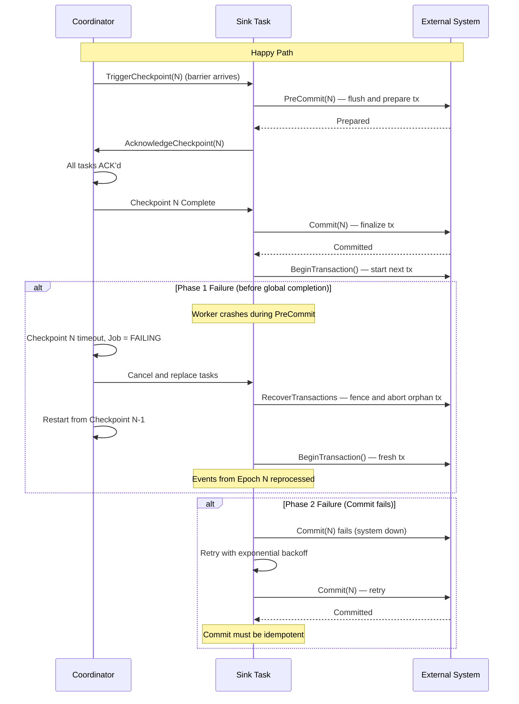
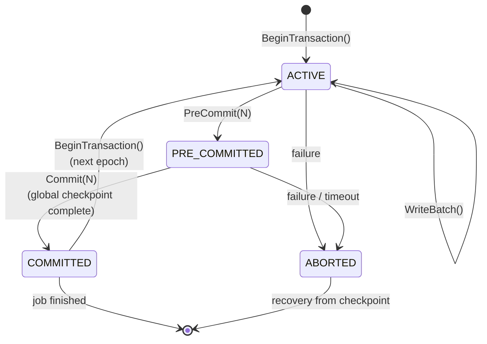

# Two-Phase Commit for Transactional Sinks

> **Feature/Project:** `Two-Phase Commit for Transactional Sinks`
>
> **WIP ID:** `WIP-10`
>
> **Author:** `Tarun Ashok`
>
> **Status:** `Implemented`
>
> **Created:** `2026-02-22`
>
> **Last Updated:** `2026-09-19`

### Revision History

| Version | Date | Author | Changes |
| -- | -- | -- | -- |
| 0.1 | 2026-02-22 | Tarun Ashok | Initial draft |
| 0.2 | 2026-02-23 | Tarun Ashok | Removed connector-specific mappings; scoped to protocol only |
| 1.0 | 2026-09-19 | Tarun Ashok | Distributed recovery, writer fencing, final checkpoints and crash acceptance |

---

## Implementation Status — 2026-09-19

Implemented by the distributed runtime follow-up to #199. See the [runtime contract](runtime-contract.md) for connector requirements and the [acceptance record](acceptance.md) for verified tests.

- PreCommit precedes recoverable snapshot capture and durable replication. Completed checkpoint decisions authorize idempotent Commit with bounded exponential retry.
- Replacement tasks restore prepared handles, establish a persisted deployment-generation fence, resolve orphan transactions, and finish the selected commit before RUNNING. Abort requires replay, including bounded retries from the initial source position before the first checkpoint.
- Bounded distributed sources coordinate a final global checkpoint before successful EOF. Missing transaction durability or an uncommitted final interval fails visibly.
- `sdk.TransactionalSink` exposes recovery, checkpoint and transaction hooks. Embedded execution has no durable global checkpoint service and rejects transactional sinks before Open. Transactional rescale without a transaction-handle mapping is rejected; cross-system atomic visibility remains out of scope.

---

## 1. Overview

### 1.1 Problem Statement

Wire's execution-model.md states that exactly-once semantics for external sinks require "transactional or idempotent" sinks, but **never defines the two-phase commit (2PC) protocol**, the pre-commit/commit hooks, or how sink transactions integrate with the checkpoint lifecycle. Without this specification, it is impossible to implement exactly-once delivery to any external system.

### 1.2 Proposed Solution (Technical Summary)

Define a two-phase commit protocol where the checkpoint lifecycle drives the transaction lifecycle. Phase 1 (PreCommit) occurs when a checkpoint barrier arrives at a sink — the sink flushes all buffered data and prepares its transaction. Phase 2 (Commit) occurs when the Coordinator confirms global checkpoint completion — the sink finalizes the transaction. On failure, Abort rolls back any in-flight transaction and processing resumes from the last committed checkpoint.

### 1.3 Goals & Non-Goals

| Goals (In Scope) | Non-Goals (Explicitly Out) |
| -- | -- |
| Define the 2PC protocol tied to checkpoint barriers | Distributed transactions across multiple sinks |
| Specify PreCommit, Commit, Abort semantics | Exactly-once for non-transactional sinks |
| Define failure recovery for each phase | Cross-system atomic commits |
| Document how custom connectors implement 2PC | Saga pattern or compensating transactions |
| Specify idempotent Commit requirements | Read-your-own-writes consistency |

### 1.4 Success Metrics

| Metric | Current Baseline | Target | Measurement |
| -- | -- | -- | -- |
| 2PC protocol specified | No specification | Complete protocol with sequence diagram | Doc review |
| TransactionalSink implementable from spec | No | Yes | Implementation test |

---

## 2. Architecture & System Design

### 2.1 High-Level Architecture

```
Coordinator                     Worker (Sink Task)               External System
    │                               │                               │
    │ TriggerCheckpoint(N)          │                               │
    ├──────────────────────────────▶│                               │
    │                               │                               │
    │                    ┌──────────┤                               │
    │                    │ Barrier N│arrives                        │
    │                    │ at sink  │                               │
    │                    └──────────┤                               │
    │                               │                               │
    │                               │──PreCommit(N)────────────────▶│
    │                               │  (flush + prepare tx)        │
    │                               │◀────────────── prepared ──────│
    │                               │                               │
    │  AcknowledgeCheckpoint(N)     │                               │
    │◀──────────────────────────────│                               │
    │                               │                               │
    │  ... wait for ALL tasks ...   │                               │
    │                               │                               │
    │  Checkpoint N COMPLETE        │                               │
    │──────────────────────────────▶│                               │
    │                               │                               │
    │                               │──Commit(N)───────────────────▶│
    │                               │  (finalize tx)               │
    │                               │◀────────────── committed ─────│
    │                               │                               │
    │                               │──BeginTransaction()──────────▶│
    │                               │  (start next tx)             │
    │                               │                               │
```

The 2PC protocol with failure handling branches — showing the happy path, Phase 1 failure (abort), and Phase 2 failure (retry):



### 2.2 Component Breakdown

**Component 1:** Checkpoint Coordinator
* **Responsibility:** Triggers checkpoints, collects ACKs, declares global completion.
* **Technology:** Coordinator RPC (see WIP-07)
* **Interactions:** Sends TriggerCheckpoint to sources, receives AcknowledgeCheckpoint from all tasks, then broadcasts Commit notification.

**Component 2:** Sink Task Runtime
* **Responsibility:** Manages the TransactionalSink lifecycle within the checkpoint protocol.
* **Technology:** Go runtime wrapping the TransactionalSink interface (see WIP-16)
* **Interactions:** Calls PreCommit on barrier arrival, Commit on global completion notification, Abort on failure.

**Component 3:** TransactionalSink Implementation
* **Responsibility:** Maps Wire's 2PC phases to the external system's transaction semantics.
* **Technology:** Connector-specific implementation of the `TransactionalSink` interface
* **Interactions:** Translates PreCommit/Commit/Abort to external system calls.

### 2.3 Data Flow — Full Checkpoint-Transaction Cycle

1. **Coordinator** triggers Checkpoint N by injecting barriers into all source streams.
2. Barriers flow through the operator graph (with alignment per execution-model.md).
3. Each **operator chain** drains its pre-barrier records; a transactional sink prepares before the chain snapshots recoverable operator state.
4. **Sink** receives the barrier:
   a. Calls `sink.PreCommit(ctx, N)` — flushes all buffered writes, prepares the transaction.
   b. Captures the prepared transaction identity, replicates the snapshot, then sends `AcknowledgeCheckpoint(N, taskID, stateHandle)` to Coordinator.
5. **Coordinator** collects ACKs from ALL tasks.
6. When all ACKs received: Checkpoint N is globally complete.
7. Coordinator notifies all sink tasks: **Commit Checkpoint N**.
8. **Sink** calls `sink.Commit(ctx, N)` — finalizes the transaction in the external system.
9. **Sink** calls `sink.BeginTransaction(ctx)` — starts the next transaction for Epoch N+1.

### 2.4 Failure Recovery

**Failure during Phase 1 (before global completion):**
1. Job enters FAILING state.
2. All tasks are canceled.
3. Explicit abort decisions roll back the transaction and stop the task. A disconnected worker preserves any preparation whose commit decision is uncertain; replacement startup resolves it using durable coordinator metadata and `RecoverTransactions`.
4. Job restarts from the selected globally completed checkpoint. Before the first checkpoint, a bounded retry reopens a replayable source at its configured initial position.
5. Sink re-opens and calls `BeginTransaction(ctx)` — fresh transaction.
6. Events from Epoch N are reprocessed. No duplicates because the Epoch N transaction was aborted.

**Failure during Phase 2 (Commit):**
1. The completed checkpoint remains the durable decision even if Commit delivery or its external response is lost. Replacement workers restore its prepared handle and re-drive Commit before processing.
2. Sink implementations **must handle idempotent Commit** — committing the same checkpointID twice must be a no-op.
3. If `Commit(N)` fails (e.g., external system down), the sink retries with exponential backoff.
4. If five attempts fail, the task fails while preserving the decision. Recovery retries Commit; it must not fall back past potentially committed transactional output.

---

## 3. API Design

### 3.1 Public TransactionalSink Interface (`sdk/sink.go`)

```go
type TransactionalSink interface {
    Sink
    RecoverTransactions(context.Context, TransactionRecovery) error
    BeginTransaction(context.Context) error
    PreCommit(context.Context, uint64) error
    Commit(context.Context, uint64) error
    Abort(context.Context) error
    Checkpoint(uint64) ([]byte, error)
    RestoreCheckpoint([]byte) error
}

```

### 3.2 Implementing 2PC for Custom Connectors

Custom connectors that support transactions must map Wire's 2PC phases to the external system's transaction primitives:

| Wire 2PC Phase | External System Equivalent |
|----------------|---------------------------|
| `BeginTransaction()` | Open a transaction / start a write session |
| `WriteBatch(events)` | Write data within the transaction boundary |
| `PreCommit(N)` | Flush all buffered data, ensure transaction is durable but not yet visible |
| `Commit(N)` | Make the transaction visible / finalize it |
| `Abort()` | Roll back all uncommitted data |

**Requirements for implementors:**
- `Commit(N)` must be **idempotent** — calling it twice with the same checkpointID must be safe. This can be achieved by tracking committed checkpoint IDs in a metadata table/store.
- `PreCommit(N)` must guarantee that all data written via `WriteBatch` is durable (flushed to the external system, not just buffered locally).
- `Abort()` must cleanly roll back without side effects. After Abort, the sink will be closed and re-opened for recovery.
- Transaction duration equals the checkpoint interval. Implementors should ensure the external system can hold transactions open for that duration.

---

## 4. Data Model & Storage

### 4.1 Checkpoint-Transaction State

The coordinator persists prepared-sink inventory and the global decision. Workers track the active transaction locally; a completed checkpoint authorizes commit but does not prove that every external system has already applied it. The connector stores recoverable external identity and enforces writer authority:

| Field | Type | Description |
| -- | -- | -- |
| task_id | string | Sink task identifier |
| current_checkpoint | int64 | Checkpoint currently in PreCommit |
| last_committed_checkpoint | uint64 | Worker-reported boundary captured in the next snapshot |
| deployment_generation | uint64 | Persisted monotonic writer fence per job deployment |
| transaction_state | enum | ACTIVE / PRE_COMMITTED / COMMITTED |



### 4.2 Recovery Metadata

On recovery, the Coordinator determines which transactions need Commit vs Abort:

- If `checkpoint N` is globally complete but a sink has `last_committed_checkpoint = N-1` → re-send Commit(N).
- If `checkpoint N` is NOT complete → Abort any in-flight transactions and restart from last committed checkpoint.

---

## 5. Design Decisions & Trade-offs

### Decision 1: Checkpoint-driven 2PC (not independent transaction boundaries)

|  |  |
| -- | -- |
| **Context** | Transaction boundaries must align with checkpoints for exactly-once. |
| **Options Considered** | (A) 2PC tied to checkpoint lifecycle, (B) Independent transaction boundaries with periodic commit, (C) Write-ahead log for sinks |
| **Decision** | Option A |
| **Rationale** | Checkpoint = the consistency boundary. If we commit transactions at checkpoint boundaries, recovery always rolls back to a consistent state. Independent transactions create gaps between checkpoint and transaction boundaries. |
| **Trade-offs Accepted** | Transaction duration = checkpoint interval. Long checkpoint intervals mean long-held transactions (problematic for some external systems with lock contention). |
| **Revisit Trigger** | If users report lock contention issues with checkpoint intervals > 1 minute. |

### Decision 2: Idempotent Commit requirement

|  |  |
| -- | -- |
| **Context** | The Commit notification may be delivered more than once (coordinator crash/restart). |
| **Options Considered** | (A) Require sinks to handle idempotent Commit, (B) Coordinator tracks Commit delivery with ACK, (C) Exactly-once Commit delivery via Raft log |
| **Decision** | Option A |
| **Rationale** | Simplest. Pushing idempotency to the sink avoids complex coordinator-side exactly-once delivery. Most external systems support idempotent operations natively or via a metadata tracking table. |
| **Trade-offs Accepted** | Sink implementors must think about idempotency. |
| **Revisit Trigger** | If sink idempotency proves too burdensome for custom connector authors. |

---

## 6. Edge Cases & Failure Modes

| # | Scenario | Handling | Impact | Severity |
| -- | -- | -- | -- | -- |
| 1 | PreCommit times out (external system slow) | Checkpoint times out → Job enters FAILING → Abort + restart from last checkpoint | Checkpoint lost, brief delay | Medium |
| 2 | Commit succeeds but worker crashes before ACK | On restart, Coordinator re-sends Commit(N). Sink Commit is idempotent → no duplicate data. | No impact | Low |
| 3 | External system down during Commit | Sink retries with backoff. If exhausted, job FAILING. On recovery, Coordinator re-attempts Commit. | Delayed commit | High |
| 4 | External system transaction timeout | If the external system's transaction timeout is shorter than the checkpoint interval, the transaction may be aborted externally. Solution: align timeouts or decrease checkpoint interval. | Data loss if misconfigured | High |
| 5 | Mixed transactional and non-transactional sinks | Non-transactional sinks get at-least-once (may see duplicates). Transactional sinks get exactly-once. Documented as expected behavior. | Partial exactly-once | Low |

---

## 7. Security & Compliance

### 7.1 Transaction Credentials

* TransactionalSink implementations inherit the same authentication as the underlying Sink.
* Resolve secret references at the worker; do not put credentials in transaction handles. This transaction interface does not encrypt or redact submitted pipeline configurations.

### 7.2 Data Consistency

* The 2PC protocol guarantees that external system state is consistent with Wire's internal checkpoint state.
* Sinks that track committed checkpoint IDs provide an audit trail for consistency verification.

---

## 8. Testing Strategy

| Test Type | Scope | Tools | Coverage Target |
| -- | -- | -- | -- |
| Unit Tests | 2PC state machine, phase transitions | Go `testing` | 100% of state transitions |
| Integration Tests | Full 2PC cycle with mock TransactionalSink | Go `testing` + mocks | Happy path + failure in each phase |
| Process failure tests | Kill worker after durable PreCommit; reopen coordinator storage | Go subprocess kill + Pebble reopen | See acceptance record; external service behavior remains connector-specific |

### 8.1 Key Test Scenarios

1. Normal cycle: BeginTransaction → WriteBatch(×N) → PreCommit → Commit → verify data visible
2. Abort after PreCommit: BeginTransaction → WriteBatch → PreCommit → kill worker → restart → verify no data from aborted transaction
3. Idempotent Commit: Commit(N) called twice → verify no duplicate data
4. Recovery: Write 1000 records across 3 checkpoints → kill during checkpoint 3 → restart → verify exactly 2 checkpoints worth of data committed
5. Phase 2 failure: Commit fails → retry → verify eventual commit

---

## 9. Open Questions & Risks

| # | Question / Risk | Owner | Status |
| -- | -- | -- | -- |
| 1 | Cross-sink atomic visibility | Tarun | Closed — outside the protocol scope |
| 2 | PreCommit deadline | Tarun | Resolved — uses the remaining checkpoint deadline; connectors must honor cancellation |
| 3 | Risk: External systems with short transaction timeouts may conflict with long checkpoint intervals. Need to document recommended configuration. | — | Acknowledged |
