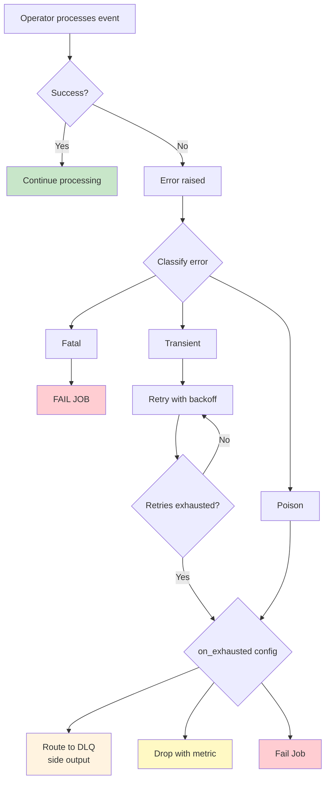

# Error Handling & Dead Letter Queues

> **Feature/Project:** `Error Handling & Dead Letter Queues`
>
> **WIP ID:** `WIP-11`
>
> **Author:** `Tarun Ashok`
>
> **Status:** `Implemented`
>
> **Created:** `2026-02-22`
>
> **Last Updated:** `2026-09-22`

### Revision History

| Version | Date | Author | Changes |
| -- | -- | -- | -- |
| 0.1 | 2026-02-22 | Tarun Ashok | Initial draft |
| 1.0 | 2026-09-22 | Tarun Ashok | Complete YAML/DLQ policies, live metrics, error-path correctness and acceptance coverage |

---

## Implementation Status — 2026-09-22

WIP-11 is implemented on the completion branch based on master `b76fa56`, as a
follow-up to [#194](https://github.com/tarungka/wire/pull/194). See the
[acceptance record](acceptance.md) for requirement-by-requirement evidence and
[current API usage](../../sdk/error_handling.md) for the supported Go/YAML API.

- Per-operator transient/poison/fatal policies support bounded fixed/exponential/no-delay retries, cancellation, panic recovery and fail/drop/DLQ outcomes in SDK and worker execution. Standard network/resource errors and explicit error markers are classified consistently.
- Failed Map/FlatMap attempts cannot leak partial output. Retries and DLQ preserve original key/value/header bytes even when user code mutates an attempted input. Retry exhaustion retains the original error cause.
- Strict YAML `error_handling` is validated before connector factories. The reserved `__dlq__` input selects one shared side-output destination without adding a normal data edge; ambiguous or recursive bindings are rejected.
- DLQ is synchronous and best effort. Missing/full/failed destinations log and count drops; Open/Close failures and panics are isolated from the main job. DLQ writes receive the active chain context and never participate in checkpoint transactions.
- Error/retry/DLQ/drop counters use the configured OTel provider, with operator/error-class and distributed task attribution. Explicit no-op metrics remain supported.
- All five named MiniCluster scenarios, all supported executable transformations, actual HTTP WriteBatch retries and cross-worker serialized policies are covered. The full repository race suite, build, vet and pinned CI lint pass. Core retry/classification/backoff/exhaustion functions have 100% statement coverage.

The proposal below has been reconciled with the shipped API and reliability
contract. Exactly-once DLQ, replay tooling, circuit breakers and global rate
limits remain non-goals or deferred open questions, not implementation gaps.

---

## 1. Overview

### 1.1 Problem Statement

Wire has **no documented strategy for handling processing errors, poison messages, or routing failed events**. When a user's Map function returns an error, or a Sink write fails, or a deserialization throws an exception — what happens? Currently the implicit behavior would be to crash the task and trigger a full job restart from checkpoint, which is disproportionate for a single bad record.

### 1.2 Proposed Solution (Technical Summary)

Implement a three-tier error handling model: (1) **Retry** — transient errors are retried with configurable backoff, (2) **Side Output / DLQ** — poison messages that fail after retries are routed to a Dead Letter Queue side output instead of crashing the job, (3) **Fail Job** — catastrophic errors (OOM, state corruption) cause job failure. Each operator can configure its error handling policy. A configured DLQ sink receives failed events with error metadata.

### 1.3 Goals & Non-Goals

| Goals (In Scope) | Non-Goals (Explicitly Out) |
| -- | -- |
| Define error classification (transient vs poison vs fatal) | Automatic error correction / data repair |
| Specify retry policies (fixed, exponential backoff) | Circuit breaker pattern (deferred) |
| Define DLQ routing mechanism via side outputs | DLQ replay / reprocessing workflow |
| Document per-operator error handling configuration | Global error rate alerting (see operations.md) |

---

## 2. Architecture & System Design

### 2.1 Error Flow

```
                    ┌──────────────┐
                    │   Operator   │
                    │  (Map/Sink)  │
                    └──────┬───────┘
                           │
                    Process event
                           │
                    ┌──────▼───────┐
                    │   Success?   │──Yes──▶ Continue
                    └──────┬───────┘
                           │ No (error)
                    ┌──────▼───────┐
                    │ Retryable?   │──No──▶ ┌──────────┐
                    └──────┬───────┘        │ Fatal?   │──Yes──▶ FAIL JOB
                           │ Yes            └────┬─────┘
                    ┌──────▼───────┐             │ No (poison)
                    │ Retry with   │             ▼
                    │ backoff      │      ┌────────────┐
                    └──────┬───────┘      │ DLQ Side   │
                           │              │ Output     │
                    ┌──────▼───────┐      └────────────┘
                    │ Retries      │
                    │ exhausted?   │──Yes──▶ DLQ Side Output
                    └──────┬───────┘
                           │ No
                           ▼
                    Retry the operation
```



### 2.2 Error Classification

| Category | Examples | Default Handling |
|----------|----------|-----------------|
| **Transient** | Network timeout, connection reset, temporary unavailability | Retry within the configured budget (default: zero retries, then fail) |
| **Poison** | Deserialization failure, panic in user code, schema mismatch | Skip retries; apply the configured exhausted action (default: fail) |
| **Fatal** | Out of memory, state corruption, disk full | Fail job |

### 2.3 Component Breakdown

**Component 1:** Error Handler (per operator)
* **Responsibility:** Classify errors, apply retry logic, route to DLQ or fail.
* **Technology:** Wrapper around user-provided operator functions
* **Interactions:** Catches errors from Map/FlatMap/Filter/Process and synchronous Sink.Write, including sinks that delegate Write to WriteBatch. Applies configured policy; it does not add multi-record batching.

**Component 2:** DLQ Side Output
* **Responsibility:** Collect failed events with error metadata. Route to a configured DLQ sink.
* **Technology:** Per-operator DLQ writer alongside the normal output path
* **Interactions:** DLQ events include original event + error message + operator name + timestamp.

---

## 3. API Design

### 3.1 Error Handling Configuration (Go SDK)

```go
stream.MapWithName("parse", parseFunc).
    WithErrorHandler(sdk.ErrorHandler{
        MaxRetries:   3,
        Backoff:      "exponential",
        InitialDelayMS: 100,
        MaxDelayMS:   10000,
        Multiplier:   2.0,
        OnExhausted:  "dlq",            // dlq | fail | drop
    })
```

### 3.2 Error Handling Configuration (YAML)

```yaml
transforms:
  - name: "parse-json"
    type: "json-parse"
    input: "source"
    error_handling:
      max_retries: 3
      backoff: "exponential"         # fixed | exponential | none
      initial_delay: "100ms"
      max_delay: "10s"
      multiplier: 2.0
      on_exhausted: "dlq"            # dlq | fail | drop
```

### 3.3 DLQ Event Format

```go
type DLQEvent struct {
    OriginalEvent Event              // The event that failed
    Error         string             // Error message
    OperatorName  string             // Which operator failed
    Timestamp     int64              // When the failure occurred
    RetryCount    int                // How many retries were attempted
}
```

Serialized as JSON in the DLQ sink:

```json
{
  "original_event": {
    "key": "base64...",
    "value": "base64...",
    "event_time": 1705312200000
  },
  "error": "json: cannot unmarshal string into Go value of type int",
  "operator": "parse-json",
  "timestamp": 1705312201000,
  "retry_count": 3
}
```

### 3.4 DLQ Sink Configuration

```yaml
sinks:
  - name: "dlq"
    type: "http-api"
    input: "__dlq__"                  # Special reserved input name
    config:
      url: "https://dlq.example.com/events"
      method: "POST"
```

If no DLQ sink is configured, `on_exhausted: "dlq"` falls back to logging the event at ERROR level and dropping it.

### 3.5 Retry Policies

**Fixed Delay:**
```
Attempt 1: wait 100ms
Attempt 2: wait 100ms
Attempt 3: wait 100ms
```

**Exponential Backoff:**
```
Attempt 1: wait 100ms
Attempt 2: wait 200ms
Attempt 3: wait 400ms
(capped at max_delay)
```

### 3.6 Metrics

| Metric | Type | Description |
|--------|------|-------------|
| `wire_operator_errors_total` | Counter | Total errors per operator, per error type |
| `wire_operator_retries_total` | Counter | Total retry attempts per operator |
| `wire_dlq_events_total` | Counter | Events routed to DLQ per operator |
| `wire_operator_drops_total` | Counter | Events dropped (if on_exhausted=drop) |

---

## 4. Data Model & Storage

No additional persistent storage. DLQ events are written to the configured DLQ sink.

Retry state is ephemeral — held in memory during retry attempts. If the task crashes mid-retry, the event is replayed from checkpoint (at-least-once).

---

## 5. Design Decisions & Trade-offs

### Decision 1: Per-operator error handling (not global)

|  |  |
| -- | -- |
| **Context** | Different operators have different error profiles. A JSON parser should DLQ bad records. A Sink should retry on transient network errors. |
| **Options Considered** | (A) Global error policy for entire job, (B) Per-operator configuration |
| **Decision** | Option B |
| **Rationale** | More flexible. A source might need aggressive retries while a map function should DLQ immediately on bad data. |
| **Trade-offs Accepted** | More configuration per operator. |
| **Revisit Trigger** | If users want a "set it once" global policy. Add global defaults with per-operator overrides. |

### Decision 2: DLQ via side outputs (not a separate pipeline)

|  |  |
| -- | -- |
| **Context** | Failed events need to go somewhere. |
| **Options Considered** | (A) Side output to a DLQ sink, (B) Separate DLQ pipeline, (C) In-place error field on the event |
| **Decision** | Option A |
| **Rationale** | DLQ delivery uses a per-operator side-output writer. The destination is a regular sink, selected by the reserved YAML input or the SDK DLQ binding. |
| **Trade-offs Accepted** | DLQ events do not participate in checkpointing. Best-effort delivery may lose records on failure and duplicate records on replay. |
| **Revisit Trigger** | If users need exactly-once DLQ delivery. |

---

## 6. Edge Cases & Failure Modes

| # | Scenario | Handling | Impact | Severity |
| -- | -- | -- | -- | -- |
| 1 | Every event fails (100% error rate) | All events routed to DLQ. Pipeline runs but produces no output. Metric alerts should catch this. | No useful output | High |
| 2 | DLQ sink itself fails | DLQ write failure logged. Original event dropped. DLQ is best-effort. | Lost DLQ record | Medium |
| 3 | Retry delay > checkpoint interval | Retry still in progress when barrier arrives. Barrier waits for the current call and retry sequence. Backoff is bounded by retry count and max_delay; user calls and sink writes must honor cancellation. | Checkpoint delayed | Medium |
| 4 | User function panics (not returns error) | Caught by `recover()`, wrapped as error, treated as poison message → DLQ | Event to DLQ | Medium |
| 5 | Transient error becomes permanent | Reclassify immediately; poison errors use the configured exhausted action, fatal errors fail. A missing DLQ logs and drops. | Individual events lost | Medium |

---

## 7. Security & Compliance

### 7.1 DLQ Data Sensitivity

* DLQ events contain the **full original event payload**. If events contain PII, the DLQ sink must have appropriate access controls.
* DLQ error messages should not leak internal state or stack traces beyond the immediate error.

---

## 8. Testing Strategy

| Test Type | Scope | Tools | Coverage Target |
| -- | -- | -- | -- |
| Unit Tests | Retry logic, error classification, backoff calculation | Go `testing` | 100% |
| Integration Tests | Map error → DLQ routing → verify DLQ sink receives event | MiniCluster | Happy path + all on_exhausted modes |

### 8.1 Key Test Scenarios

1. Map returns error on 1 of 100 events → 99 events to sink, 1 to DLQ
2. Sink WriteBatch fails transiently → retry succeeds → no data loss
3. Sink WriteBatch remains unavailable → retries exhausted → job fails (the default exhausted action is fail; explicitly fatal errors skip retries)
4. Panic in user function → caught → event to DLQ → pipeline continues
5. No DLQ configured + on_exhausted=dlq → event dropped with ERROR log

---

## 9. Open Questions & Risks

| # | Question / Risk | Owner | Status |
| -- | -- | -- | -- |
| 1 | Should DLQ events participate in checkpointing (exactly-once DLQ)? | Tarun | Open |
| 2 | Should there be a max DLQ rate (e.g., > 10% errors → fail job)? | Tarun | Open |
| 3 | Should we support DLQ replay (reprocess failed events after fix)? | Tarun | Open — deferred to v2 |
| 4 | Risk: Retry backoff can cause memory pressure if many events are in retry simultaneously | — | Acknowledged |
