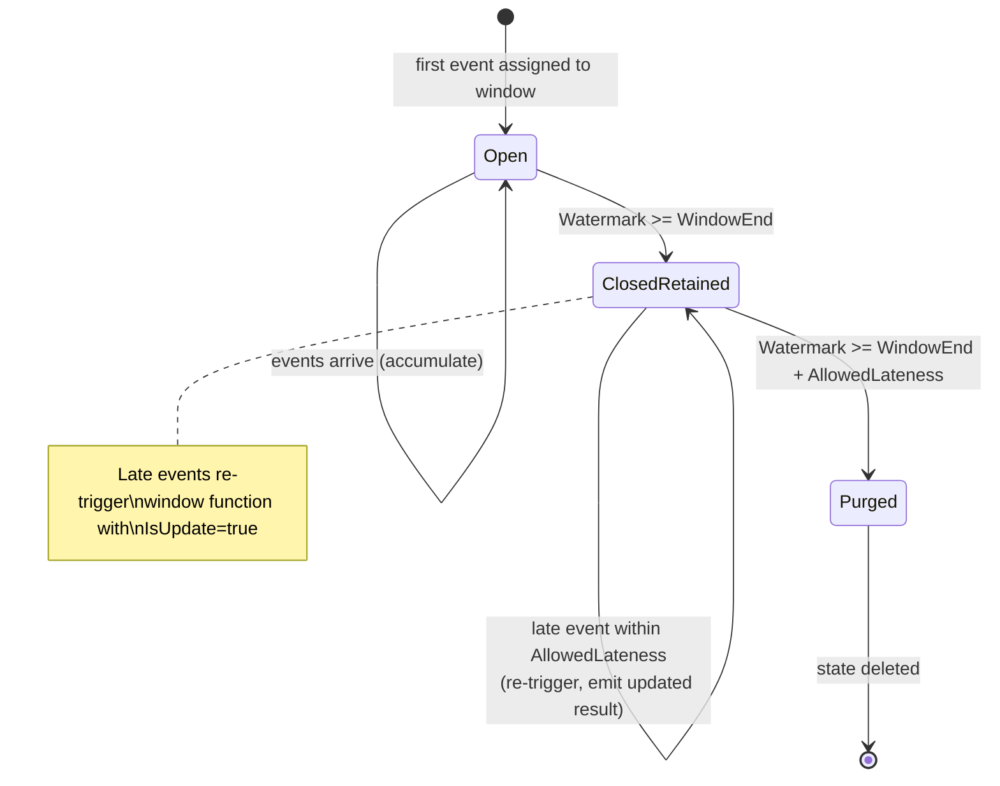

# Late Data & Allowed Lateness

> **Feature/Project:** `Late Data & Allowed Lateness`
>
> **WIP ID:** `WIP-12`
>
> **Author:** `Tarun Ashok`
>
> **Status:** `Implemented`
>
> **Created:** `2026-02-22`
>
> **Last Updated:** `2026-09-23`

### Revision History

| Version | Date | Author | Changes |
| -- | -- | -- | -- |
| 0.1 | 2026-02-22 | Tarun Ashok | Initial draft |

---

## Implementation Status — 2026-09-23

The completion branch implements ordered Aggregate/Reduce/Apply execution,
per-window SDK/YAML lateness, named late branches, attributed live metrics,
atomic backend persistence and portable checkpoint recovery. It follows #193
and is based on master `931d02e` (including WIP-10 and WIP-11).
[Completion PR #227](https://github.com/tarungka/wire/pull/227) is ready for review.

See the [runtime contract](runtime-contract.md) for supported configuration,
resource bounds and compatibility, and [acceptance evidence](acceptance.md) for
the requirement-by-requirement test mapping. Completion means the scoped window
behavior; it does not claim to resolve WIP-10's mixed-source completion issue.

---

## 1. Overview

### 1.1 Problem Statement

Wire's execution-model.md mentions "Allowed Lateness: Users can configure a grace period where late events trigger a window re-computation/update" but provides **no configuration syntax, no units, no per-operator scoping, and no side-output mechanism** for events that arrive after the allowed lateness expires.

### 1.2 Proposed Solution (Technical Summary)

Define "late data" as any event with `EventTime < CurrentWatermark`. Implement a configurable `AllowedLateness` duration per window operator. Events assigned to a window with `CurrentWatermark < WindowEnd + AllowedLateness` remain eligible. If that window has already fired, an accepted event triggers an updated result. An event is too late only when all its assigned windows have expired; runtime integration routes that event to a configured side output (or drops it). Window state is retained for `WindowEnd + AllowedLateness` before purge.

### 1.3 Goals & Non-Goals

| Goals (In Scope) | Non-Goals (Explicitly Out) |
| -- | -- |
| Define late data semantics | Retracting/correcting previously emitted results |
| Specify AllowedLateness configuration | Per-key lateness configuration |
| Define side output for too-late events | Automatic lateness detection/tuning |
| Specify window state retention policy | Stateless operator lateness handling |

---

## 2. Architecture & System Design

### 2.1 Late Data Flow

For each assigned window, compare the **current watermark** with the window's
retention deadline. Comparing event time with `WindowEnd - AllowedLateness` is
incorrect: that would classify the same event identically before and after purge.

```text
Assign event to its window(s), merging retained sessions when appropriate.
  For each window:
    Watermark >= WindowEnd + AllowedLateness -> expired; do not recreate it.
    Watermark < WindowEnd -> accumulate; window has not closed yet.
    Otherwise -> accumulate and emit an updated result for the closed window.
  If every assigned window is expired -> route the event once to late output.
```

An event older than the watermark may still belong to an open sliding/session
window. Even with zero allowed lateness, that open window can accept it. Zero
lateness means no retention after window end, rather than dropping every event
whose timestamp is below the watermark. Session merges that extend an already
emitted window fire an update at the extended end; earlier results are not retracted.

### 2.2 Window State Retention

Without allowed lateness:
- Window state purged when `Watermark >= WindowEnd`

With allowed lateness:
- Window state purged when `Watermark >= WindowEnd + AllowedLateness`
- During `[WindowEnd, WindowEnd + AllowedLateness)`, the window is "closed but retained"
- Late events re-trigger the window function, emitting an **updated** result

---

## 3. API Design

### 3.1 Go SDK

```go
keyed.Window(sdk.TumblingWindow(5 * time.Minute)).
    AllowedLateness(30 * time.Second)
```

### 3.2 YAML Configuration

```yaml
transforms:
  - name: "count-window"
    type: "tumbling-window"
    input: "keyed-stream"
    config:
      size: "5m"
      aggregation: "count"
      allowed_lateness: "30s"       # Grace period for late events
      late_output: "late-events"    # Side output name for too-late events
```

### 3.3 Side Output for Too-Late Events

```go
lateTag := sdk.NewOutputTag("late-events")

windowed := keyed.Window(sdk.TumblingWindow(5 * time.Minute)).
    AllowedLateness(30 * time.Second).
    SetLateOutputTag(lateTag)

// Create the main result stream, then collect its late branch.
mainStream := windowed.Aggregate(sdk.CountAggregator{})
lateStream := mainStream.GetSideOutput(lateTag)
lateStream.AddSink(lateSink)
```

### 3.4 Updated Result Emission

When a late event re-opens a window:
- The window function is re-invoked with the updated accumulator.
- The emitted result is marked as an **update** (not a new result).
- Downstream operators receive both the original and updated results.

```go
type WindowResult struct {
    Key        []byte
    WindowStart int64
    WindowEnd   int64
    Value      []byte
    IsUpdate   bool    // true if this is a re-computation due to late data
}
```

### 3.5 Metrics

| Metric | Type | Description |
|--------|------|-------------|
| `wire_late_events_total` | Counter | Events arriving after watermark (per operator) |
| `wire_late_events_allowed_total` | Counter | Late events within allowed lateness (re-opened window) |
| `wire_late_events_dropped_total` | Counter | Events beyond allowed lateness (too late) |
| `wire_window_state_retention_bytes` | Gauge | Extra state held for allowed lateness |

---

## 4. Data Model & Storage

### 4.1 Window State Lifecycle

| Phase | Watermark Position | State | Behavior |
|-------|-------------------|-------|----------|
| Open | `W < WindowEnd` | Active | Events assigned, aggregation updated |
| Closed but retained | `WindowEnd <= W < WindowEnd + AllowedLateness` | Retained | Late events re-trigger, updated results emitted |
| Purged | `W >= WindowEnd + AllowedLateness` | Deleted | State purged from Pebble. Events are too-late. |



### 4.2 Storage Impact

AllowedLateness increases state retention duration. For tumbling windows with `size=5m` and `allowed_lateness=30s`, state lives for 5m30s instead of 5m. For session windows, the impact is proportional to the number of active sessions.

---

## 5. Design Decisions & Trade-offs

### Decision 1: Updated results (not retractions)

|  |  |
| -- | -- |
| **Context** | When a late event updates a window, downstream needs to know. |
| **Options Considered** | (A) Emit updated result with `IsUpdate=true` flag, (B) Emit retraction of old result + new result, (C) Only emit final result at purge time |
| **Decision** | Option A: Updated result with flag |
| **Rationale** | Simplest. Sinks that support upsert naturally handle updates. Retractions add complexity and require all downstream operators to handle negative records. |
| **Trade-offs Accepted** | Append-only sinks will see duplicate records for the same window. Users must handle `IsUpdate` flag. |
| **Revisit Trigger** | If users need true retraction semantics for SQL-style materialized views. |

### Decision 2: Drop expired-window events by default (zero retention)

|  |  |
| -- | -- |
| **Context** | What happens to events whose assigned windows have expired when AllowedLateness is not configured? |
| **Options Considered** | (A) Drop silently, (B) Drop with metric, (C) Route to global DLQ |
| **Decision** | Option B: Drop with metric |
| **Rationale** | Dropping silently is dangerous (users don't know they're losing data). Routing everything to DLQ is noisy. Metric-only is a good default — users monitor `wire_late_events_dropped_total` and add AllowedLateness if needed. |
| **Trade-offs Accepted** | Events for expired windows are dropped by default; events for still-open windows remain eligible. Users configure retention to tolerate arrivals after window end. |
| **Revisit Trigger** | If users frequently lose data without realizing it. Consider making AllowedLateness mandatory. |

---

## 6. Edge Cases & Failure Modes

| # | Scenario | Handling | Impact | Severity |
| -- | -- | -- | -- | -- |
| 1 | AllowedLateness > WindowSize | Valid but unusual. State retention = WindowSize + AllowedLateness. Documented as supported. | Extra state | Low |
| 2 | Burst of late events re-opens same window 100 times | Each re-open triggers re-computation. If window function is expensive, this adds load. | Performance degradation | Medium |
| 3 | Late event arrives for a session window that already merged | Session window is re-opened, late event added, potential re-merge with adjacent sessions. | Complex but correct | Medium |
| 4 | Recovery rewinds watermark → events no longer "late" | On recovery from checkpoint, watermark rewinds. Events that were previously late are now on-time. Windows re-compute correctly. | Expected behavior | Low |
| 5 | AllowedLateness configured but no late output tag set | Too-late events dropped with metric. No side output. | Data loss (documented) | Low |

---

## 7. Security & Compliance

No additional security considerations.

---

## 8. Testing Strategy

| Test Type | Scope | Tools | Coverage Target |
| -- | -- | -- | -- |
| Unit Tests | Late event detection, window state retention, purge timing | Go `testing` | 100% |
| Integration Tests | Late event → updated result → verify downstream | MiniCluster | All window types |

### 8.1 Key Test Scenarios

1. On-time event → window fires → late event within AllowedLateness → updated result emitted
2. Late event beyond AllowedLateness → routed to side output
3. No AllowedLateness configured → late events dropped, metric incremented
4. Window state purged after `WindowEnd + AllowedLateness` → verify Pebble state cleaned up
5. Recovery: checkpoint before late event → restore → late event replayed → correct result

---

## 9. Open Questions & Risks

| # | Question / Risk | Owner | Status |
| -- | -- | -- | -- |
| 1 | Should AllowedLateness be configurable per-key (not just per-operator)? | Tarun | Open — likely No for v1 |
| 2 | Should updated results carry the previous result for diffing? | Tarun | Open |
| 3 | Risk: Large AllowedLateness + many keys = significant state growth. Need monitoring. | — | Acknowledged |
