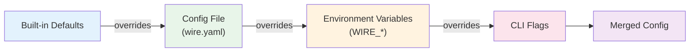

# Configuration Reference

> **Feature/Project:** `Configuration Reference`
>
> **WIP ID:** `WIP-13`
>
> **Author:** `Tarun Ashok`
>
> **Status:** `Partially Implemented`
>
> **Created:** `2026-02-22`
>
> **Last Updated:** `2026-09-12`

### Revision History

| Version | Date | Author | Changes |
| -- | -- | -- | -- |
| 0.1 | 2026-02-22 | Tarun Ashok | Initial draft |

---

## Implementation Status — 2026-09-12

Assessed against `master` at `0e78195`. This section records current implementation; the proposal below retains its original design context and targets.

- **Implemented:** YAML/JSON system-config loading, ordered file merging, environment substitution, CLI overrides, and validation are implemented.
- **Remaining:** Pipeline YAML is not implemented (WIP-19), and some configured features such as authentication/TLS remain unwired in the runtime. A formal machine-readable schema and a documented cluster walkthrough remain outstanding.
- **Validation:** [load order, substitution semantics, and current validation rules](../../configuration-validation.md). Environment substitution now includes mode, listen, and worker string fields.
- **Current reference:** [all accepted fields, defaults, and CLI mappings](../../configuration-reference.md), with loader-validated [coordinator](../../examples/coordinator.yaml) and [worker](../../examples/worker.yaml) examples. Run with `./wire --config docs/examples/coordinator.yaml` and `./wire --config docs/examples/worker.yaml`. The reference has a drift check against current config types and flags.
- **Evidence:** [loader.go](../../../internal/config/loader.go), [flags.go](../../../internal/config/flags.go), [main.go](../../../cmd/main.go).

---

## 1. Overview

### 1.1 Problem Statement

Wire's `operations.md` references "Configuration via `wire.yaml`" but the file format is never documented. The CLI has ~720 lines of flag parsing in `cmd/init.go` with 50+ flags covering HTTP, Raft, TLS, write queues, profiling, and cluster join — none of which are documented. Pipeline configuration exists as example YAML/JSON in `.config/` but with no schema or field reference. Users cannot configure or run Wire without reading source code.

### 1.2 Proposed Solution (Technical Summary)

Document the complete configuration surface: CLI flags (derived from `cmd/init.go`), the `wire.yaml` system configuration file schema, the pipeline configuration schema, environment variable overrides, and all validation rules. This TRD serves as the single source of truth for "how to configure Wire."

### 1.3 Goals & Non-Goals

| Goals (In Scope) | Non-Goals (Explicitly Out) |
| -- | -- |
| Document all CLI flags with types, defaults, and descriptions | Documenting internal Go config structs |
| Define wire.yaml schema with examples | Dynamic configuration reloading |
| Define pipeline YAML schema with examples | Configuration UI / dashboard |
| Document environment variable substitution | Configuration migration tooling |
| Document all validation rules and error messages | Performance impact of config options |

### 1.4 Success Metrics

| Metric | Current Baseline | Target | Measurement |
| -- | -- | -- | -- |
| Documented CLI flags | 0 / 50+ | 100% | Cross-reference with cmd/init.go |
| User can configure a cluster from docs alone | Impossible | Possible | Manual walkthrough |
| Valid wire.yaml example provided | No | Yes | Example validates against schema |

---

## 2. Architecture & System Design

### 2.1 Configuration Loading Hierarchy

```
┌─────────────────────────────────────────────┐
│             Configuration Precedence         │
│   (later sources override earlier)          │
│                                              │
│   1. Built-in defaults (Go code)            │
│   2. Config file (wire.yaml / config.json)  │
│   3. Environment variables (WIRE_*)         │
│   4. CLI flags (highest priority)           │
└─────────────────────────────────────────────┘
```



### 2.2 Component Breakdown

**Component 1:** `cmd/init.go` — Flag Parser
* **Responsibility:** Defines all CLI flags via `spf13/pflag`, parses command-line arguments, applies defaults.
* **Technology:** Go, `spf13/pflag` library
* **Interactions:** Produces a `Config` struct consumed by the main application.

**Component 2:** Configuration File Loader
* **Responsibility:** Reads `wire.yaml` or JSON config files, merges with flag defaults.
* **Technology:** `knadh/koanf` (declared in go.mod, currently commented out in code)
* **Interactions:** Config files specified via `--config` flag. Multiple files merged in order.

**Component 3:** Pipeline Config Parser
* **Responsibility:** Reads pipeline YAML/JSON and constructs a StreamGraph.
* **Technology:** Go YAML/JSON unmarshaler
* **Interactions:** Separate from system config. Submitted via CLI or REST API.

---

## 3. API Design

### 3.1 CLI Flag Reference

Current flags from `cmd/init.go`. TLS flags are accepted but do not yet enable
runtime TLS. The old Raft/join/backup flags are absent, not dormant options.

| Flag | Type | Default | Description |
| --- | --- | --- | --- |
| `--version` | `bool` | `false` | Show version information and exit |
| `--config` | `stringslice` | `[]string{".config/config.json"}` | path to one or more config files (will be merged in order) |
| `--debug` | `bool` | `false` | run in debug mode - better logs |
| `--mode` | `string` | `"coordinator"` | operating mode: coordinator or worker |
| `--listen` | `string` | `":4002"` | wire protocol listen address |
| `--node-cert` | `string` | `""` | TLS certificate file |
| `--node-key` | `string` | `""` | TLS private key file |
| `--node-ca` | `string` | `""` | CA certificate for peer verification |
| `--node-verify-client` | `bool` | `false` | require mutual TLS |
| `--max-frame-size` | `uint32` | `16777216` | max wire protocol frame size |
| `--coordinator-data-dir` | `string` | `"data/coordinator"` | coordinator metadata storage directory |
| `--node-id` | `string` | `""` | coordinator node ID (defaults to hostname) |
| `--http-listen` | `string` | `":4001"` | HTTP API listen address |
| `--election-backend` | `string` | `"noop"` | leader election backend (noop, filelock) |
| `--election-lock-path` | `string` | `"data/coordinator/leader.lock"` | file path for filelock election backend |
| `--coordinator-addr` | `string` | `""` | coordinator address to connect to (worker mode) |
| `--worker-id` | `string` | `""` | worker node ID (defaults to hostname) |
| `--worker-listen` | `string` | `":4003"` | worker data-plane listen address |
| `--task-slots` | `int` | `4` | number of task slots (worker mode) |
| `--metrics-enabled` | `bool` | `true` | expose Prometheus /metrics scrape endpoint |
| `--metrics-addr` | `string` | `":9090"` | bind address for the Prometheus /metrics scrape endpoint |

### 3.2 System Configuration File (wire.yaml)

See the [generated field reference](../../configuration-reference.md) for all
accepted fields, defaults, and CLI mappings. Start with the loader-validated
[coordinator example](../../examples/coordinator.yaml) and
[worker example](../../examples/worker.yaml). System files configure nodes;
they do not submit streaming jobs. `--metrics-enabled`, `--metrics-addr`, and
`--max-frame-size` are CLI-only settings with no system-file field.

### 3.3 Pipeline Configuration Schema

See WIP-14 Section 3.5 for the full YAML pipeline schema. Key fields:

```yaml
name: "pipeline-name"         # Required
parallelism: 4
checkpoint:
  interval: "10s"
  timeout: "10m"
restart:
  strategy: "fixed-delay"
  attempts: 3
  delay: "10s"
sources: [...]                # See WIP-16 for connector configs
transforms: [...]             # See WIP-14 for transform types
sinks: [...]                  # See WIP-16 for connector configs
```

### 3.4 Environment Variable Substitution

Pipeline configs support `${VAR}` and `${VAR:-default}` syntax:

```yaml
config:
  password: "${DB_PASSWORD}"           # Fails if not set
  host: "${DB_HOST:-localhost}"        # Falls back to "localhost"
```

---

## 4. Data Model & Storage

### 4.1 Port Assignments

| Port | Protocol | Purpose |
|------|----------|---------|
| `4001` | HTTP/HTTPS | REST API, health checks, Prometheus metrics |
| `4002` | TCP | Inter-node communication (Yamux data transport). **Note:** Raft consensus on this port is deferred to WIP-09 Phase D. |

Both ports are configurable via `--http-addr` and `--raft-addr` (the `--raft-addr` flag name is a legacy artifact; it serves as the general inter-node communication address).

### 4.2 Data Directory Layout

```
/var/lib/wire/                      # --raft-dir (data root)
  coordinator/                      # Coordinator metadata
    metadata/                       # PebbleDB metadata store (see WIP-09)
  # raft/                           # Future: Raft log and stable store (Phase D of WIP-09)
  #   raft.db                       # Future: Raft log/stable store
  #   snapshots/                    # Future: Raft snapshots
  state/                            # Pebble state databases (per task)
    job-<id>/task-<n>/pebble-db/
```

---

## 5. Design Decisions & Trade-offs

### Decision 1: pflag for CLI parsing (not cobra)

|  |  |
| -- | -- |
| **Context** | Wire needs a CLI parser. |
| **Options Considered** | (A) `spf13/cobra` (subcommands), (B) `spf13/pflag` (flat flags), (C) `urfave/cli` |
| **Decision** | Option B: pflag (already implemented in codebase) |
| **Rationale** | Wire is a single binary with a single mode. Subcommands add unnecessary complexity. pflag is mature and POSIX-compliant. |
| **Trade-offs Accepted** | No subcommand structure. All flags are top-level. |
| **Revisit Trigger** | If Wire adds separate `coordinator` and `worker` binaries/modes. |

### Decision 2: koanf for config file merging

|  |  |
| -- | -- |
| **Context** | Need to merge multiple config file formats (YAML, JSON) with CLI flags. |
| **Options Considered** | (A) `knadh/koanf` (already in go.mod), (B) `spf13/viper`, (C) Custom loader |
| **Decision** | Option A: koanf (already chosen, implementation in progress) |
| **Rationale** | Lightweight, supports multiple formats, composable providers. Already a dependency. |
| **Trade-offs Accepted** | Less ecosystem support than Viper. |
| **Revisit Trigger** | If koanf lacks features needed for config hot-reload. |

---

## 6. Edge Cases & Failure Modes

| # | Scenario | Handling | Impact | Severity |
| -- | -- | -- | -- | -- |
| 1 | `--http-addr` and `--raft-addr` set to same value | Validation error at startup: "HTTP and Raft addresses must differ" | Startup blocked | Low |
| 2 | Advertised address is `0.0.0.0` | Validation error: "advertised address is not routable" | Startup blocked | Low |
| 3 | `--http-cert` set without `--http-key` | Validation error: "both must be set, or neither" | Startup blocked | Low |
| 4 | `--join` and `--disco-mode` both set | Validation error: "mutually exclusive" | Startup blocked | Low |
| 5 | Node tries to join itself | Validation error: "cannot join with itself unless bootstrapping" | Startup blocked | Low |
| 6 | `--raft-reap-node-timeout` set to 0 or negative | Validation error: "must be greater than 0" | Startup blocked | Low |
| 7 | Config file references non-existent file path | Validation error from `CheckFilePaths()` | Startup blocked | Low |
| 8 | Pipeline YAML references undefined transform input | Validation error: "input 'x' not found" | Job rejected | Low |
| 9 | Environment variable in pipeline config not set | Substitution fails, error returned | Job rejected | Medium |

---

## 7. Security & Compliance

### 7.1 Credential Handling

* Credentials should **never** be stored in config files.
* Use `${ENV_VAR}` substitution for all secrets in pipeline configs.
* The `--auth` flag points to an external auth file (not inline in wire.yaml).
* TLS certificate paths are validated at startup to prevent misconfiguration.

---

## 8. Testing Strategy

| Test Type | Scope | Tools | Coverage Target |
| -- | -- | -- | -- |
| Unit Tests | Config parsing, validation rules, env var substitution | Go `testing` | 100% of validation rules |
| Integration Tests | Full config load from file + flags + env | Test fixtures | All config file formats |
| Smoke Tests | Wire starts with example configs | Docker | Both wire.yaml and pipeline.yaml examples |

### 8.1 Key Test Scenarios

1. All default values produce a valid startup (single-node mode)
2. `--config` with multiple files merges correctly (later overrides earlier)
3. Every validation rule produces the expected error message
4. `${ENV_VAR}` and `${ENV_VAR:-default}` substitution works correctly
5. Example wire.yaml and pipeline.yaml from this TRD parse without errors

---

## 9. Open Questions & Risks

| # | Question / Risk | Owner | Status |
| -- | -- | -- | -- |
| 1 | Should wire.yaml support TOML format in addition to YAML and JSON? | Tarun | Open |
| 2 | The koanf config loader is currently commented out in cmd/init.go. When will it be re-enabled? | Tarun | Open |
| 3 | Should config validation produce all errors at once or fail on first error? | Tarun | Open |
| 4 | Risk: Discovery modes (consul-kv, etcd-kv, dns, dns-srv) are defined in code but commented out. When will they be enabled? | — | Acknowledged |
