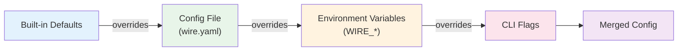

# Configuration Reference

> **Feature/Project:** `Configuration Reference`
>
> **WIP ID:** `WIP-13`
>
> **Author:** `Tarun Ashok`
>
> **Status:** `Draft`
>
> **Created:** `2026-02-22`
>
> **Last Updated:** `2026-02-22`

### Revision History

| Version | Date | Author | Changes |
| -- | -- | -- | -- |
| 0.1 | 2026-02-22 | Tarun Ashok | Initial draft |

---

## 1. Overview

### 1.1 Problem Statement

Wire's `operations.md` references "Configuration via `wire.yaml`" but the file format is never documented. The CLI has ~720 lines of flag parsing in `cmd/init.go` with 50+ flags covering HTTP, Raft, TLS, write queues, profiling, and cluster join — none of which are documented. Pipeline configuration exists as example YAML/JSON in `.config/` but with no schema or field reference. Users cannot configure or run Wire without reading source code.

### 1.2 Proposed Solution (Technical Summary)

Document the complete configuration surface: CLI flags (derived from `cmd/init.go`), the `wire.yaml` system configuration file schema, the pipeline configuration schema, environment variable overrides, and all validation rules. This TRD serves as the single source of truth for "how to configure Wire."

### 1.3 Goals & Non-Goals

| Goals (In Scope) | Non-Goals (Explicitly Out) |
| -- | -- |
| Document all CLI flags with types, defaults, and descriptions | Documenting internal Go config structs |
| Define wire.yaml schema with examples | Dynamic configuration reloading |
| Define pipeline YAML schema with examples | Configuration UI / dashboard |
| Document environment variable substitution | Configuration migration tooling |
| Document all validation rules and error messages | Performance impact of config options |

### 1.4 Success Metrics

| Metric | Current Baseline | Target | Measurement |
| -- | -- | -- | -- |
| Documented CLI flags | 0 / 50+ | 100% | Cross-reference with cmd/init.go |
| User can configure a cluster from docs alone | Impossible | Possible | Manual walkthrough |
| Valid wire.yaml example provided | No | Yes | Example validates against schema |

---

## 2. Architecture & System Design

### 2.1 Configuration Loading Hierarchy

```
┌─────────────────────────────────────────────┐
│             Configuration Precedence         │
│   (later sources override earlier)          │
│                                              │
│   1. Built-in defaults (Go code)            │
│   2. Config file (wire.yaml / config.json)  │
│   3. Environment variables (WIRE_*)         │
│   4. CLI flags (highest priority)           │
└─────────────────────────────────────────────┘
```



### 2.2 Component Breakdown

**Component 1:** `cmd/init.go` — Flag Parser
* **Responsibility:** Defines all CLI flags via `spf13/pflag`, parses command-line arguments, applies defaults.
* **Technology:** Go, `spf13/pflag` library
* **Interactions:** Produces a `Config` struct consumed by the main application.

**Component 2:** Configuration File Loader
* **Responsibility:** Reads `wire.yaml` or JSON config files, merges with flag defaults.
* **Technology:** `knadh/koanf` (declared in go.mod, currently commented out in code)
* **Interactions:** Config files specified via `--config` flag. Multiple files merged in order.

**Component 3:** Pipeline Config Parser
* **Responsibility:** Reads pipeline YAML/JSON and constructs a StreamGraph.
* **Technology:** Go YAML/JSON unmarshaler
* **Interactions:** Separate from system config. Submitted via CLI or REST API.

---

## 3. API Design

### 3.1 CLI Flag Reference

#### General Flags

| Flag | Type | Default | Description |
|------|------|---------|-------------|
| `--config` | `[]string` | `.config/config.json` | Path to one or more config files (merged in order) |
| `--node-id` | `string` | _(advertised Raft addr)_ | Unique identifier for this node |
| `--store-db` | `string` | `bbolt` | Backend database for Raft stable/log store (`bbolt`, `badgerdb`) |
| `--debug` | `bool` | `false` | Enable debug mode (verbose logging) |
| `--version` | `bool` | `false` | Print version information and exit |

#### HTTP Server Flags

| Flag | Type | Default | Description |
|------|------|---------|-------------|
| `--http-addr` | `string` | `localhost:4001` | HTTP server bind address |
| `--http-adv-addr` | `string` | _(same as http-addr)_ | Advertised HTTP address |
| `--http-allow-origin` | `string` | `""` | `Access-Control-Allow-Origin` header value |
| `--http-cert` | `string` | `""` | Path to X.509 certificate for HTTPS |
| `--http-key` | `string` | `""` | Path to X.509 private key for HTTPS |
| `--http-ca-cert` | `string` | `""` | Path to CA certificate for HTTPS client verification |
| `--http-verify-client` | `bool` | `false` | Enable mutual TLS for HTTPS |

#### Raft Consensus Flags

| Flag | Type | Default | Description |
|------|------|---------|-------------|
| `--raft-addr` | `string` | `localhost:4002` | Raft communication bind address |
| `--raft-adv-addr` | `string` | _(same as raft-addr)_ | Advertised Raft address |
| `--raft-dir` | `string` | `""` | Directory for Raft data (logs, snapshots) |
| `--raft-timeout` | `duration` | `1s` | Raft heartbeat timeout |
| `--raft-election-timeout` | `duration` | `1s` | Raft election timeout |
| `--raft-apply-timeout` | `duration` | `10s` | Raft log apply timeout |
| `--raft-snap` | `uint64` | `8192` | Outstanding log entries before snapshot |
| `--raft-snap-int` | `duration` | `10s` | Snapshot threshold check interval |
| `--raft-leader-lease-timeout` | `duration` | `0s` | Leader lease timeout (0 = Raft default) |
| `--raft-log-level` | `string` | `DEBUG` | Minimum Raft log level |
| `--raft-non-voter` | `bool` | `false` | Configure as non-voting (read-only) node |
| `--raft-shutdown-stepdown` | `bool` | `true` | Leader steps down before shutdown |
| `--raft-remove-shutdown` | `bool` | `false` | Shutdown Raft if node removed |
| `--raft-cluster-remove-shutdown` | `bool` | `false` | Remove node from cluster on shutdown |
| `--raft-reap-node-timeout` | `duration` | `0` | Reap unreachable voting nodes after this duration (0 = disabled) |
| `--raft-reap-read-only-node-timeout` | `duration` | `0` | Reap unreachable non-voting nodes after this duration (0 = disabled) |

#### Cluster Join Flags

| Flag | Type | Default | Description |
|------|------|---------|-------------|
| `--join` | `string` | `""` | Comma-delimited `host:port` list for cluster join |
| `--join-attempts` | `int` | `5` | Number of join attempts per address |
| `--join-interval` | `duration` | `3s` | Delay between join retries |
| `--join-as` | `string` | `""` | Username for authenticated join |
| `--bootstrap-expect` | `int` | `0` | Min nodes required for bootstrap (0 = single-node) |
| `--bootstrap-expect-timeout` | `duration` | `120s` | Max time for bootstrap process |

#### Node-to-Node Encryption Flags

| Flag | Type | Default | Description |
|------|------|---------|-------------|
| `--node-cert` | `string` | `""` | X.509 certificate for inter-node encryption |
| `--node-key` | `string` | `""` | X.509 private key for inter-node encryption |
| `--node-ca-cert` | `string` | `""` | CA certificate for verifying node certificates |
| `--node-no-verify` | `bool` | `false` | Skip verification of node certificates |
| `--node-verify-client` | `bool` | `false` | Enable mutual TLS for inter-node communication |
| `--node-verify-server-name` | `string` | `""` | Expected hostname on node certificates |

#### Authentication & Backup Flags

| Flag | Type | Default | Description |
|------|------|---------|-------------|
| `--auth` | `string` | `""` | Path to authentication/authorization file |
| `--auto-backup` | `string` | `""` | Path to auto-backup configuration |
| `--auto-restore` | `string` | `""` | Path to auto-restore configuration |
| `--auto-vacuum-int` | `duration` | `0` | Auto-vacuum interval (0 = disabled) |
| `--auto-optimize-int` | `duration` | `24h` | Auto-optimize interval (0 = disabled) |

#### Write Queue Flags

| Flag | Type | Default | Description |
|------|------|---------|-------------|
| `--write-queue-capacity` | `int` | `1024` | Capacity of queued writes queue |
| `--write-queue-batch-size` | `int` | `128` | Batch size for queued writes |
| `--write-queue-timeout` | `duration` | `50ms` | Max time before partial batch flush |
| `--write-queue-tx` | `bool` | `false` | Use transactions for queued writes |

#### Cluster Communication Flags

| Flag | Type | Default | Description |
|------|------|---------|-------------|
| `--cluster-connect-timeout` | `duration` | `30s` | Timeout for initial connection to other nodes |

#### Profiling Flags

| Flag | Type | Default | Description |
|------|------|---------|-------------|
| `--cpu-profile` | `string` | `""` | Path to CPU profile output |
| `--mem-profile` | `string` | `""` | Path to memory profile output |
| `--trace-profile` | `string` | `""` | Path to trace profile output |

### 3.2 System Configuration File (wire.yaml)

```yaml
node:
  id: "node-1"
  data_dir: "/var/lib/wire"
  store_db: "bbolt"
  debug: false

http:
  addr: "0.0.0.0:4001"
  adv_addr: "node1.wire.local:4001"
  allow_origin: "*"
  tls:
    cert: "/etc/wire/certs/http.crt"
    key: "/etc/wire/certs/http.key"
    ca_cert: "/etc/wire/certs/ca.crt"
    verify_client: false

raft:
  addr: "0.0.0.0:4002"
  adv_addr: "node1.wire.local:4002"
  heartbeat_timeout: "1s"
  election_timeout: "1s"
  apply_timeout: "10s"
  snapshot_threshold: 8192
  snapshot_interval: "10s"
  leader_lease_timeout: "0s"
  log_level: "INFO"
  non_voter: false
  shutdown_stepdown: true

cluster:
  join: ["node2:4002", "node3:4002"]
  join_attempts: 5
  join_interval: "3s"
  bootstrap_expect: 3
  bootstrap_expect_timeout: "120s"
  connect_timeout: "30s"

node_tls:
  cert: "/etc/wire/certs/node.crt"
  key: "/etc/wire/certs/node.key"
  ca_cert: "/etc/wire/certs/ca.crt"
  verify_client: true
  verify_server_name: "wire-node"

auth:
  file: "/etc/wire/auth.json"

write_queue:
  capacity: 1024
  batch_size: 128
  timeout: "50ms"
  transactional: false
```

### 3.3 Pipeline Configuration Schema

See WIP-14 Section 3.5 for the full YAML pipeline schema. Key fields:

```yaml
name: "pipeline-name"         # Required
parallelism: 4
checkpoint:
  interval: "10s"
  timeout: "10m"
restart:
  strategy: "fixed-delay"
  attempts: 3
  delay: "10s"
sources: [...]                # See WIP-16 for connector configs
transforms: [...]             # See WIP-14 for transform types
sinks: [...]                  # See WIP-16 for connector configs
```

### 3.4 Environment Variable Substitution

Pipeline configs support `${VAR}` and `${VAR:-default}` syntax:

```yaml
config:
  password: "${DB_PASSWORD}"           # Fails if not set
  host: "${DB_HOST:-localhost}"        # Falls back to "localhost"
```

---

## 4. Data Model & Storage

### 4.1 Port Assignments

| Port | Protocol | Purpose |
|------|----------|---------|
| `4001` | HTTP/HTTPS | REST API, health checks, Prometheus metrics |
| `4002` | TCP | Raft consensus + Yamux data transport |

Both ports are configurable via `--http-addr` and `--raft-addr`.

### 4.2 Data Directory Layout

```
/var/lib/wire/                      # --raft-dir
  raft/                             # Raft log and stable store
    raft.db                         # BoltDB (or BadgerDB) for log/stable store
    snapshots/                      # Raft snapshots
  state/                            # Pebble state databases (per task)
    job-<id>/task-<n>/pebble-db/
```

---

## 5. Design Decisions & Trade-offs

### Decision 1: pflag for CLI parsing (not cobra)

|  |  |
| -- | -- |
| **Context** | Wire needs a CLI parser. |
| **Options Considered** | (A) `spf13/cobra` (subcommands), (B) `spf13/pflag` (flat flags), (C) `urfave/cli` |
| **Decision** | Option B: pflag (already implemented in codebase) |
| **Rationale** | Wire is a single binary with a single mode. Subcommands add unnecessary complexity. pflag is mature and POSIX-compliant. |
| **Trade-offs Accepted** | No subcommand structure. All flags are top-level. |
| **Revisit Trigger** | If Wire adds separate `coordinator` and `worker` binaries/modes. |

### Decision 2: koanf for config file merging

|  |  |
| -- | -- |
| **Context** | Need to merge multiple config file formats (YAML, JSON) with CLI flags. |
| **Options Considered** | (A) `knadh/koanf` (already in go.mod), (B) `spf13/viper`, (C) Custom loader |
| **Decision** | Option A: koanf (already chosen, implementation in progress) |
| **Rationale** | Lightweight, supports multiple formats, composable providers. Already a dependency. |
| **Trade-offs Accepted** | Less ecosystem support than Viper. |
| **Revisit Trigger** | If koanf lacks features needed for config hot-reload. |

---

## 6. Edge Cases & Failure Modes

| # | Scenario | Handling | Impact | Severity |
| -- | -- | -- | -- | -- |
| 1 | `--http-addr` and `--raft-addr` set to same value | Validation error at startup: "HTTP and Raft addresses must differ" | Startup blocked | Low |
| 2 | Advertised address is `0.0.0.0` | Validation error: "advertised address is not routable" | Startup blocked | Low |
| 3 | `--http-cert` set without `--http-key` | Validation error: "both must be set, or neither" | Startup blocked | Low |
| 4 | `--join` and `--disco-mode` both set | Validation error: "mutually exclusive" | Startup blocked | Low |
| 5 | Node tries to join itself | Validation error: "cannot join with itself unless bootstrapping" | Startup blocked | Low |
| 6 | `--raft-reap-node-timeout` set to 0 or negative | Validation error: "must be greater than 0" | Startup blocked | Low |
| 7 | Config file references non-existent file path | Validation error from `CheckFilePaths()` | Startup blocked | Low |
| 8 | Pipeline YAML references undefined transform input | Validation error: "input 'x' not found" | Job rejected | Low |
| 9 | Environment variable in pipeline config not set | Substitution fails, error returned | Job rejected | Medium |

---

## 7. Security & Compliance

### 7.1 Credential Handling

* Credentials should **never** be stored in config files.
* Use `${ENV_VAR}` substitution for all secrets in pipeline configs.
* The `--auth` flag points to an external auth file (not inline in wire.yaml).
* TLS certificate paths are validated at startup to prevent misconfiguration.

---

## 8. Testing Strategy

| Test Type | Scope | Tools | Coverage Target |
| -- | -- | -- | -- |
| Unit Tests | Config parsing, validation rules, env var substitution | Go `testing` | 100% of validation rules |
| Integration Tests | Full config load from file + flags + env | Test fixtures | All config file formats |
| Smoke Tests | Wire starts with example configs | Docker | Both wire.yaml and pipeline.yaml examples |

### 8.1 Key Test Scenarios

1. All default values produce a valid startup (single-node mode)
2. `--config` with multiple files merges correctly (later overrides earlier)
3. Every validation rule produces the expected error message
4. `${ENV_VAR}` and `${ENV_VAR:-default}` substitution works correctly
5. Example wire.yaml and pipeline.yaml from this TRD parse without errors

---

## 9. Open Questions & Risks

| # | Question / Risk | Owner | Status |
| -- | -- | -- | -- |
| 1 | Should wire.yaml support TOML format in addition to YAML and JSON? | Tarun | Open |
| 2 | The koanf config loader is currently commented out in cmd/init.go. When will it be re-enabled? | Tarun | Open |
| 3 | Should config validation produce all errors at once or fail on first error? | Tarun | Open |
| 4 | Risk: Discovery modes (consul-kv, etcd-kv, dns, dns-srv) are defined in code but commented out. When will they be enabled? | — | Acknowledged |
