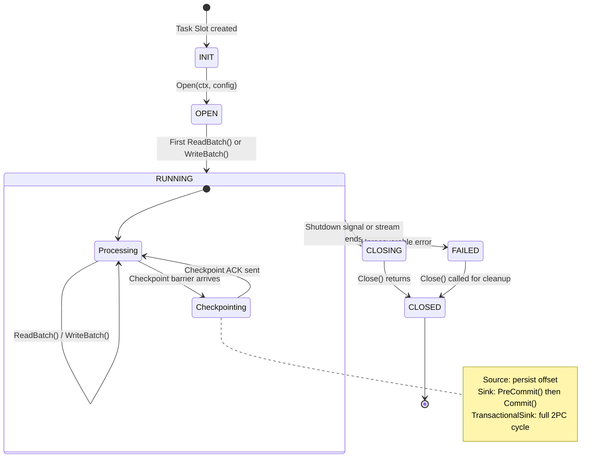

# Connector SDK & Built-in Connectors

> **Feature/Project:** `Connector SDK & HTTP API Connector`
>
> **WIP ID:** `WIP-16`
>
> **Author:** `Tarun Ashok`
>
> **Status:** `Draft`
>
> **Created:** `2026-02-22`
>
> **Last Updated:** `2026-02-23`

### Revision History

| Version | Date | Author | Changes |
| -- | -- | -- | -- |
| 0.1 | 2026-02-22 | Tarun Ashok | Initial draft |
| 0.2 | 2026-02-23 | Tarun Ashok | Scoped to HTTP API connector only |

---

## 1. Overview

### 1.1 Problem Statement

Wire's architecture docs reference connectors but **zero connector code exists, no interfaces are defined, and no configuration is documented**. The AGENTS.md lists Source/Sink interfaces (`Connect()`, `Read()`, `Write()`, `Close()`) but these don't exist in the codebase and are too simplistic for Wire's exactly-once guarantees (they lack offset management, watermark generation, and transactional commit hooks).

### 1.2 Proposed Solution (Technical Summary)

Define a connector SDK with two core interfaces — `Source` (replayable reads with offset tracking and watermark generation) and `Sink` (batch writes with optional transactional semantics). Additionally define a `TransactionalSink` extension for exactly-once delivery via two-phase commit tied to Wire's checkpoint lifecycle. Provide a built-in HTTP API connector (source and sink) and a registration mechanism for custom connectors.

### 1.3 Goals & Non-Goals

| Goals (In Scope) | Non-Goals (Explicitly Out) |
| -- | -- |
| Define Source interface with replay, offset, and watermark support | CDC (Change Data Capture) framework |
| Define Sink interface with batch writes | Schema registry integration |
| Define TransactionalSink for 2PC exactly-once | Dynamic connector loading (plugins at runtime) |
| Document HTTP API source and sink connector | Third-party connector integrations |
| Provide connector registration/factory mechanism | Connector auto-discovery |
| Document custom connector development guide | Connector performance benchmarks |

### 1.4 Success Metrics

| Metric | Current Baseline | Target | Measurement |
| -- | -- | -- | -- |
| Defined connector interfaces | 0 | 2 (Source + Sink) + 1 (TransactionalSink) | Code review |
| Built-in connectors | 0 | 1 (HTTP API) | Code review |
| Custom connector can be written from docs | Impossible | < 1 hour | Developer trial |

---

## 2. Architecture & System Design

### 2.1 High-Level Architecture

```
┌──────────────────────────────────────────────────────┐
│                    Wire Runtime                       │
│                                                       │
│  ┌─────────┐    ┌──────────┐    ┌─────────────────┐ │
│  │ Source   │───▶│ Operator │───▶│ Sink            │ │
│  │ (reads)  │    │  Chain   │    │ (writes)        │ │
│  └────┬─────┘    └──────────┘    └───────┬─────────┘ │
│       │                                   │           │
│  RestoreOffset()                    WriteBatch()      │
│  ReadBatch()                        PreCommit()       │
│  GenerateWatermark()                Commit()          │
│       │                              Abort()          │
└───────┼──────────────────────────────┼────────────────┘
        │                              │
        ▼                              ▼
  ┌───────────┐                 ┌────────────┐
  │ HTTP API  │                 │  HTTP API  │
  │ Source    │                 │  Sink      │
  │ (ingest  │                 │ (POST to   │
  │  endpoint)│                 │  external) │
  └───────────┘                 └────────────┘
```

### 2.2 Component Breakdown

**Component 1:** `sdk.Source` interface
* **Responsibility:** Read events from an external system with replayability.
* **Technology:** Go interface in `sdk/` package
* **Interactions:** Called by Task Slot runtime. `RestoreOffset` called during recovery. `GenerateWatermark` called periodically.

**Component 2:** `sdk.Sink` interface
* **Responsibility:** Write events to an external system.
* **Technology:** Go interface in `sdk/` package
* **Interactions:** Called by Task Slot runtime. `WriteBatch` called with buffered events.

**Component 3:** `sdk.TransactionalSink` interface
* **Responsibility:** Extends Sink with transaction support for exactly-once. Participates in checkpoint-driven two-phase commit.
* **Technology:** Go interface extending `sdk.Sink`
* **Interactions:** `BeginTransaction` called at start, `PreCommit` on barrier receipt, `Commit` on global checkpoint completion, `Abort` on failure.

**Component 4:** Connector Registry
* **Responsibility:** Maps connector type strings (e.g., `"http-api"`) to factory functions for Source/Sink creation.
* **Technology:** Global registry with `RegisterSource` / `RegisterSink` functions
* **Interactions:** YAML parser and SDK look up connectors by type string.

### 2.2.1 Connector Lifecycle State Machine

The lifecycle of a connector (Source or Sink) within a Task Slot, showing the callback ordering that connector implementers must follow:



### 2.3 Data Flow

**Source data flow:**
1. Runtime calls `source.Open(ctx, config)` on task start.
2. Runtime calls `source.RestoreOffset(ctx, offset)` if recovering from checkpoint.
3. Runtime loops: `events, offset, err := source.ReadBatch(ctx, maxBatch)`
4. Runtime periodically calls `source.GenerateWatermark()` to advance watermarks.
5. On checkpoint, runtime persists the latest `Offset` in the checkpoint.
6. On shutdown, runtime calls `source.Close()`.

**Sink data flow (standard):**
1. Runtime calls `sink.Open(ctx, config)`.
2. Runtime batches events and calls `sink.WriteBatch(ctx, events)`.
3. On shutdown, runtime calls `sink.Close()`.

**Sink data flow (transactional, exactly-once):**
1. Runtime calls `sink.Open(ctx, config)` then `sink.BeginTransaction(ctx)`.
2. Runtime calls `sink.WriteBatch(ctx, events)` within the transaction.
3. On checkpoint barrier: `sink.PreCommit(ctx, checkpointID)` (Phase 1).
4. On global checkpoint complete: `sink.Commit(ctx, checkpointID)` (Phase 2).
5. New cycle: `sink.BeginTransaction(ctx)`.
6. On failure: `sink.Abort(ctx)`, then restore and restart.

---

## 3. API Design

### 3.1 Source Interface

```go
type Source interface {
    // Open initializes the source connection.
    Open(ctx context.Context, config SourceConfig) error

    // ReadBatch reads the next batch of events. Blocks until data available.
    ReadBatch(ctx context.Context, maxBatch int) ([]Event, Offset, error)

    // RestoreOffset rewinds to a previously saved offset (for recovery).
    RestoreOffset(ctx context.Context, offset Offset) error

    // GenerateWatermark returns the current watermark timestamp.
    GenerateWatermark() int64

    // Close releases all resources.
    Close() error
}

type Offset []byte

type SourceConfig struct {
    OperatorID   string
    SubtaskIndex int   // Which parallel instance (0..parallelism-1)
    Parallelism  int   // Total parallel instances
}
```

### 3.2 Sink Interface

```go
type Sink interface {
    Open(ctx context.Context, config SinkConfig) error
    WriteBatch(ctx context.Context, events []Event) error
    Close() error
}

type SinkConfig struct {
    OperatorID   string
    SubtaskIndex int
    Parallelism  int
}
```

### 3.3 TransactionalSink Interface

```go
type TransactionalSink interface {
    Sink
    BeginTransaction(ctx context.Context) error
    PreCommit(ctx context.Context, checkpointID int64) error
    Commit(ctx context.Context, checkpointID int64) error
    Abort(ctx context.Context) error
}
```

### 3.4 Connector Registry

```go
// Registration (typically in init())
func RegisterSource(typeName string, factory func() Source)
func RegisterSink(typeName string, factory func() Sink)

// Lookup (used by YAML parser and runtime)
func NewSource(typeName string) (Source, error)
func NewSink(typeName string) (Sink, error)
```

### 3.5 HTTP API Source

Wire exposes an HTTP endpoint that external systems POST events to. Events are buffered in a bounded queue and consumed by the source's `ReadBatch` method.

```yaml
type: http-api
config:
  address: ":8080"                     # Listen address (required)
  path: "/ingest"                      # Endpoint path (default: /ingest)
  max_body_size: "10MB"                # Max request body size
  buffer_size: 10000                   # Internal event buffer capacity
  auth:
    type: "bearer"                     # none | bearer | basic
    token: "${HTTP_AUTH_TOKEN}"         # For bearer auth
    username: ""                       # For basic auth
    password: ""                       # For basic auth
```

**Behavior:**
- Wire starts an HTTP server on the configured address.
- External systems POST JSON events to the endpoint.
- Events are validated and queued in a bounded buffer.
- `ReadBatch` drains the buffer up to `maxBatch` events.
- If the buffer is full, the HTTP endpoint returns `429 Too Many Requests` (backpressure).
- Offset tracking: the source assigns a monotonically increasing sequence number to each received event. On recovery, events after the last checkpointed sequence are re-requested from the sender (requires sender-side replay support) or acknowledged as lost.

**Request format:**

```
POST /ingest HTTP/1.1
Content-Type: application/json

{
  "events": [
    {
      "key": "user-123",
      "value": "{\"action\": \"click\", \"page\": \"/home\"}",
      "event_time": 1706000000000,
      "headers": {"source": "web-app"}
    }
  ]
}
```

**Response:**

```json
// Success (200 OK)
{"accepted": 5, "sequence": 10042}

// Buffer full (429 Too Many Requests)
{"error": "buffer full", "retry_after_ms": 100}

// Validation error (400 Bad Request)
{"error": "invalid event format", "details": "..."}
```

### 3.6 HTTP API Sink

Wire POSTs processed events to an external HTTP endpoint.

```yaml
type: http-api
config:
  url: "https://api.example.com/events"  # Target URL (required)
  method: "POST"                         # HTTP method (default: POST)
  headers:                               # Custom headers
    Content-Type: "application/json"
    Authorization: "Bearer ${API_TOKEN}"
  batch_size: 100                        # Events per HTTP request
  timeout: "30s"                         # Request timeout
  retry:
    max_attempts: 3                      # Max retry attempts
    backoff: "exponential"               # constant | exponential
    initial_delay: "1s"
    max_delay: "30s"
  idempotency_key_field: "id"            # Event field used as idempotency key (optional)
```

**Behavior:**
- Wire batches events and POSTs them to the configured URL.
- Each request contains a JSON array of events.
- Retries on 5xx responses and network errors with configurable backoff.
- 4xx responses (except 429) are treated as permanent failures and routed to DLQ.
- 429 responses are retried with the `Retry-After` header value.
- If `idempotency_key_field` is set, the sink includes an `X-Idempotency-Key` header for at-least-once delivery with deduplication support on the receiver side.

**Request format (sent by Wire):**

```
POST /events HTTP/1.1
Content-Type: application/json
X-Wire-Batch-ID: "batch-42-subtask-0"

{
  "events": [
    {
      "key": "user-123",
      "value": "{\"count\": 42}",
      "event_time": 1706000000000,
      "headers": {"window_start": "2024-01-15T12:00:00Z"}
    }
  ]
}
```

---

## 4. Data Model & Storage

### 4.1 Connector Classification

| Connector | Source | Sink | Replayable | Transactional Sink | Idempotent Sink |
| -- | -- | -- | -- | -- | -- |
| HTTP API | Yes (receiver) | Yes | No (at-least-once) | No | Via idempotency key |

### 4.2 Storage Considerations

* **Source offsets:** Serialized as `Offset` (opaque `[]byte`) and stored in checkpoint state alongside operator state. For the HTTP API source, the offset is the last sequence number processed.
* **Sink transaction state:** Transaction IDs tracked in coordinator metadata for crash recovery during 2PC. The HTTP API sink does not support 2PC; it relies on idempotent delivery.

---

## 5. Design Decisions & Trade-offs

### Decision 1: `ReadBatch` returns `Offset` (not stored internally)

|  |  |
| -- | -- |
| **Context** | Source needs to track position for checkpoint/recovery. |
| **Options Considered** | (A) Source returns offset per batch, runtime stores it; (B) Source manages its own offset checkpointing; (C) Offset stored in Pebble keyed state |
| **Decision** | Option A |
| **Rationale** | Clean separation of concerns. Source focuses on reading, runtime focuses on checkpointing. Offset is just another piece of checkpoint state. |
| **Trade-offs Accepted** | Source must be stateless between calls — cannot assume internal state survives recovery. |
| **Revisit Trigger** | If sources need complex multi-part offsets that don't serialize well to `[]byte`. |

### Decision 2: TransactionalSink as separate interface (not baked into Sink)

|  |  |
| -- | -- |
| **Context** | Not all sinks support transactions. Forcing all sinks to implement 2PC methods is wasteful. |
| **Options Considered** | (A) Single Sink interface with optional no-op transaction methods; (B) Separate TransactionalSink interface via Go interface embedding |
| **Decision** | Option B |
| **Rationale** | Clean type system. Runtime does `if ts, ok := sink.(TransactionalSink); ok { ... }`. No-op methods are error-prone. |
| **Trade-offs Accepted** | Two interfaces to document and test. |
| **Revisit Trigger** | If the number of sink interface variants grows beyond 2. |

### Decision 3: Structured Go config (not generic map)

|  |  |
| -- | -- |
| **Context** | Connectors need configuration, but each connector has different fields. |
| **Options Considered** | (A) Each connector defines its own Go config struct; (B) Generic `map[string]interface{}` config; (C) YAML config parsed by each connector |
| **Decision** | Option A with YAML unmarshaling |
| **Rationale** | Strong typing with validation. YAML tags provide schema documentation. Each connector's config struct is its own documentation. |
| **Trade-offs Accepted** | New connector = new config struct. Cannot dynamically add config fields. |
| **Revisit Trigger** | If a plugin/dynamic loading system is added. |

### Decision 4: HTTP API as the only built-in connector

|  |  |
| -- | -- |
| **Context** | Wire needs at least one connector to be functional. The question is how many to build. |
| **Options Considered** | (A) HTTP API only; (B) HTTP API + common integrations; (C) Full connector ecosystem |
| **Decision** | Option A |
| **Rationale** | HTTP API is universal — any system can send HTTP requests. Building specific integrations adds maintenance burden and couples Wire to external systems. Users with specific needs can write custom connectors using the SDK. |
| **Trade-offs Accepted** | Users must build or adapt their own connectors for non-HTTP integrations. Higher friction for common use cases. |
| **Revisit Trigger** | If user demand for specific connectors becomes a significant adoption barrier. |

---

## 6. Edge Cases & Failure Modes

| # | Scenario | Handling | Impact | Severity |
| -- | -- | -- | -- | -- |
| 1 | HTTP API source: burst exceeds buffer capacity | HTTP endpoint returns `429 Too Many Requests`. Sender retries. | Sender-side backpressure | Low |
| 2 | HTTP API source: malformed JSON in request body | Returns `400 Bad Request` with error details. Event not ingested. | Single request rejected | Low |
| 3 | HTTP API sink: target endpoint returns 5xx | Retry with exponential backoff up to `max_attempts`. If exhausted, event routed to DLQ. | Temporary delay or DLQ | Medium |
| 4 | HTTP API sink: target endpoint returns 4xx (not 429) | Permanent failure. Event routed to DLQ. | Data routed to DLQ | Medium |
| 5 | HTTP API source: recovery from checkpoint but events not replayable | Events between last checkpoint and failure are lost. HTTP API source is at-least-once when senders support replay, at-most-once otherwise. | Potential data loss | High |
| 6 | HTTP API sink: network timeout during POST | Treated as retryable failure. Retried with backoff. Idempotency key prevents duplicates if receiver supports it. | Temporary delay | Medium |
| 7 | TransactionalSink Commit succeeds but ACK lost | On restart, Commit is called again with same checkpointID. Sink must handle idempotent Commit. | No impact if idempotent | Medium |

---

## 7. Security & Compliance

### 7.1 Authentication & Authorization

* All connector credentials support `${ENV_VAR}` substitution — never stored in plain text in pipeline configs.
* HTTP API source supports bearer token and basic auth for ingest endpoint authentication.
* HTTP API sink supports bearer token, basic auth, and custom headers for outbound requests.

### 7.2 Data Protection

* **In transit:** HTTP API connectors use HTTPS (TLS) by default. HTTP (non-TLS) requires explicit opt-in via configuration.
* **Credentials at rest:** Stored only in environment variables or secret management systems (see WIP-17).

---

## 8. Testing Strategy

| Test Type | Scope | Tools | Coverage Target |
| -- | -- | -- | -- |
| Unit Tests | Interface contracts, config parsing, serialization | Go `testing` | >= 90% |
| Integration Tests | HTTP API source/sink against mock HTTP servers | Go `httptest` | Happy path + error cases |
| Contract Tests | Source replay correctness, Sink idempotency | Custom test harness | HTTP API connector |
| Load Tests | HTTP API source under high ingest rate | Go benchmarks, `vegeta` | Buffer backpressure behavior |

### 8.1 Key Test Scenarios

1. HTTP API source: POST events → ReadBatch → verify events match
2. HTTP API source: buffer full → verify 429 response → drain buffer → verify 200
3. HTTP API source: checkpoint → restart → verify offset restored
4. HTTP API sink: WriteBatch → verify POST sent with correct payload
5. HTTP API sink: target returns 503 → verify retry with backoff
6. HTTP API sink: target returns 400 → verify event routed to DLQ
7. Custom connector: implement Source, register, verify it works via YAML pipeline

---

## 9. Open Questions & Risks

| # | Question / Risk | Owner | Status |
| -- | -- | -- | -- |
| 1 | Should the HTTP API source support WebSocket connections for real-time streaming? | Tarun | Open |
| 2 | Should the HTTP API sink support configurable serialization formats (JSON, msgpack, protobuf)? | Tarun | Open |
| 3 | Risk: HTTP API source is not truly replayable — on recovery, events between last checkpoint and failure may be lost unless the sender implements replay logic. | — | Acknowledged |
| 4 | Should connector config support hot-reload without job restart? | Tarun | Open |
| 5 | Should Wire provide a `/health` endpoint on the HTTP API source for load balancer integration? | Tarun | Open |
