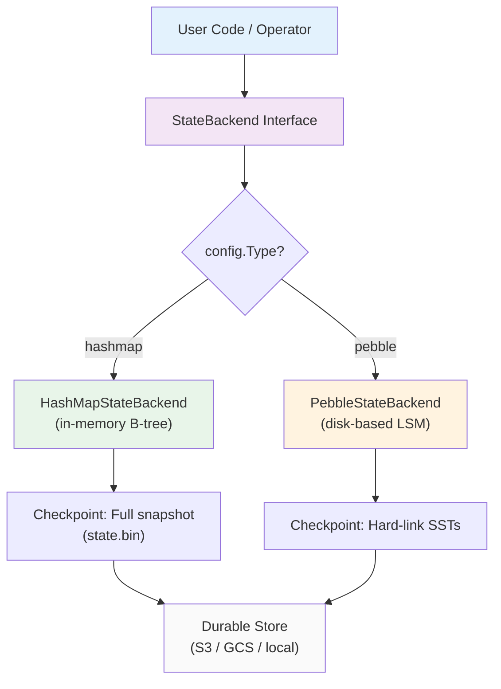

# Multiple State Backends

> **Feature/Project:** `Multiple State Backends`
>
> **WIP ID:** `WIP-18`
>
> **Author:** `Tarun Ashok`
>
> **Status:** `Draft`
>
> **Created:** `2026-02-23`
>
> **Last Updated:** `2026-02-23`

### Revision History

| Version | Date | Author | Changes |
| -- | -- | -- | -- |
| 0.1 | 2026-02-23 | Tarun Ashok | Initial draft |

---

## 1. Overview

### 1.1 Problem Statement

Wire's `state-backend.md` defines a `StateBackend` interface with seven methods (`Put`, `Get`, `Delete`, `NewIterator`, `Checkpoint`, `Restore`, `Close`) and documents Pebble as the sole implementation. The Flink gap analysis identifies this as a gap: Flink offers three state backend options (HashMapStateBackend, EmbeddedRocksDBStateBackend, ForStStateBackend), while Wire offers only Pebble.

The consequences:

- **Development friction:** Developers running local tests or `sdk.MiniCluster` (WIP-14 Section 8.2) pay Pebble overhead — disk I/O, directory creation, 3-4 background goroutines for compaction and WAL sync per task (WIP-02 Section 2.2) — when their total state might be a few KB.
- **No lightweight option:** Simple jobs (stateless transforms with minimal keyed state, event counters, small lookup tables) are forced to use a full LSM-tree engine designed for TB-scale state.
- **Hardcoded backend:** The `StateBackend` interface exists for decoupling, but there is no factory, no configuration, and no second implementation. The abstraction is unused.

### 1.2 Proposed Solution (Technical Summary)

Introduce two concrete implementations behind the existing `StateBackend` interface, selectable via configuration:

1. **HashMapStateBackend** — Pure in-memory backend using a B-tree for ordered key storage. Checkpointing serializes the entire map to a single binary blob uploaded to durable storage. Suitable for development, unit tests, and production jobs with small state (< 256 MB per task).

2. **PebbleStateBackend** — The existing default. Formalized as one of multiple options. No behavioral changes. LSM-tree, disk-based, incremental hard-link checkpoints.

Backend selection is via configuration at four levels (per WIP-13 precedence): `pipeline.yaml` field `state_backend`, `wire.yaml` system default, `env.SetStateBackend()` in the Go SDK (WIP-14 Section 3.1), or `--state-backend` CLI flag. The default remains `pebble` for backwards compatibility.

### 1.3 Goals & Non-Goals

| Goals (In Scope) | Non-Goals (Explicitly Out) |
| -- | -- |
| Define HashMapStateBackend implementation and behavior | Disaggregated/remote state backend (ForSt equivalent) |
| Formalize PebbleStateBackend as one of multiple options | Changing the `StateBackend` interface itself |
| Define backend selection via config, SDK, and CLI | Per-operator backend selection (all operators in a job use the same backend) |
| Define checkpoint/restore behavior for in-memory backend | State migration between backends (e.g., migrating a Pebble savepoint to HashMap) |
| Define memory limits and safeguards for HashMap backend | Spill-to-disk for HashMap when memory is exceeded |
| Specify checkpoint metadata changes (WIP-06 impact) | Checkpoint format migration tooling |

### 1.4 Success Metrics

| Metric | Current Baseline | Target | Measurement |
| -- | -- | -- | -- |
| Available state backend implementations | 1 (Pebble) | 2 (Pebble + HashMap) | Code review |
| MiniCluster test startup time | Requires Pebble disk setup | < 100ms with HashMap | Benchmark |
| Backend configurable without code change | No | Yes, via pipeline.yaml or CLI flag | Configuration test |
| HashMap checkpoint/restore correctness | N/A | Passes same test suite as Pebble | Integration tests |

---

## 2. Architecture & System Design

### 2.1 High-Level Architecture

```
User Code / Operator
       |
       v
+--------------------------+
| StateBackend Interface   |  <-- Defined in state-backend.md
| Put/Get/Delete/Iterator  |
| Checkpoint/Restore/Close |
+--------------------------+
       |                 |
       v                 v
+---------------+  +-------------------+
| HashMapState  |  | PebbleState       |
| Backend       |  | Backend (default) |
| (in-memory)   |  | (disk-based LSM)  |
+---------------+  +-------------------+
       |                 |
       v                 v
  Checkpoint:        Checkpoint:
  Full snapshot      Hard-link snapshot
  (single blob)      (incremental SSTs)
       |                 |
       v                 v
+-----------------------------------+
| Durable Store (S3/MinIO/local FS) |
+-----------------------------------+
```



### 2.2 Component Breakdown

**Component 1:** StateBackendFactory
* **Responsibility:** Creates the appropriate `StateBackend` implementation based on configuration.
* **Technology:** Go factory function `NewStateBackend(config StateBackendConfig) (StateBackend, error)`
* **Interactions:** Called by the Task Slot initialization code when deploying a task. Reads `StateBackendConfig` from `JobConfig.properties` (WIP-07 `SubmitJob` message).

**Component 2:** HashMapStateBackend
* **Responsibility:** In-memory state storage implementing the full `StateBackend` interface. Uses a B-tree for ordered key storage to support `NewIterator(prefix)` with efficient prefix scans.
* **Technology:** `github.com/tidwall/btree` (pure Go, generics-based). No CGO.
* **Interactions:** Same interface as PebbleStateBackend. Used by operator chain goroutines (WIP-02). No background goroutines needed (no compaction, no WAL sync).

**Component 3:** PebbleStateBackend (existing, formalized)
* **Responsibility:** Disk-based state storage. No changes to behavior.
* **Technology:** Pebble (CockroachDB).
* **Interactions:** Unchanged from current `state-backend.md`.

**Component 4:** HashMapSnapshotSerializer
* **Responsibility:** Serializes the in-memory B-tree to a binary format for checkpoint upload and deserializes it on restore.
* **Technology:** Custom length-prefixed binary format with magic number, version, and CRC32 checksum.
* **Interactions:** Called by `HashMapStateBackend.Checkpoint()` and `HashMapStateBackend.Restore()`. Produces a single file uploaded to the same S3 layout defined in WIP-06.

### 2.3 Data Flow: Checkpoint with HashMap Backend

1. Coordinator sends `TriggerCheckpoint(N)` (WIP-07 Section 3.2.3).
2. Source tasks inject barriers (execution-model.md Section 5).
3. Task with HashMapStateBackend receives barrier, performs barrier alignment (WIP-05).
4. Task calls `backend.Checkpoint(N)`:
   a. Acquires a read lock on the B-tree.
   b. Iterates all entries, serializes to binary format.
   c. Releases the read lock.
   d. Writes serialized blob to a temp file or in-memory buffer.
5. Background goroutine uploads the blob to `s3://bucket/wire/jobs/{job_id}/checkpoints/chk-{N}/task-{i}-state/state.bin`.
6. Task sends `AcknowledgeCheckpoint(N)` with `StateHandle` (WIP-07 Section 3.2.4).
7. Resume processing.

Key difference from Pebble: step 4 is a **full snapshot** (not incremental). The entire state is serialized every time. This is acceptable because HashMap is designed for small state.

### 2.4 Data Flow: Restore with HashMap Backend

1. Coordinator reads `metadata.json` (WIP-06).
2. New task downloads `state.bin` from durable storage.
3. Task calls `backend.Restore(handle)`:
   a. Validates magic number, version, and CRC32 checksum.
   b. Deserializes entries back into the B-tree.
   c. State is fully restored in memory.
4. Task transitions to RUNNING.

---

## 3. API Design

### 3.1 StateBackendFactory

```go
// StateBackendType enumerates available state backends.
type StateBackendType string

const (
    StateBackendHashMap StateBackendType = "hashmap"
    StateBackendPebble  StateBackendType = "pebble"
)

// StateBackendConfig holds configuration for state backend creation.
type StateBackendConfig struct {
    Type        StateBackendType
    // Pebble-specific
    DataDir     string  // e.g., "/data/wire/worker-1/job-abc/task-3/pebble-db"
    // HashMap-specific
    MaxMemoryMB int     // Memory limit for HashMap backend (default: 256)
}

// NewStateBackend creates a StateBackend based on configuration.
func NewStateBackend(config StateBackendConfig) (StateBackend, error) {
    switch config.Type {
    case StateBackendHashMap:
        return NewHashMapStateBackend(config.MaxMemoryMB), nil
    case StateBackendPebble:
        return NewPebbleStateBackend(config.DataDir)
    default:
        return nil, fmt.Errorf("unknown state backend type: %q", config.Type)
    }
}
```

### 3.2 HashMapStateBackend Implementation

```go
type HashMapStateBackend struct {
    mu          sync.RWMutex
    tree        *btree.BTreeG[kvEntry]    // Sorted by key for prefix scans
    maxMemBytes int64
    curMemBytes int64
}

type kvEntry struct {
    Key   []byte
    Value []byte
}

func NewHashMapStateBackend(maxMemoryMB int) *HashMapStateBackend {
    return &HashMapStateBackend{
        tree:        btree.NewBTreeG[kvEntry](kvLess),
        maxMemBytes: int64(maxMemoryMB) * 1024 * 1024,
    }
}

func (h *HashMapStateBackend) Put(key, value []byte) error {
    h.mu.Lock()
    defer h.mu.Unlock()

    newSize := h.curMemBytes + int64(len(key)) + int64(len(value))
    if prev, ok := h.tree.Get(kvEntry{Key: key}); ok {
        newSize -= int64(len(prev.Key)) + int64(len(prev.Value))
    }
    if newSize > h.maxMemBytes {
        return ErrStateMemoryExceeded
    }

    h.tree.Set(kvEntry{Key: key, Value: value})
    h.curMemBytes = newSize
    return nil
}

func (h *HashMapStateBackend) Get(key []byte) ([]byte, error) {
    h.mu.RLock()
    defer h.mu.RUnlock()

    if entry, ok := h.tree.Get(kvEntry{Key: key}); ok {
        return entry.Value, nil
    }
    return nil, nil // Key not found returns nil, nil (same as Pebble convention)
}

func (h *HashMapStateBackend) Delete(key []byte) error {
    h.mu.Lock()
    defer h.mu.Unlock()

    if prev, ok := h.tree.Delete(kvEntry{Key: key}); ok {
        h.curMemBytes -= int64(len(prev.Key)) + int64(len(prev.Value))
    }
    return nil
}

func (h *HashMapStateBackend) NewIterator(prefix []byte) Iterator {
    h.mu.RLock()
    defer h.mu.RUnlock()

    // Copy matching entries under read lock for a consistent snapshot.
    // See Section 5, Decision 3 for rationale.
    var entries []kvEntry
    h.tree.Ascend(kvEntry{Key: prefix}, func(entry kvEntry) bool {
        if !bytes.HasPrefix(entry.Key, prefix) {
            return false // Past the prefix range, stop
        }
        entries = append(entries, kvEntry{
            Key:   slices.Clone(entry.Key),
            Value: slices.Clone(entry.Value),
        })
        return true
    })
    return newSliceIterator(entries)
}

func (h *HashMapStateBackend) Checkpoint(checkpointID int64) (SnapshotHandle, error) {
    h.mu.RLock()
    defer h.mu.RUnlock()

    buf := serializeState(h.tree)

    return SnapshotHandle{
        Data:       buf,
        Format:     "hashmap-v1",
        NumEntries: h.tree.Len(),
        SizeBytes:  int64(len(buf)),
    }, nil
}

func (h *HashMapStateBackend) Restore(handle SnapshotHandle) error {
    h.mu.Lock()
    defer h.mu.Unlock()

    h.tree.Clear()
    h.curMemBytes = 0

    entries, err := deserializeState(handle.Data)
    if err != nil {
        return fmt.Errorf("state restore failed: %w", err)
    }

    for _, entry := range entries {
        h.tree.Set(entry)
        h.curMemBytes += int64(len(entry.Key)) + int64(len(entry.Value))
    }
    return nil
}

func (h *HashMapStateBackend) Close() error {
    h.mu.Lock()
    defer h.mu.Unlock()
    h.tree.Clear()
    h.curMemBytes = 0
    return nil
}
```

### 3.3 Error Types

```go
var (
    ErrStateMemoryExceeded = errors.New("hashmap state backend: memory limit exceeded")
    ErrUnknownBackendType  = errors.New("unknown state backend type")
)
```

### 3.4 SDK Integration (extends WIP-14 Section 3.1)

```go
env := sdk.NewStreamExecutionEnvironment()
env.SetStateBackend(sdk.NewHashMapStateBackend(256)) // 256 MB limit
// or
env.SetStateBackend(sdk.NewPebbleStateBackend("/data/wire"))
```

`SetStateBackend()` is already defined in WIP-14. This WIP provides the concrete backend implementations.

### 3.5 Configuration (extends WIP-13)

#### pipeline.yaml

```yaml
name: "my-small-state-job"
parallelism: 4
state_backend:
  type: "hashmap"                    # "hashmap" or "pebble" (default: "pebble")
  hashmap:
    max_memory_mb: 256               # Per-task memory limit (default: 256)
  pebble:
    data_dir: "/data/wire"           # Base directory for Pebble (default: /var/lib/wire/state)
checkpoint:
  interval: "10s"
```

#### wire.yaml (system-wide default)

```yaml
state:
  default_backend: "pebble"          # System-wide default
  hashmap:
    max_memory_mb: 256
  pebble:
    data_dir: "/var/lib/wire/state"
```

#### CLI flags

| Flag | Type | Default | Description |
|------|------|---------|-------------|
| `--state-backend` | `string` | `pebble` | State backend type: `hashmap` or `pebble` |
| `--state-hashmap-max-memory-mb` | `int` | `256` | Per-task memory limit for HashMap backend (MB) |

#### Environment variables

| Variable | Maps To |
|----------|---------|
| `WIRE_STATE_BACKEND` | `--state-backend` |
| `WIRE_STATE_HASHMAP_MAX_MEMORY_MB` | `--state-hashmap-max-memory-mb` |

#### Configuration precedence (per WIP-13 Section 2.1)

```
Go SDK SetStateBackend() > CLI flag > pipeline.yaml > wire.yaml > built-in default (pebble)
```

---

## 4. Data Model & Storage

### 4.1 Key Encoding (unchanged)

Both backends use the same composite key encoding from WIP-03 Section 2.3:

```
[KeyGroupPrefix (2 bytes)][OperatorID (4 bytes)][UserKey (N bytes)][Namespace/Window (M bytes)]
```

The HashMap backend stores these composite keys as-is in the B-tree. The B-tree sorts them lexicographically, which means Key Group ordering and prefix scans work identically to Pebble. A range scan for Key Groups [64, 128) uses prefix `0x0040` through `0x0080`, same as Pebble.

### 4.2 Checkpoint Storage Layout

The durable storage layout from WIP-06 is extended with backend-specific state formats:

**Pebble (existing):**
```
s3://bucket/wire/jobs/{job_id}/checkpoints/chk-{N}/
  metadata.json
  task-0-state/
    MANIFEST-000001
    000042.sst
    000043.sst
  task-1-state/
    MANIFEST-000001
    000055.sst
```

**HashMap (new):**
```
s3://bucket/wire/jobs/{job_id}/checkpoints/chk-{N}/
  metadata.json
  task-0-state/
    state.bin                    # Single serialized blob
  task-1-state/
    state.bin
```

### 4.3 Changes to metadata.json (WIP-06 impact)

A new field `state_backend_type` is added to each task entry in `metadata.json`:

```json
{
  "schema_version": 1,
  "tasks": [
    {
      "task_id": "count-window-0",
      "operator_id": "count-window",
      "subtask_index": 0,
      "state_backend_type": "hashmap",
      "state_path": "task-0-state/",
      "state_size_bytes": 65536,
      "state_files": ["state.bin"],
      "key_group_range": { "start": 0, "end": 32 }
    }
  ]
}
```

This field is required for restore to know how to interpret the state files. The `state_files` array contains `["state.bin"]` for HashMap (single file) vs the list of SST/MANIFEST files for Pebble.

This is a backwards-compatible addition — existing checkpoints without `state_backend_type` are assumed to be `"pebble"`. No `schema_version` bump required (per WIP-06 Decision 2: backwards-compatible changes don't bump version).

### 4.4 HashMap Snapshot Format (state.bin)

```
 0                   1                   2                   3
 0 1 2 3 4 5 6 7 8 9 0 1 2 3 4 5 6 7 8 9 0 1 2 3 4 5 6 7 8 9 0 1
+-+-+-+-+-+-+-+-+-+-+-+-+-+-+-+-+-+-+-+-+-+-+-+-+-+-+-+-+-+-+-+-+
|                     Magic ("WHSB")                            |
+-+-+-+-+-+-+-+-+-+-+-+-+-+-+-+-+-+-+-+-+-+-+-+-+-+-+-+-+-+-+-+-+
| Version (1B)  |           NumEntries (4 bytes)                |
+-+-+-+-+-+-+-+-+-+-+-+-+-+-+-+-+-+-+-+-+-+-+-+-+-+-+-+-+-+-+-+-+
|                     Entry 1: KeyLen (4 bytes)                 |
+-+-+-+-+-+-+-+-+-+-+-+-+-+-+-+-+-+-+-+-+-+-+-+-+-+-+-+-+-+-+-+-+
|                     Entry 1: Key (KeyLen bytes)               |
+-+-+-+-+-+-+-+-+-+-+-+-+-+-+-+-+-+-+-+-+-+-+-+-+-+-+-+-+-+-+-+-+
|                     Entry 1: ValueLen (4 bytes)               |
+-+-+-+-+-+-+-+-+-+-+-+-+-+-+-+-+-+-+-+-+-+-+-+-+-+-+-+-+-+-+-+-+
|                     Entry 1: Value (ValueLen bytes)           |
+-+-+-+-+-+-+-+-+-+-+-+-+-+-+-+-+-+-+-+-+-+-+-+-+-+-+-+-+-+-+-+-+
|                     ... (repeat for each entry)               |
+-+-+-+-+-+-+-+-+-+-+-+-+-+-+-+-+-+-+-+-+-+-+-+-+-+-+-+-+-+-+-+-+
|                     CRC32 (4 bytes)                           |
+-+-+-+-+-+-+-+-+-+-+-+-+-+-+-+-+-+-+-+-+-+-+-+-+-+-+-+-+-+-+-+-+
```

| Field | Size | Encoding | Description |
|-------|------|----------|-------------|
| Magic | 4 bytes | ASCII `"WHSB"` | Wire HashMap State Backend. Identifies the file type. |
| Version | 1 byte | uint8 | Format version. Current: `0x01`. |
| NumEntries | 4 bytes | Big-endian uint32 | Number of key-value entries. |
| KeyLen | 4 bytes | Big-endian uint32 | Length of the key in bytes. |
| Key | KeyLen bytes | Raw bytes | The composite key (KeyGroupPrefix + OperatorID + UserKey + ...). |
| ValueLen | 4 bytes | Big-endian uint32 | Length of the value in bytes. |
| Value | ValueLen bytes | Raw bytes | The state value. |
| CRC32 | 4 bytes | Big-endian uint32 | CRC32 (IEEE) of all preceding bytes (magic through last value byte). |

Entries are written in B-tree sort order (lexicographic by key). This means entries are naturally grouped by Key Group prefix, enabling efficient partial restore during rescaling (Section 2.4).

### 4.5 Memory Accounting

| Metric | Description |
|--------|-------------|
| `curMemBytes` | Sum of `len(key) + len(value)` for all entries in the B-tree |
| `maxMemBytes` | Configured limit from `max_memory_mb` |
| B-tree overhead | Not tracked. B-tree node metadata adds ~40-60 bytes per entry. Actual memory usage is ~1.2-1.5x `curMemBytes`. |

Wire exposes `wire_state_backend_memory_bytes{backend="hashmap"}` as a Prometheus gauge metric (per-task).

---

## 5. Design Decisions & Trade-offs

### Decision 1: B-tree for HashMap backend (not Go map)

|  |  |
| -- | -- |
| **Context** | The `StateBackend` interface requires `NewIterator(prefix)` for prefix scans. Go's `map[string][]byte` has no ordered iteration. |
| **Options Considered** | (A) `map[string][]byte` + sort keys on each iterator call, (B) `sync.Map` + sorted copy on iteration, (C) B-tree (`tidwall/btree`), (D) Skip list |
| **Decision** | Option C: B-tree |
| **Rationale** | B-tree provides O(log n) lookups and naturally ordered iteration for prefix scans. The `NewIterator(prefix)` method is critical for window cleanup (scan all keys in a window range) and Key Group extraction during rescaling (scan all keys with a Key Group prefix per WIP-03). A Go map would require O(n log n) sorting on every iterator call. `tidwall/btree` is pure Go, generics-based, and well-tested. |
| **Trade-offs Accepted** | Slightly slower point lookups than Go's built-in map (O(log n) vs O(1) amortized). Acceptable because the HashMap backend targets small state where absolute latency is not the bottleneck. |
| **Revisit Trigger** | If profiling shows B-tree overhead is significant for high-throughput small-state jobs. |

### Decision 2: Full snapshot for HashMap checkpoints (not incremental)

|  |  |
| -- | -- |
| **Context** | Pebble supports incremental checkpoints via hard-links to SSTables. HashMap has no LSM tree or SSTables to hard-link. |
| **Options Considered** | (A) Full snapshot (serialize entire map), (B) Change tracking (track dirty keys, serialize delta), (C) Copy-on-write snapshot using B-tree immutability |
| **Decision** | Option A: Full snapshot |
| **Rationale** | HashMap is designed for small state (< 256 MB). Serializing 256 MB takes ~50-200ms (bounded by memory bandwidth). The simplicity of a full snapshot eliminates the complexity of dirty tracking, delta management, and merge logic. Delta checkpoints only save bandwidth/time when state is large and changes are sparse — the exact scenario where Pebble should be used instead. |
| **Trade-offs Accepted** | Every checkpoint uploads the full state, even if only 1 key changed. For 256 MB state with 10s checkpoint interval, this is ~25.6 MB/s upload bandwidth — acceptable for S3. |
| **Revisit Trigger** | If users need HashMap with state > 256 MB. More likely: users should switch to Pebble. |

### Decision 3: Copy-under-read-lock for iterator snapshots (not COW)

|  |  |
| -- | -- |
| **Context** | The operator chain goroutine (WIP-02) calls `NewIterator(prefix)` which must return a consistent view. Concurrent operations (checkpoint goroutine) may also access the B-tree. |
| **Options Considered** | (A) Hold read lock for entire iteration, (B) Copy matching entries into a slice under read lock, iterate the copy, (C) Copy-on-write B-tree (immutable snapshots) |
| **Decision** | Option B: Copy matching entries under read lock |
| **Rationale** | In Wire's execution model (WIP-02), the operator chain goroutine processes events sequentially. State access is single-threaded per operator within a chain. The read lock is needed only to protect against the async checkpoint goroutine reading state concurrently. Copying the prefix-matching entries (a subset of the tree) under a brief read lock is simple and correct. A COW tree adds implementation complexity for minimal benefit at target state sizes. |
| **Trade-offs Accepted** | Memory overhead of copied entries during iteration. For small state, this is negligible. |
| **Revisit Trigger** | If concurrent state access patterns emerge (e.g., async enrichment operators). |

### Decision 4: Pebble remains the default backend

|  |  |
| -- | -- |
| **Context** | Need to choose the default when no explicit backend is configured. |
| **Options Considered** | (A) Pebble as default, (B) HashMap as default, (C) Auto-detect based on available resources |
| **Decision** | Option A: Pebble |
| **Rationale** | Pebble handles all state sizes correctly. HashMap has a hard memory limit and loses state on process crash (before checkpoint). Making HashMap the default would cause surprising failures for users with growing state. Pebble is the safe, production-grade default. Users who want HashMap explicitly opt in. This matches Flink's approach where RocksDB (the disk-based backend) is the recommended default. |
| **Trade-offs Accepted** | Development/test workflows require explicit configuration to get the faster HashMap backend. Mitigated by `sdk.MiniCluster` defaulting to HashMap (Decision 5). |
| **Revisit Trigger** | If > 50% of users override to HashMap. |

### Decision 5: MiniCluster uses HashMap by default

|  |  |
| -- | -- |
| **Context** | The test harness `sdk.MiniCluster` (WIP-14 Section 8.2) should be fast and require no disk setup. |
| **Options Considered** | (A) MiniCluster uses Pebble (same as production), (B) MiniCluster uses HashMap by default (overridable) |
| **Decision** | Option B: MiniCluster defaults to HashMap |
| **Rationale** | Faster test startup (no Pebble directory creation, no WAL, no compaction goroutines). Tests focus on operator logic, not storage engine performance. Users can override to Pebble for storage-specific tests. Flink's MiniCluster similarly defaults to HashMapStateBackend. |
| **Trade-offs Accepted** | Tests may pass with HashMap but fail with Pebble if there are backend-specific edge cases. Mitigated by requiring CI to run the test suite with both backends. |
| **Revisit Trigger** | If backend-specific bugs slip through testing. |

### Decision 6: Custom binary format for state.bin (not raw msgpack)

|  |  |
| -- | -- |
| **Context** | Need a serialization format for the HashMap snapshot file. |
| **Options Considered** | (A) Raw msgpack (list of key-value pairs), (B) Custom length-prefixed binary with magic/version/CRC, (C) Protobuf, (D) JSON |
| **Decision** | Option B: Custom binary |
| **Rationale** | A magic number enables quick validation ("is this a HashMap state file or a Pebble SSTable?"). A version byte allows format evolution without external schema files. A CRC32 checksum provides integrity verification (related to WIP-06 Open Question 1). Length-prefixed entries enable streaming deserialization without loading the entire file into memory first. |
| **Trade-offs Accepted** | Custom format requires a dedicated serializer/deserializer. Not inspectable with generic msgpack tools. |
| **Revisit Trigger** | If the state.bin format needs to support cross-language tooling, consider switching to a standard format. |

---

## 6. Edge Cases & Failure Modes

| # | Scenario | Handling | Impact | Severity |
| -- | -- | -- | -- | -- |
| 1 | HashMap `Put` exceeds `max_memory_mb` | Returns `ErrStateMemoryExceeded`. Operator receives error, routes to DLQ (WIP-11) or fails the task. | Event processing blocked for that key | High |
| 2 | Process crash with HashMap backend (state in memory only) | State is lost. On recovery, state is restored from the last completed checkpoint (WIP-06). Events between last checkpoint and crash are replayed from sources. Exactly-once semantics preserved. | Data replayed from last checkpoint | Medium |
| 3 | Checkpoint serialization takes longer than checkpoint interval | Next checkpoint is delayed (per `min_pause` from WIP-05). Coordinator logs warning. If serialization exceeds `checkpoint.timeout`, checkpoint is aborted. | Checkpoint skipped | Medium |
| 4 | `state.bin` corrupted in S3 | CRC32 check fails during `Restore()`. Task reports `STATE_RESTORE_FAILED` (WIP-07 error 5001). Coordinator falls back to previous checkpoint. | One checkpoint lost | Medium |
| 5 | User configures HashMap for a job with growing, unbounded state | State grows until `max_memory_mb` is hit. Every `Put` returns `ErrStateMemoryExceeded`. Job effectively stalls. | Job failure | High |
| 6 | Restoring a Pebble checkpoint with HashMap backend (or vice versa) | `metadata.json` `state_backend_type` field does not match the configured backend. Restore fails with error: `"state backend mismatch: checkpoint uses 'pebble', job configured with 'hashmap'"` | Job rejected at restore | Medium |
| 7 | Rescaling with HashMap backend (parallelism 4 to 8) | Same Key Group redistribution as Pebble (WIP-03 Section 3.4). Each new task downloads the relevant `state.bin`, deserializes it, and filters entries by Key Group prefix. Only entries with Key Group in the task's new range are kept. | Correct but requires full deserialization + filter | Low |
| 8 | HashMap with zero state (empty job, no keyed operations) | Checkpoint produces a `state.bin` with 0 entries (header + CRC only, 13 bytes). Restore creates an empty B-tree. | No impact | Low |
| 9 | `NewIterator(prefix)` called with prefix that matches all keys | Copies entire B-tree contents under read lock. For 256 MB state, this briefly doubles memory usage. | Memory spike | Medium |
| 10 | Concurrent checkpoint and state mutation | Checkpoint acquires read lock. Puts/Deletes block until checkpoint serialization completes (they require write lock). For 256 MB at ~1 GB/s memory read speed, this is ~250ms of blocked processing. | Processing stall during checkpoint | Medium |

---

## 7. Security & Compliance

### 7.1 Data Protection

* HashMap state is stored in process memory. It is not encrypted at rest in memory. If the host is compromised, state is readable from the process memory space.
* Checkpoint `state.bin` files uploaded to S3 inherit the same encryption as Pebble SSTables (SSE-S3 or SSE-KMS, per state-backend.md Section 4.2).
* No credentials or sensitive configuration are stored in state data by Wire itself. User application state may contain sensitive data — this is the user's responsibility.

### 7.2 Memory Safety

* The `max_memory_mb` limit prevents a single task from consuming all worker memory.
* If a worker runs multiple tasks each with HashMap backends, total memory usage is `num_tasks * max_memory_mb`. The Worker should validate total allocated HashMap memory against available system memory at task deployment time (`RequestTaskSlots` in WIP-07 Section 3.2.5).

---

## 8. Testing Strategy

| Test Type | Scope | Tools | Coverage Target |
| -- | -- | -- | -- |
| Unit Tests | HashMap Put/Get/Delete/Iterator, memory accounting, memory limit enforcement | Go `testing`, table-driven | 100% of StateBackend interface methods |
| Unit Tests | Snapshot serialization/deserialization, CRC validation, corrupt data handling | Go `testing` | All format edge cases |
| Unit Tests | StateBackendFactory creation, unknown type rejection | Go `testing` | All backend types |
| Integration Tests | Full checkpoint/restore cycle with HashMap backend | `sdk.MiniCluster` | State survives checkpoint/restore |
| Integration Tests | Rescaling with HashMap (4 to 8, 8 to 4, 4 to 3) | `sdk.MiniCluster` | Key Group redistribution correct |
| Integration Tests | Same pipeline produces identical results with HashMap and Pebble backends | `sdk.MiniCluster` | Correctness parity |
| Benchmark Tests | HashMap vs Pebble: Put latency, Get latency, Iterator throughput, Checkpoint duration | Go `testing.B` | Baseline established |
| Benchmark Tests | Checkpoint serialization time at various state sizes (1 MB, 64 MB, 256 MB) | Go `testing.B` | Checkpoint overhead quantified |

### 8.1 Key Test Scenarios

1. **Interface compliance:** Both HashMap and Pebble pass the exact same test suite (table-driven tests parameterized by backend type).
2. **Memory limit enforcement:** Insert entries until `ErrStateMemoryExceeded` is returned. Verify subsequent Gets for existing keys still work. Verify Delete frees memory and allows new Puts.
3. **Prefix scan correctness:** Insert keys with Key Group prefixes `0x0000` through `0x007F`. Call `NewIterator(0x0020)`. Verify only keys with prefix `0x0020` are returned, in sorted order.
4. **Checkpoint roundtrip:** Put 10,000 key-value pairs. Checkpoint. Clear backend. Restore from checkpoint. Verify all 10,000 entries match.
5. **CRC corruption detection:** Flip one bit in a `state.bin` file. Attempt restore. Verify error is returned.
6. **Backend mismatch rejection:** Create a checkpoint with Pebble. Attempt restore with HashMap. Verify descriptive error message.
7. **Concurrent access:** Run checkpoint and Put/Get in parallel goroutines with `-race` flag. Verify no data races.
8. **Empty state checkpoint:** Checkpoint with zero entries. Restore. Verify empty state, no errors.
9. **Large value:** Put a single 10 MB value. Checkpoint and restore. Verify correctness.
10. **Configuration parsing:** Verify `pipeline.yaml` with `state_backend.type: hashmap` produces a HashMapStateBackend. Verify omitted `state_backend` field produces Pebble (default).

### 8.2 Performance Comparison (expected, to be validated by benchmarks)

| Metric | HashMapStateBackend | PebbleStateBackend |
|--------|--------------------|--------------------|
| Put latency (p50) | ~100ns | ~1-5us |
| Get latency (p50) | ~80ns | ~500ns-2us |
| Iterator creation | ~1-10us (copy) | ~200ns (snapshot) |
| Checkpoint time (10 MB state) | ~10ms (serialize) | ~1ms (hard-link) |
| Checkpoint time (256 MB state) | ~250ms (serialize) | ~1ms (hard-link) |
| Max practical state size | ~256 MB (memory-bound) | TBs (disk-bound) |
| Recovery time (10 MB) | ~5ms (deserialize) | ~50ms (download + open) |
| Goroutines per task | 0 extra | 3-4 (compaction, WAL sync) |
| Disk I/O during processing | None | Continuous (WAL, compaction) |

---

## 9. Open Questions & Risks

| # | Question / Risk | Owner | Status |
| -- | -- | -- | -- |
| 1 | Should `max_memory_mb` default be 256 MB or configurable as a percentage of available memory? Percentage-based is more portable across machine sizes. | Tarun | Open |
| 2 | Should we support per-operator state backend selection (e.g., stateless operators use HashMap, windowed aggregation uses Pebble)? Adds significant complexity. | Tarun | Open — likely No for v1 |
| 3 | Should the HashMap checkpoint block processing (synchronous snapshot under read lock) or use a COW snapshot for true async? COW adds complexity but eliminates the ~250ms stall at max state size. | Tarun | Open |
| 4 | Risk: Users may use HashMap in production for jobs whose state gradually grows beyond the memory limit, causing sudden failures. Should we log warnings at 50% and 80% of the limit? | Tarun | Open — leaning Yes |
| 5 | Should `state.bin` support compression (e.g., Snappy/LZ4) to reduce upload size and S3 storage cost? | Tarun | Open |
| 6 | Risk: The B-tree's actual memory usage includes internal node overhead (~40-60 bytes per entry). With millions of small keys, real memory usage could be ~1.5-2x the tracked `curMemBytes`. Should B-tree overhead be included in memory accounting? | — | Acknowledged |
| 7 | Should restoring across backend types be supported (e.g., checkpoint taken with HashMap, restore with Pebble)? This requires a canonical format or conversion tool. Flink supports this via a "canonical savepoint format." | Tarun | Open — likely future WIP |
| 8 | How does the HashMap backend interact with State TTL (WIP-14 `WithTTL()`)? Pebble can use compaction filters for TTL cleanup. HashMap would need an explicit expiry sweep goroutine or lazy eviction on access. | Tarun | Open |
