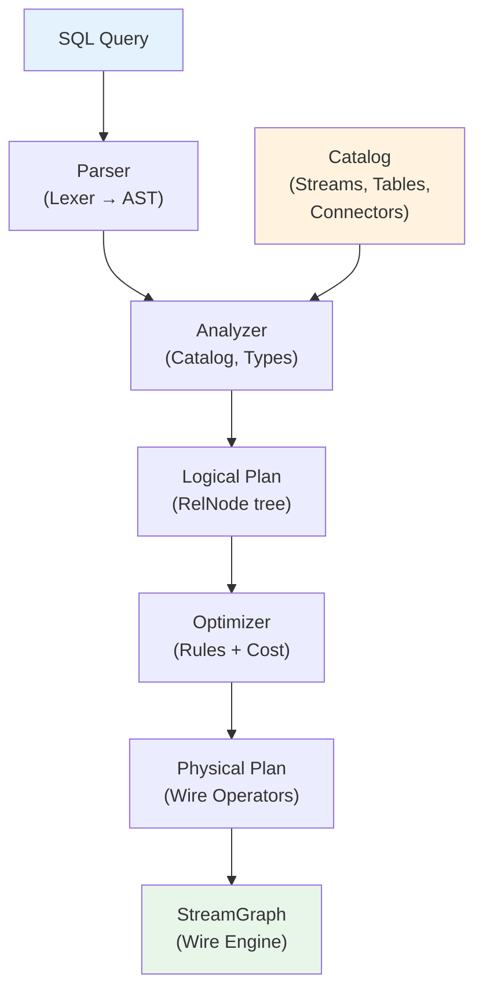

# Streaming SQL Engine

> **Feature/Project:** `Streaming SQL Engine`
>
> **WIP ID:** `WIP-21`
>
> **Author:** `Tarun Ashok`
>
> **Status:** `Draft`
>
> **Created:** `2026-03-24`
>
> **Last Updated:** `2026-03-24`

### Revision History

| Version | Date | Author | Changes |
| -- | -- | -- | -- |
| 0.1 | 2026-03-24 | Tarun Ashok | Initial draft |

---

## 1. Overview

### 1.1 Problem Statement

Wire provides a Go SDK (WIP-14) and YAML DSL (WIP-19) for building streaming pipelines. Both require users to think in terms of operators, DAGs, and serialization. SQL is the most widely understood data query language — analysts, data engineers, and backend developers already know it. Without a SQL layer, Wire excludes a large class of users who want real-time analytics without writing Go code or learning a custom DSL.

### 1.2 Proposed Solution (Technical Summary)

Add a **Streaming SQL Engine** to Wire that:
1. Parses standard SQL (with streaming extensions) into a logical query plan.
2. Optimizes the plan using rule-based and cost-based optimizations.
3. Compiles the plan into Wire's existing `StreamGraph` — the same internal representation used by the Go SDK and YAML parser.
4. Supports continuous queries: queries that run indefinitely over unbounded streams, emitting results as new data arrives.

The SQL dialect extends ANSI SQL with streaming-specific constructs: `CREATE STREAM`, `TUMBLE()`, `HOP()`, `SESSION()` window functions, `EMIT` strategies, and watermark declarations.

### 1.3 Goals & Non-Goals

| Goals (In Scope) | Non-Goals (Explicitly Out) |
| -- | -- |
| SQL parser (SELECT, INSERT INTO, CREATE STREAM/TABLE, joins, windows) | Stored procedures or PL/SQL |
| Streaming window functions (TUMBLE, HOP, SESSION) | Batch/bounded table scans (Wire is streaming-first) |
| Continuous query execution on unbounded streams | Full ANSI SQL compliance (only streaming-relevant subset) |
| Stream-stream and stream-table joins | Materialized views with external query serving |
| DDL for declaring streams and connectors | User-defined functions in SQL (UDFs deferred to future WIP) |
| Query optimization (predicate pushdown, projection pruning, join reordering) | Distributed query federation across external databases |
| Integration with Wire's checkpoint/restore mechanism | Interactive SQL shell / REPL (separate tooling concern) |
| Compilation to StreamGraph (same execution path as Go SDK) | SQL-based job management (use REST API from WIP-15) |

### 1.4 Success Metrics

| Metric | Current Baseline | Target | Measurement |
| -- | -- | -- | -- |
| Users who can write a real-time aggregation without Go | 0 (requires Go SDK) | Any SQL-literate user | User trial |
| Query planning latency (parse → StreamGraph) | N/A | < 50ms for typical queries | Benchmark |
| Feature parity with common streaming SQL (Flink SQL subset) | 0% | 80% of Flink SQL core features | Feature matrix |
| Window query correctness under out-of-order data | N/A | 100% match with Go SDK equivalent | Integration tests |

---

## 2. Architecture & System Design

### 2.1 High-Level Architecture

```
SQL Query (text)
       │
       ▼
┌──────────────────┐
│   SQL Parser     │  ← Lexer + Parser → AST
│  (ANSI + Wire    │
│   extensions)    │
└────────┬─────────┘
         │
         ▼
┌──────────────────┐
│  Query Analyzer  │  ← Name resolution, type checking, validation
│  (Catalog +      │     against stream/table catalog
│   Type System)   │
└────────┬─────────┘
         │
         ▼
┌──────────────────┐
│ Logical Planner  │  ← Relational algebra tree
│  (Rel nodes:     │     (Scan, Project, Filter, Join, Aggregate,
│   streaming ext) │      Window, Union, Insert)
└────────┬─────────┘
         │ Optimizer (rule-based + cost-based)
         ▼
┌──────────────────┐
│ Physical Planner │  ← Maps logical nodes to Wire operators
└────────┬─────────┘
         │
         ▼
┌──────────────────┐
│   StreamGraph    │  ← Same IR as Go SDK / YAML
│  (Wire Engine)   │
└──────────────────┘
```



### 2.2 Component Breakdown

**Component 1:** `sql.Parser`
* **Responsibility:** Tokenize and parse SQL text into an Abstract Syntax Tree (AST). Handles Wire-specific extensions (CREATE STREAM, window TVFs, EMIT clauses).
* **Technology:** Hand-written recursive descent parser in Go (no external dependencies). Pratt parsing for expressions.
* **Interactions:** Produces `ast.Statement` nodes consumed by the Analyzer.
* **Why hand-written:** Zero dependencies (aligns with Wire's single-binary philosophy). Full control over error messages and streaming extensions. Parser generators (yacc, ANTLR) add build complexity and Go interop friction.

**Component 2:** `sql.Catalog`
* **Responsibility:** Registry of known streams, tables, connectors, and their schemas. Provides name resolution and type information to the Analyzer.
* **Technology:** In-memory catalog backed by Wire's Coordinator metadata store.
* **Interactions:** Populated by DDL statements (`CREATE STREAM`, `CREATE TABLE`) and connector registration (WIP-16). Queried by Analyzer during validation.

**Component 3:** `sql.Analyzer`
* **Responsibility:** Validate AST against catalog. Resolve names, infer types, expand wildcards (`SELECT *`), validate window specifications, check join conditions.
* **Technology:** Go, tree-walking over AST nodes.
* **Interactions:** Reads from Catalog, produces validated + annotated AST (or descriptive errors).

**Component 4:** `sql.LogicalPlanner`
* **Responsibility:** Convert validated AST into a relational algebra tree of `RelNode`s (Scan, Project, Filter, Join, Aggregate, Window, Sort, Limit, Insert).
* **Technology:** Go structs implementing `RelNode` interface.
* **Interactions:** Input from Analyzer, output to Optimizer.

**Component 5:** `sql.Optimizer`
* **Responsibility:** Transform logical plan for efficiency. Rule-based optimizations (predicate pushdown, projection pruning, constant folding, join reordering). Optional cost-based optimization using catalog statistics.
* **Technology:** Go, visitor pattern over RelNode tree. Rules registered as `OptimizationRule` implementations.
* **Interactions:** Transforms LogicalPlan in-place or produces new optimized plan.

**Component 6:** `sql.PhysicalPlanner`
* **Responsibility:** Map optimized logical plan to Wire's physical operators and construct a `StreamGraph`.
* **Technology:** Go, pattern matching on RelNode types.
* **Interactions:** Produces `StreamGraph` nodes (same types as Go SDK). Hands off to Wire's existing scheduler.

### 2.3 Data Flow

1. User submits SQL query via REST API (WIP-15) or embedded Go API.
2. **Parser** tokenizes and parses into AST.
3. **Analyzer** validates against Catalog, resolves types.
4. **LogicalPlanner** converts to relational algebra tree.
5. **Optimizer** applies transformation rules.
6. **PhysicalPlanner** maps to Wire operators, produces `StreamGraph`.
7. `StreamGraph` follows normal Wire execution: optimize → `JobGraph` → `ExecutionGraph` → distributed execution.
8. Continuous query runs indefinitely, emitting results per the `EMIT` strategy.

---

## 3. SQL Dialect

### 3.1 DDL — Stream & Table Declarations

```sql
-- Declare a stream backed by a connector
CREATE STREAM page_views (
    user_id     VARCHAR,
    page_url    VARCHAR,
    view_time   TIMESTAMP,
    WATERMARK FOR view_time AS view_time - INTERVAL '5' SECOND
) WITH (
    'connector' = 'kafka',
    'topic'     = 'page-views',
    'format'    = 'json',
    'bootstrap.servers' = 'kafka:9092'
);

-- Declare a lookup table (bounded, for enrichment joins)
CREATE TABLE user_profiles (
    user_id   VARCHAR PRIMARY KEY,
    name      VARCHAR,
    region    VARCHAR
) WITH (
    'connector' = 'jdbc',
    'url'       = 'postgresql://localhost/users',
    'table'     = 'profiles'
);
```

### 3.2 Continuous Queries

```sql
-- Simple filter + projection
SELECT user_id, page_url
FROM page_views
WHERE page_url LIKE '/product/%';

-- Tumbling window aggregation
SELECT
    user_id,
    TUMBLE_START(view_time, INTERVAL '5' MINUTE) AS window_start,
    TUMBLE_END(view_time, INTERVAL '5' MINUTE)   AS window_end,
    COUNT(*) AS view_count
FROM page_views
GROUP BY
    user_id,
    TUMBLE(view_time, INTERVAL '5' MINUTE);

-- Hopping (sliding) window
SELECT
    user_id,
    HOP_START(view_time, INTERVAL '1' MINUTE, INTERVAL '5' MINUTE) AS window_start,
    COUNT(*) AS view_count
FROM page_views
GROUP BY
    user_id,
    HOP(view_time, INTERVAL '1' MINUTE, INTERVAL '5' MINUTE);

-- Session window
SELECT
    user_id,
    SESSION_START(view_time, INTERVAL '30' MINUTE) AS session_start,
    SESSION_END(view_time, INTERVAL '30' MINUTE)   AS session_end,
    COUNT(*) AS page_count
FROM page_views
GROUP BY
    user_id,
    SESSION(view_time, INTERVAL '30' MINUTE);
```

### 3.3 Joins

```sql
-- Stream-table join (lookup enrichment)
SELECT
    pv.user_id,
    up.name,
    up.region,
    pv.page_url,
    pv.view_time
FROM page_views AS pv
JOIN user_profiles AS up ON pv.user_id = up.user_id;

-- Stream-stream join (windowed)
SELECT
    a.user_id,
    a.page_url AS first_page,
    b.page_url AS second_page,
    a.view_time AS first_view,
    b.view_time AS second_view
FROM page_views AS a
JOIN page_views AS b
    ON a.user_id = b.user_id
    AND b.view_time BETWEEN a.view_time AND a.view_time + INTERVAL '10' MINUTE
WHERE a.page_url <> b.page_url;
```

### 3.4 INSERT INTO (Sink)

```sql
-- Write continuous query results to a sink
INSERT INTO output_stream
SELECT
    user_id,
    TUMBLE_START(view_time, INTERVAL '5' MINUTE) AS window_start,
    COUNT(*) AS view_count
FROM page_views
GROUP BY
    user_id,
    TUMBLE(view_time, INTERVAL '5' MINUTE);
```

### 3.5 EMIT Strategy (Wire Extension)

```sql
-- Emit only when window closes (default)
SELECT ...
GROUP BY user_id, TUMBLE(view_time, INTERVAL '5' MINUTE)
EMIT AFTER WATERMARK;

-- Emit early partial results every 30 seconds, then final on watermark
SELECT ...
GROUP BY user_id, TUMBLE(view_time, INTERVAL '5' MINUTE)
EMIT
    BEFORE WATERMARK DELAY INTERVAL '30' SECOND,
    AFTER WATERMARK;
```

### 3.6 Type System

| SQL Type | Go Type | Wire Encoding |
|----------|---------|---------------|
| `BOOLEAN` | `bool` | 1 byte |
| `TINYINT` | `int8` | 1 byte |
| `SMALLINT` | `int16` | 2 bytes LE |
| `INT` / `INTEGER` | `int32` | 4 bytes LE |
| `BIGINT` | `int64` | 8 bytes LE |
| `FLOAT` | `float32` | 4 bytes IEEE 754 |
| `DOUBLE` | `float64` | 8 bytes IEEE 754 |
| `VARCHAR` / `STRING` | `string` | length-prefixed UTF-8 |
| `BINARY` / `BYTES` | `[]byte` | length-prefixed |
| `TIMESTAMP` | `int64` (unix ms) | 8 bytes LE |
| `INTERVAL` | `time.Duration` | 8 bytes (nanoseconds) |
| `ARRAY<T>` | `[]T` | length-prefixed elements |
| `MAP<K,V>` | `map[K]V` | length-prefixed KV pairs |
| `ROW(...)` | struct | sequential field encoding |

Nullability: All types are nullable by default. `NOT NULL` constraint can be specified in DDL and enforced at ingestion.

---

## 4. Query Planning & Optimization

### 4.1 Logical Plan Nodes (RelNode)

```go
type RelNode interface {
    InputNodes() []RelNode
    OutputSchema() Schema
    Accept(visitor RelVisitor)
}

// Core nodes
type StreamScan struct { ... }    // Read from a declared stream
type TableScan struct { ... }     // Read from a lookup table
type Project struct { ... }       // Column selection / expression evaluation
type Filter struct { ... }        // Predicate evaluation
type Aggregate struct { ... }     // GROUP BY with aggregate functions
type WindowAggregate struct { ... } // Windowed GROUP BY (TUMBLE/HOP/SESSION)
type Join struct { ... }          // Stream-stream or stream-table join
type Union struct { ... }         // UNION ALL
type Sort struct { ... }          // ORDER BY (limited: only within windows)
type Limit struct { ... }         // LIMIT (only within windows)
type InsertInto struct { ... }    // Write to sink
```

### 4.2 Optimization Rules

| Rule | Category | Description |
|------|----------|-------------|
| **Predicate Pushdown** | Rule-based | Push `WHERE` filters as close to source as possible. Reduces data volume early. |
| **Projection Pruning** | Rule-based | Remove unused columns from scans and intermediate operators. Reduces serialization cost. |
| **Constant Folding** | Rule-based | Evaluate constant expressions at plan time (`1 + 2` → `3`). |
| **Filter Merge** | Rule-based | Combine adjacent Filter nodes into a single node with AND'd predicates. |
| **Join Reordering** | Cost-based | Reorder multi-way joins based on estimated cardinality (catalog statistics). |
| **Window Merge** | Rule-based | Merge multiple aggregations over the same window into a single window operator. |
| **Source Filter Pushdown** | Rule-based | Push predicates into connector config where supported (e.g., Kafka partition pruning). |

### 4.3 Physical Operator Mapping

| Logical Node | Wire Physical Operator | Notes |
|-------------|----------------------|-------|
| `StreamScan` | `Source` (connector) | Configured from `WITH` properties |
| `Project` | `Map` | Expression evaluation |
| `Filter` | `Filter` | Predicate evaluation |
| `Aggregate` | `KeyBy → Process` | Stateful, incremental aggregation |
| `WindowAggregate` | `KeyBy → Window → Aggregate` | Uses SDK window API (WIP-14) |
| `Join (stream-table)` | `KeyBy → Process` (async lookup) | Table cached/refreshed in state |
| `Join (stream-stream)` | `KeyBy → CoProcess` | Both sides buffered in state with TTL |
| `InsertInto` | `Sink` (connector) | Configured from target stream's `WITH` properties |

---

## 5. Integration Points

### 5.1 Job Submission (REST API — WIP-15)

```
POST /api/v1/jobs/sql
Content-Type: application/json

{
  "sql": "INSERT INTO output SELECT user_id, COUNT(*) ...",
  "properties": {
    "parallelism": 4,
    "checkpoint.interval": "10s"
  }
}
```

Response: Standard job submission response (job ID, status URL).

### 5.2 Embedded Go API

```go
import "github.com/tarungka/wire/sql"

env := sdk.NewStreamExecutionEnvironment()

// Register streams/tables
catalog := sql.NewCatalog()
catalog.RegisterStream("page_views", sql.StreamDef{
    Schema: sql.Schema{
        Fields: []sql.Field{
            {Name: "user_id", Type: sql.VARCHAR},
            {Name: "page_url", Type: sql.VARCHAR},
            {Name: "view_time", Type: sql.TIMESTAMP},
        },
        WatermarkField: "view_time",
        WatermarkDelay: 5 * time.Second,
    },
    Connector: kafka.NewSource(kafka.Config{
        Topic:   "page-views",
        Brokers: []string{"kafka:9092"},
        Format:  "json",
    }),
})

// Execute SQL
engine := sql.NewEngine(env, catalog)
result, err := engine.ExecuteSQL(`
    INSERT INTO output
    SELECT user_id, COUNT(*) AS cnt
    FROM page_views
    GROUP BY user_id, TUMBLE(view_time, INTERVAL '5' MINUTE)
`)
```

### 5.3 Connector Integration (WIP-16)

SQL DDL `WITH` clauses map directly to connector configuration. The SQL engine delegates connector instantiation to the Connector SDK. Connector types must be registered in the catalog before use.

### 5.4 State & Checkpointing

SQL queries compile to the same `StreamGraph` as Go SDK pipelines. All state management (keyed state for aggregations, join buffers, window state) uses Wire's existing Pebble-backed state API. Checkpointing works identically — no SQL-specific state handling needed.

---

## 6. Design Decisions & Trade-offs

### Decision 1: Hand-written parser (not parser generator)

|  |  |
| -- | -- |
| **Context** | Need a SQL parser in Go with streaming extensions. |
| **Options Considered** | (A) Hand-written recursive descent, (B) `goyacc` / PEG generator, (C) Embed an existing SQL parser (e.g., vitess sqlparser) |
| **Decision** | Option A: Hand-written recursive descent with Pratt parsing for expressions |
| **Rationale** | Zero external dependencies (Wire's single-binary philosophy). Full control over error messages — SQL errors must be user-friendly with line/column info. Easy to extend with Wire-specific syntax (EMIT, WATERMARK, window TVFs). Vitess parser is MySQL-specific and would need heavy modification. |
| **Trade-offs Accepted** | More initial code to write. Must manually handle operator precedence (Pratt parsing mitigates this). |
| **Revisit Trigger** | If parser maintenance becomes a burden or SQL dialect grows significantly. |

### Decision 2: Compile to StreamGraph (not custom execution engine)

|  |  |
| -- | -- |
| **Context** | SQL queries need to execute on Wire's distributed runtime. |
| **Options Considered** | (A) Compile SQL → StreamGraph (reuse existing engine), (B) Build a separate SQL execution engine with its own operators |
| **Decision** | Option A: Compile to StreamGraph |
| **Rationale** | Massive code reuse — checkpointing, state management, scheduling, fault tolerance all come for free. One execution path to optimize. SQL and Go SDK pipelines are first-class citizens with identical runtime behavior. |
| **Trade-offs Accepted** | SQL-specific optimizations (e.g., vectorized execution) harder to add later. Performance ceiling tied to Wire's row-at-a-time model. |
| **Revisit Trigger** | If SQL query performance significantly lags comparable systems and profiling shows StreamGraph overhead as the bottleneck. |

### Decision 3: Streaming-first SQL (no batch mode)

|  |  |
| -- | -- |
| **Context** | Should SQL support bounded queries (batch) or only streaming? |
| **Options Considered** | (A) Streaming-only, (B) Unified batch + streaming (Flink-style), (C) Streaming with bounded source support |
| **Decision** | Option C: Streaming-first, but bounded sources (e.g., JDBC table scan) allowed for enrichment joins |
| **Rationale** | Wire is a streaming engine. Trying to be a batch engine too adds enormous complexity (different scheduling, different join strategies, different optimization rules). Bounded tables are supported only as lookup/enrichment sources, not as primary scan targets. |
| **Trade-offs Accepted** | Users needing batch analytics must use a different tool. Cannot run `SELECT * FROM big_table` as a one-shot query. |
| **Revisit Trigger** | Strong user demand for bounded query support. |

### Decision 4: EMIT clause for controlling output timing

|  |  |
| -- | -- |
| **Context** | Streaming aggregations can emit results at different points: on every input, periodically, or only when the window closes. |
| **Options Considered** | (A) Always emit on window close, (B) Configurable via EMIT clause (Flink-style), (C) Configurable via job properties |
| **Decision** | Option B: EMIT clause in SQL |
| **Rationale** | Different queries have different latency requirements. Real-time dashboards want early partial results; billing pipelines want final-only. Making it part of the SQL syntax keeps the query self-describing. |
| **Trade-offs Accepted** | Non-standard SQL syntax. Users must learn Wire-specific EMIT semantics. |
| **Revisit Trigger** | If SQL standards adopt a similar mechanism. |

---

## 7. Edge Cases & Failure Modes

| # | Scenario | Handling | Impact | Severity |
| -- | -- | -- | -- | -- |
| 1 | SQL syntax error | Parser returns error with line/column position and suggestion | Query rejected, no job started | Low |
| 2 | Reference to undeclared stream/table | Analyzer returns "unknown stream: X" error | Query rejected | Low |
| 3 | Type mismatch in expression (e.g., `VARCHAR + INT`) | Analyzer returns type error with expected vs actual types | Query rejected | Low |
| 4 | Stream-stream join without time bound | Analyzer rejects: "stream-stream joins require a time-bounded condition (BETWEEN ... AND ...)" | Query rejected — unbounded joins would consume infinite state | Medium |
| 5 | Window aggregation state grows unbounded (extreme late data) | Allowed lateness + state TTL garbage collect old windows. Late events beyond allowed lateness routed to late-data side output. | Bounded state growth | Medium |
| 6 | Lookup table unavailable during stream-table join | Configurable: fail job, use cached data, or skip (emit null) | Depends on configuration | Medium |
| 7 | SQL query references Wire-unsupported SQL feature | Parser/Analyzer returns "unsupported: X" with link to docs | Query rejected | Low |
| 8 | Checkpoint during mid-window aggregation | Window state included in checkpoint. On restore, aggregation resumes from checkpoint. Exactly-once maintained. | No impact — handled by existing checkpoint mechanism | Low |

---

## 8. Security & Compliance

### 8.1 SQL Injection

* SQL is submitted by the job author, not end-users. No dynamic SQL construction from untrusted input.
* Parameterized queries not needed in v1 (no user-facing query endpoint).
* If a public query endpoint is added later, parameterized queries become mandatory.

### 8.2 Resource Limits

* **Query complexity limit:** Maximum number of joins, subqueries, and window functions per query (configurable).
* **State size limit:** Per-operator state size limits (inherited from Wire's state backend config).
* **Parse timeout:** Parser has a configurable timeout to prevent DoS via pathological SQL.

### 8.3 Catalog Access Control

* DDL operations (`CREATE STREAM`, `DROP STREAM`) require elevated permissions.
* Query execution requires read access to referenced streams/tables.
* Access control model deferred to WIP-17 (Security Model).

---

## 9. Testing Strategy

| Test Type | Scope | Tools | Coverage Target |
| -- | -- | -- | -- |
| Unit Tests | Parser (tokenizer, AST), Analyzer, Planner, Optimizer rules | Go `testing` | >= 85% |
| Integration Tests | End-to-end SQL → StreamGraph → execution → output verification | MiniCluster (WIP-14) | All SQL features |
| Conformance Tests | SQL dialect compliance against a test suite of queries + expected results | Custom test runner | 100% of documented syntax |
| Fuzz Tests | Parser robustness against malformed SQL | `go-fuzz` | No panics on any input |

### 9.1 Key Test Scenarios

1. Simple SELECT/WHERE/PROJECT produces correct filtered output
2. TUMBLE/HOP/SESSION windows produce correct aggregations
3. Stream-table join enriches correctly with lookup refresh
4. Stream-stream join with time bounds produces correct matches
5. Watermark propagation through SQL operators matches Go SDK behavior
6. EMIT BEFORE WATERMARK produces partial results at correct intervals
7. Checkpoint/restore mid-query produces exactly-once results
8. Optimizer rules produce functionally equivalent but faster plans
9. Invalid SQL produces helpful error messages with line/column info
10. Parser handles 10K+ character queries without timeout

---

## 10. Implementation Phases

### Phase 1: Foundation (Parser + Simple Queries)
- Hand-written lexer and recursive descent parser
- AST node types for SELECT, FROM, WHERE, GROUP BY, INSERT INTO
- Catalog with in-memory stream/table registration
- Analyzer: name resolution, basic type checking
- Logical planner: Scan, Project, Filter, InsertInto
- Physical planner: map to Source → Filter → Map → Sink
- **Deliverable:** `SELECT col FROM stream WHERE predicate` executes end-to-end

### Phase 2: Windowed Aggregations
- TUMBLE, HOP, SESSION window functions in parser + planner
- WindowAggregate logical node + physical mapping
- Built-in aggregate functions: COUNT, SUM, MIN, MAX, AVG
- EMIT clause (AFTER WATERMARK default, BEFORE WATERMARK optional)
- **Deliverable:** Windowed GROUP BY queries execute correctly

### Phase 3: Joins
- Stream-table join (lookup enrichment)
- Stream-stream join with time-bounded conditions
- Join node in logical + physical planner
- Catalog support for table connectors
- **Deliverable:** Both join types execute correctly

### Phase 4: Optimization
- Rule-based: predicate pushdown, projection pruning, constant folding, filter merge
- Cost-based: join reordering (requires catalog statistics)
- Window merge optimization
- **Deliverable:** Measurable performance improvement on multi-join queries

### Phase 5: Production Hardening
- Fuzz testing for parser
- Comprehensive error messages
- SQL EXPLAIN (show logical + physical plan)
- REST API integration (WIP-15)
- Documentation and examples

---

## 11. Open Questions & Risks

| # | Question / Risk | Owner | Status |
| -- | -- | -- | -- |
| 1 | Should we support subqueries (correlated and uncorrelated) in v1, or defer? | Tarun | Open |
| 2 | What expression language for computed columns? Standard SQL expressions only, or allow Wire-specific functions? | Tarun | Open |
| 3 | Should `CREATE STREAM` DDL persist across restarts (stored in Coordinator metadata), or be session-scoped? | Tarun | Open |
| 4 | How to handle schema evolution (stream schema changes while query is running)? | Tarun | Open |
| 5 | Risk: Hand-written parser maintenance cost grows with SQL dialect complexity | — | Acknowledged |
| 6 | Risk: Row-at-a-time execution model may bottleneck SQL workloads that benefit from vectorized/columnar processing | — | Acknowledged |
| 7 | Should we support `CREATE VIEW` for reusable sub-queries? | Tarun | Open |
| 8 | How does the SQL engine interact with Wire's backpressure mechanism when a query is too slow? | Tarun | Open |

---

## 12. References

- [WIP-14: User API & Go SDK](../WIP-14/README.md) — StreamGraph, DataStream API
- [WIP-15: Job Lifecycle & REST API](../WIP-15/README.md) — Job submission endpoint
- [WIP-16: Connector SDK](../WIP-16/README.md) — Source/Sink connectors
- [WIP-19: YAML Pipeline Parser](../WIP-19/README.md) — Alternative declarative interface
- [Apache Flink SQL](https://nightlies.apache.org/flink/flink-docs-stable/docs/dev/table/sql/overview/) — Primary inspiration for streaming SQL dialect
- [Apache Calcite](https://calcite.apache.org/) — Reference for SQL planning and optimization patterns
- [Materialize](https://materialize.com/docs/sql/) — Streaming SQL semantics reference
