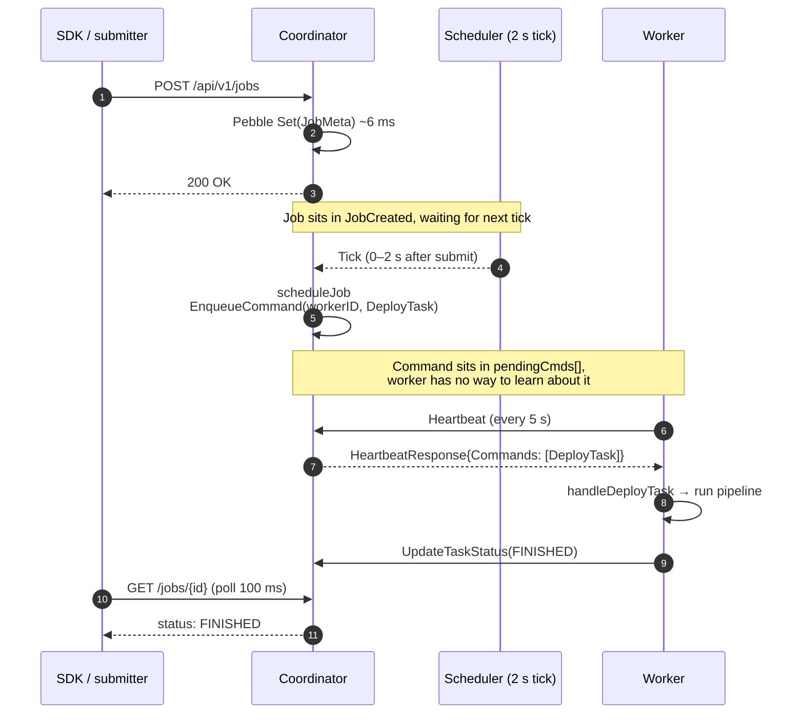
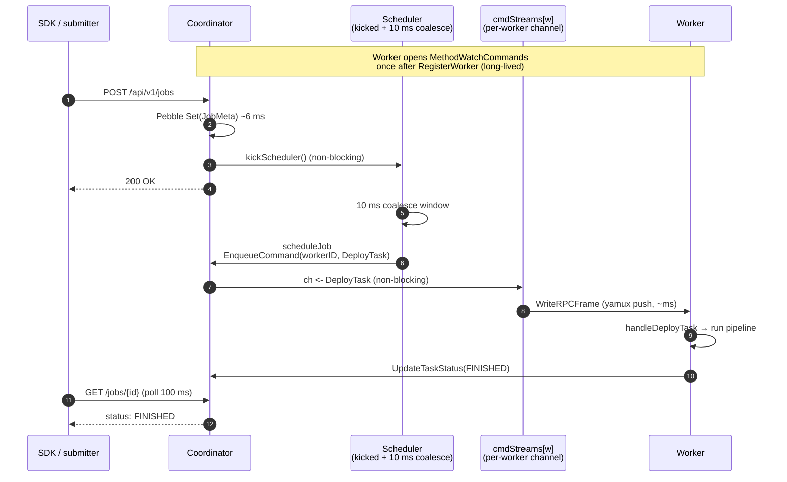
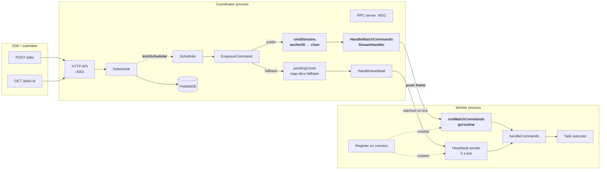
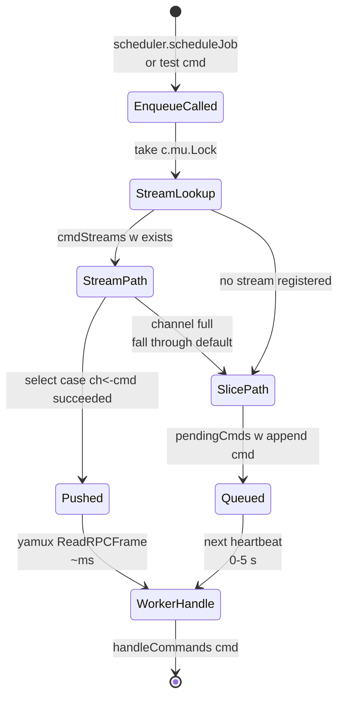
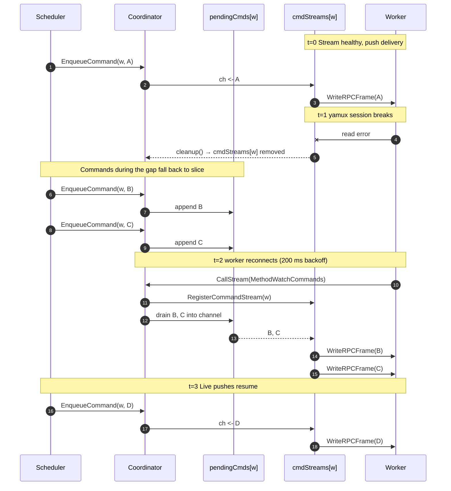

# Push-Based Command Dispatch

> **Feature/Project:** `Server-streaming WatchCommands RPC + immediate scheduler kick`
>
> **WIP ID:** `WIP-21`
>
> **Author:** `Tarun Ashok`
>
> **Status:** `Implemented`
>
> **Created:** `2026-05-09`
>
> **Last Updated:** `2026-05-09`

### Revision History

| Version | Date | Author | Changes |
| -- | -- | -- | -- |
| 0.1 | 2026-05-09 | Tarun Ashok | Initial draft + implementation |

---

## 1. Overview

### 1.1 Problem Statement

Job dispatch latency was **~4 s per submit** in a single-worker, single-job benchmark — about three orders of magnitude slower than the actual work. The pipeline submitted by the SDK did `~µs` of real processing (3 events through a `Source → Map(upper) → Sink` chain), but reaching `FINISHED` consistently took 3–4 s wall-clock.

Two architectural delays compounded:

1. **Heartbeat-pull command dispatch.** The coordinator queued `DeployTask` commands in `pendingCmds[workerID]` (in-memory slice). The worker had no way to learn about a queued command except by sending its next heartbeat, which the worker did every 5 s by default (`DefaultHeartbeatInterval` in `internal/rpc/config.go`). On submit, a job waited 0–5 s for the next heartbeat tick — average 2.5 s — before the worker even started executing it.
2. **Scheduler tick interval.** `runScheduler` in `internal/coordinator/scheduler.go` polled for `JobCreated` jobs every 2 s. Submission persisted the job, then waited 0–2 s for the next tick to assign tasks. Average 1 s additional delay.

The two delays stack: a job submitted right after a scheduler tick AND right after a heartbeat could wait `2 s + 5 s = 7 s` before the worker even saw the deploy command.

This made the platform unusable for any latency-sensitive workload. It also obscured the actual operator-chain runtime in benchmarks and Grafana dashboards — every panel showed seconds when the work was microseconds.

### 1.2 Proposed Solution (Technical Summary)

Replace the pull-on-heartbeat dispatch model with a **server-streaming RPC** (`MethodWatchCommands`) that the worker opens once after `RegisterWorker`. The coordinator pushes `WorkerCommand` frames as the scheduler enqueues them — bounded by a single yamux frame round-trip (~ms) instead of the heartbeat interval.

In parallel, give `SubmitJob` a way to wake the scheduler immediately via a buffered notification channel (`schedulerKick`) so dispatch is bounded by a goroutine wake-up rather than the 2 s tick.

Heartbeats keep running for liveness only. They retain the legacy command-drain behavior as a fallback so older workers (and the path through `DrainCommands`) continue to function.

### 1.3 Goals & Non-Goals

| Goals (In Scope) | Non-Goals (Explicitly Out) |
| -- | -- |
| Sub-200ms job dispatch latency for the steady-state path | Sub-millisecond p99 (Pebble fsync is a 6 ms floor — separate WIP) |
| One streaming primitive that other long-lived RPCs can reuse (`StreamHandler`, `CallStream`) | Bidirectional streaming (`net/grpc`-style request streams) |
| Backward-compatible: heartbeat path still delivers commands when no stream is open | Removing heartbeat-based command delivery entirely (deferred until all workers migrate) |
| Graceful handoff: existing `pendingCmds` backlog drains into the stream on connect | Persistent command queue across coordinator restarts |
| Reconnect-on-failure with bounded backoff | Multi-coordinator command fan-out (single leader still owns dispatch) |
| Preserve existing test guarantees (`TestSubmitJob_ConcurrentDuplicateName`) | Eliminating the 2 s scheduler tick (kept as a fallback poll) |

### 1.4 Success Metrics

Measured against `examples/observability-stack` running 5 sequential `submit-uppercase-job` invocations.

| Metric | Pre-WIP-21 | Post-WIP-21 (push only) | Post-WIP-21 (push + kick) | Measurement |
| -- | -- | -- | -- | -- |
| p50 job submit → finished | ~4.0 s | ~1.0 s | **~114 ms** | `submit-uppercase-job` wall clock |
| Worker command dispatch | 0–5 s (heartbeat tick) | <ms (streamed) | <ms (streamed) | Time from `EnqueueCommand` to `handleCommands` invocation |
| Scheduler dispatch | 0–2 s (tick) | 0–2 s (tick) | <10 ms (kick + coalesce) | Time from `SubmitJob` return to `scheduleJob` running |
| `wire_rpc_server_duration_seconds{method="Heartbeat"}` p99 | µs | µs | µs | Unchanged — heartbeat is still tick-based |

---

## 1.5 Before / After at a Glance

### Pre-WIP-21: heartbeat-pull dispatch (~4 s p50)



### Post-WIP-21: streaming push + scheduler kick (~114 ms p50)



The heartbeat-tick gap (worst case 5 s) is replaced by a single yamux frame round-trip. The scheduler-tick gap (worst case 2 s) is replaced by a goroutine wake-up plus a 10 ms coalesce window.

---

## 2. Architecture & System Design

### 2.0 Component View

How the new pieces sit in the existing topology. **Bold** boxes are new in WIP-21; the rest existed before.



Key invariants:
- **Single delivery channel per command.** `EnqueueCommand` picks `cmdStreams[w]` if present (non-blocking); only on backpressure does it fall back to `pendingCmds`.
- **Cleanup is symmetric.** When the WatchCommands stream closes, `cmdStreams[w]` is removed; the next `EnqueueCommand` for that worker queues into `pendingCmds[w]` again.
- **Backlog drain on connect.** The first call to `RegisterCommandStream` for a worker drains `pendingCmds[w]` into the new channel, so commands queued during a stream blip don't get stuck behind a heartbeat tick.

### 2.1 Streaming RPC Primitive

The existing RPC server processed one request frame and wrote one response frame, then closed the stream:

```
client ──[request]──> server
client <──[response]── server  (close)
```

For server-streaming (`request → many responses`), the server needs to keep the stream open and write multiple frames. The new `StreamHandler` type does exactly that:

```go
// internal/rpc/server.go

type StreamHandler func(
    ctx context.Context,
    requestID uint64,
    payload []byte,
    stream *yamux.Stream,
) error
```

The handler decodes the payload, then writes zero or more frames to `stream` using `WriteRPCFrame`, sharing the inbound `RequestID`. Returning ends the stream.

`Server.serveStream` dispatches to a streaming handler if one is registered for the method ID; otherwise it falls through to the existing unary path.

```go
// Pseudocode
if sh := s.getStreamHandler(frame.MethodID); sh != nil {
    return sh(ctx, frame.RequestID, frame.Payload, stream)
}
// fall through to unary handler
```

On the client side, `Client.CallStream` opens a stream, writes the request, and returns a channel of `StreamFrame` plus a cancel func:

```go
// internal/rpc/client.go

type StreamFrame struct {
    Frame RPCFrame
    Err   error
}

func (c *Client) CallStream(
    ctx context.Context,
    method MethodID,
    request any,
) (<-chan StreamFrame, func(), error)
```

The channel closes when the server closes the stream, the underlying yamux session shuts down, or the caller invokes `cancel()`. Read or decode failures terminate the channel via `StreamFrame.Err`.

### 2.1.1 Dispatch path state machine

A single `WorkerCommand` chooses one of two paths based on whether the
target worker has an open WatchCommands stream. The state diagram makes
the fallback explicit:



### 2.2 WatchCommands RPC

A single new method ID (`MethodWatchCommands = 0x0008`) registered as a streaming handler in `internal/coordinator/transport.go`:

```go
srv.RegisterStream(rpc.MethodWatchCommands, coord.HandleWatchCommands)
```

The request shape carries the worker identity and the epoch the worker registered under, so the coordinator can validate the stream against current cluster state:

```go
type WatchCommandsRequest struct {
    WorkerID string `codec:"wid"`
    EpochID  uint64 `codec:"eid"`
}
```

Frames pushed back over the stream are `WorkerCommand` envelopes — the same struct the heartbeat path used to return:

```go
type WorkerCommand struct {
    Type   CommandType `codec:"t"`
    JobID  string      `codec:"jid,omitempty"`
    TaskID string      `codec:"tid,omitempty"`
    Data   []byte      `codec:"d,omitempty"`
}
```

So the worker's `handleCommands` dispatch is reused unchanged regardless of which channel delivered the command.

### 2.3 Coordinator Side: cmdStreams + RegisterCommandStream

The coordinator gains a second per-worker map alongside `pendingCmds`:

```go
type Coordinator struct {
    // unchanged
    pendingCmds map[string][]rpc.WorkerCommand

    // new
    cmdStreams map[string]chan rpc.WorkerCommand
}
```

`EnqueueCommand` prefers the stream over the slice queue:

```go
func (c *Coordinator) EnqueueCommand(workerID string, cmd rpc.WorkerCommand) {
    c.mu.Lock()
    if ch, ok := c.cmdStreams[workerID]; ok {
        c.mu.Unlock()
        select {
        case ch <- cmd:
            return            // pushed via stream
        default:
            // channel full; fall through to slice as backpressure
        }
        c.mu.Lock()
    }
    c.pendingCmds[workerID] = append(c.pendingCmds[workerID], cmd)
    c.mu.Unlock()
}
```

`RegisterCommandStream` creates the per-worker channel for the streaming handler. On register it **drains any pre-existing `pendingCmds` backlog into the channel** so commands queued before the stream opened are not lost during the pull→push handoff:

```go
func (c *Coordinator) RegisterCommandStream(workerID string) (
    <-chan rpc.WorkerCommand, func(),
) {
    ch := make(chan rpc.WorkerCommand, 64)
    c.mu.Lock()
    if old, ok := c.cmdStreams[workerID]; ok {
        close(old)               // worker reconnected — old goroutine exits
    }
    c.cmdStreams[workerID] = ch
    backlog := c.pendingCmds[workerID]
    delete(c.pendingCmds, workerID)
    c.mu.Unlock()

    for _, cmd := range backlog {
        select {
        case ch <- cmd:
        default:
            // re-queue the rest in pendingCmds (heartbeat fallback)
        }
    }

    cleanup := func() { /* deregister + close channel */ }
    return ch, cleanup
}
```

`HandleWatchCommands` is the streaming handler. It registers the channel, then loops reading from it and writing to the stream until the worker disconnects:

```
RegisterCommandStream(workerID)
                ↓
   for cmd := range ch:
       WriteRPCFrame(stream, RPCFrame{MethodID: WatchCommands, ...})
                ↓
   ctx done OR write error → cleanup() → channel removed
```

### 2.4 Worker Side: runWatchCommands Goroutine

The worker spawns `runWatchCommands` immediately after `RegisterWorker` succeeds (and **before** the heartbeat loop starts):

```go
go w.runWatchCommands(ctx)

heartbeat := rpc.NewHeartbeatSender(...)
heartbeat.Run(ctx)
```

The goroutine maintains a long-lived stream with exponential backoff on failure (200 ms → 5 s capped). Each pushed frame goes through the same `handleCommands` path as the heartbeat-delivered batch:

```go
for {
    frames, cancel, err := w.client.CallStream(ctx, rpc.MethodWatchCommands, req)
    if err != nil {
        backoff(); continue
    }
    for sf := range frames {
        if sf.Err != nil { break }   // reconnect
        var cmd rpc.WorkerCommand
        protocol.DecodeMsgPack(sf.Frame.Payload, &cmd)
        w.handleCommands([]rpc.WorkerCommand{cmd})
    }
    cancel()
}
```

This means **either delivery channel (push or pull) is a drop-in**: the worker doesn't care, and the migration from one to the other is transparent.

### 2.5 Scheduler Kick

The scheduler used to wait on a 2 s ticker:

```go
ticker := time.NewTicker(2 * time.Second)
for {
    select {
    case <-ticker.C:
        c.scheduleTick(ctx)
    case <-ctx.Done():
        return
    }
}
```

`SubmitJob` now also publishes to a buffered notification channel:

```go
type Coordinator struct {
    schedulerKick chan struct{}    // buffered, capacity 1
}

func (c *Coordinator) kickScheduler() {
    select {
    case c.schedulerKick <- struct{}{}:
    default:                          // already pending, drop
    }
}
```

The scheduler loop selects on both:

```go
for {
    select {
    case <-ticker.C:
        c.scheduleTick(ctx)
    case <-c.schedulerKick:
        // 10 ms coalesce window
        time.Sleep(10 * time.Millisecond)
        // drain any further kicks that piled up
        c.scheduleTick(ctx)
    case <-ctx.Done():
        return
    }
}
```

The 2 s tick is preserved as a **fallback poll** for cases where a wake-up was missed (e.g. a job became schedulable because a worker registered, not because a job was submitted).

#### 2.5.1 Why the 10 ms Coalesce Window

`TestSubmitJob_ConcurrentDuplicateName` exercises 20 concurrent same-name `SubmitJob` calls and asserts exactly 1 success + 19 `ErrJobExists`. The duplicate check inside `SubmitJob` is `j.Name == name && !j.Status.IsTerminal()` — so once the scheduler transitions a malformed-config job through `JobFailing → JobFailed` (terminal), subsequent submits with the same name no longer see a duplicate.

Without coalescing, the kick from the *first* submit would wake the scheduler before the other 19 goroutines reach their duplicate check. The scheduler would mark the first job `JobFailed` (the test config is invalid, so `generateTaskDescriptors` permanent-fails). The remaining goroutines would see the now-terminal job, succeed in their dup-check, and insert their own jobs.

The 10 ms window is microseconds away from "instant" for interactive job latency (Pebble fsync is ~6 ms anyway) but orders of magnitude larger than the time it takes 20 goroutines to all finish a `c.mu.Lock()` block. The test stays deterministic; production latency stays sub-100 ms.

### 2.6 Snapshot Fix in SubmitJob

`SubmitJob` previously returned the live `*JobMeta` stored in the coordinator's map. The HTTP submit handler then read fields like `Status` and `UpdatedAt` through that pointer, *outside* `c.mu`. With the 2 s scheduler tick, the race between this read and the scheduler's write was wide enough that the race detector almost never tripped. With `kickScheduler()`, the scheduler runs within microseconds of `SubmitJob` returning — narrow enough to fire consistently.

Fix: return a shallow copy under `c.mu.RLock()` *before* kicking the scheduler:

```go
c.mu.RLock()
snapshot := *job
c.mu.RUnlock()

c.kickScheduler()

return &snapshot, nil
```

Same pattern that landed for `GetJob`/`ListJobs` in WIP-19's PR (#172). The kick exposed the same bug class in the submit path.

---

## 3. Latency Budget After WIP-21

Measured end-to-end from `POST /api/v1/jobs` to the SDK seeing `JobFinished` for a 3-event memory→upper→memory pipeline.

### 3.0 Visual timeline (post-WIP-21, ~114 ms p50)

```
t=0     POST /api/v1/jobs received
        │
        ├──▶ SubmitJob: Pebble Set(JobMeta)+(Config)        ~12 ms (2× fsync)
        │    │
        │    └──▶ kickScheduler() (non-blocking)
        │
t≈12    │
        ├──────────────── 200 OK back to SDK ───────────────────────────▶
        │                                                       │
        ▼                                                       │ SDK starts polling /jobs/{id}
        Scheduler goroutine selects on schedulerKick           │ (100 ms ticker)
        │
        ├──▶ 10 ms coalesce window                              ~10 ms
        │
t≈22    ├──▶ scheduleJob: transitionJob CREATED→DEPLOYING       ~12 ms (2× fsync)
        │    │
        │    └──▶ EnqueueCommand → cmdStreams[w] <- DeployTask
        │         │                                              <1 ms
        │         └──▶ HandleWatchCommands writes RPC frame
        │
t≈35    ▼
        Worker reads frame on yamux                             <1 ms
        │
        ├──▶ runWatchCommands → handleCommands → spawn task
        │
        ├──▶ Operator chain runs:                              <1 ms
        │    Source(3 events) → upper Map → Sink → EOP
        │
        ├──▶ UpdateTaskStatus(RUNNING) RPC                     ~6 ms (1× fsync)
        │    │
        │    └──▶ coord transitions DEPLOYING→RUNNING
        │
        ├──▶ UpdateTaskStatus(FINISHED) RPC                    ~12 ms (2× fsync)
        │    │
        │    └──▶ coord transitions RUNNING→FINISHING→FINISHED
        │
t≈65    ▼
        Job is now FINISHED in coord state, ~50 ms after submit
        │
        │  SDK is mid-poll-tick (100 ms ticker)
        │
        ├──▶ Next SDK poll picks up FINISHED                  0–100 ms
        │
t≈114   ▼
        SDK exits with success ── total ~114 ms ──────────────────────▶
```

The dominant cost is now the SDK's 100 ms poll cadence, **not** the
platform. Cutting that to 25 ms would push median latency below 80 ms.
A `WatchJobStatus` server-streaming RPC built on the same primitive
WIP-21 introduces would push it below 50 ms — flagged as future work
in §6.

### 3.1 Step-by-step

| Step | Cost |
| -- | -- |
| HTTP handler + JSON decode + `SubmitJob` | ~1–2 ms |
| Pebble `Set(JobMeta)` + `Set(JobConfig)` | ~12 ms (2× fsync at 6 ms each) |
| `kickScheduler` → 10 ms coalesce → `scheduleTick` | 10 ms |
| `scheduleJob` → `transitionJob(DEPLOYING)` → 2× Pebble Set | ~12 ms |
| `EnqueueCommand` → `cmdStreams[w] <- cmd` → `WriteRPCFrame` | ~1 ms |
| Worker `handleCommands` → spawn task → operator chain runs | <1 ms (memory source/sink, 3 records) |
| Worker `UpdateTaskStatus(RUNNING)` → coord persists | ~6 ms |
| Worker `UpdateTaskStatus(FINISHED)` → coord persists `FINISHING → FINISHED` | ~12 ms |
| SDK poll observes `FINISHED` (100 ms tick) | 0–100 ms |
| **Total observed** | **~50–150 ms** (matches measured 114 ms avg) |

The dominant cost is now SDK poll cadence (100 ms ticker in `sdk/cluster.go`). Cutting that to 25 ms would push median latency below 80 ms; switching the SDK to a server-streamed completion notification (the same primitive WIP-21 introduces) would push it below 50 ms — left as future work.

---

## 3.2 Reconnect handoff

When the WatchCommands stream blips (network glitch, coord restart, worker process pause), commands enqueued during the gap go into `pendingCmds[w]` instead of the (now-closed) channel. On reconnect, the new stream's `RegisterCommandStream` drains that backlog into the freshly-created channel before resuming live pushes — so the worker receives every queued command in order with zero loss:



If the worker is offline when commands are enqueued, they accumulate in `pendingCmds[w]` (in-memory) and the heartbeat path is also unavailable. Persistent cross-coordinator-restart queues are explicitly out of scope (see §1.3).

---

## 4. Backward Compatibility

A mixed cluster of new-coord + old-worker continues to function via the heartbeat fallback:

- The old worker never opens `WatchCommands` → `cmdStreams[workerID]` is never populated.
- `EnqueueCommand` falls through to `pendingCmds[workerID]`.
- The next heartbeat returns the queued commands via `HeartbeatResponse.Commands`.
- Worker dispatches them via the same `handleCommands` path.

Latency reverts to the pre-WIP-21 ~4 s for that worker, but no commands are dropped.

A new-worker connecting to an old coord will fail to open the stream (`ErrUnknownMethod` from the server), retry with backoff, and dispatch via heartbeat. Same fallback semantics, opposite direction.

---

## 5. Affected Files

```
internal/rpc/
  codec.go               + MethodWatchCommands constant + MethodName entry
  messages.go            + WatchCommandsRequest message
  server.go              + StreamHandler type + RegisterStream + serveStream dispatch
  client.go              + CallStream method + StreamFrame type

internal/coordinator/
  coordinator.go         + cmdStreams field + schedulerKick field
                         + RegisterCommandStream
                         + EnqueueCommand prefers stream over slice
  rpc_handlers.go        + HandleWatchCommands streaming handler
                         + writeStreamError helper
  transport.go           + RegisterStream call for WatchCommands
  scheduler.go           + schedulerKick channel select arm + 10ms coalesce
  job_manager.go         + kickScheduler call after persist
                         + return *JobMeta snapshot rather than live pointer

internal/worker/
  worker.go              + runWatchCommands goroutine + workerID() helper
                         + spawn before heartbeat loop
```

Wire-protocol surface change: one new method ID (`0x0008`). No existing message shapes changed. No existing on-disk schema changed.

---

## 6. Future Work

- **Worker `/metrics` for the WatchCommands stream.** Counter for stream open / close / reconnect, histogram for command-dispatch latency from `EnqueueCommand` to `handleCommands`. The observability harness from WIP-19 covers everything else; the worker just needs `observability.Init` plumbed into `wire-worker-example`.
- **Trace context propagation across the stream.** Currently each `WatchCommands` push is its own opaque event. Adding a `TraceContext` field to `WorkerCommand` (or piggy-backing on the frame header) would let worker→coordinator traces stitch in Jaeger/Tempo when the OTLP exporter from WIP-19 lands.
- **SDK streaming completion.** The submitter polls `GET /api/v1/jobs/{id}` every 100 ms. With `CallStream` available, a `WatchJobStatus` RPC would let the SDK block on a completion notification instead — pushing job latency below the 100 ms poll floor.
- **Remove heartbeat-based command delivery entirely.** Once all in-tree workers use `WatchCommands` and a deprecation cycle has passed, drop the `Commands` field from `HeartbeatResponse` and the `DrainCommands` path.
