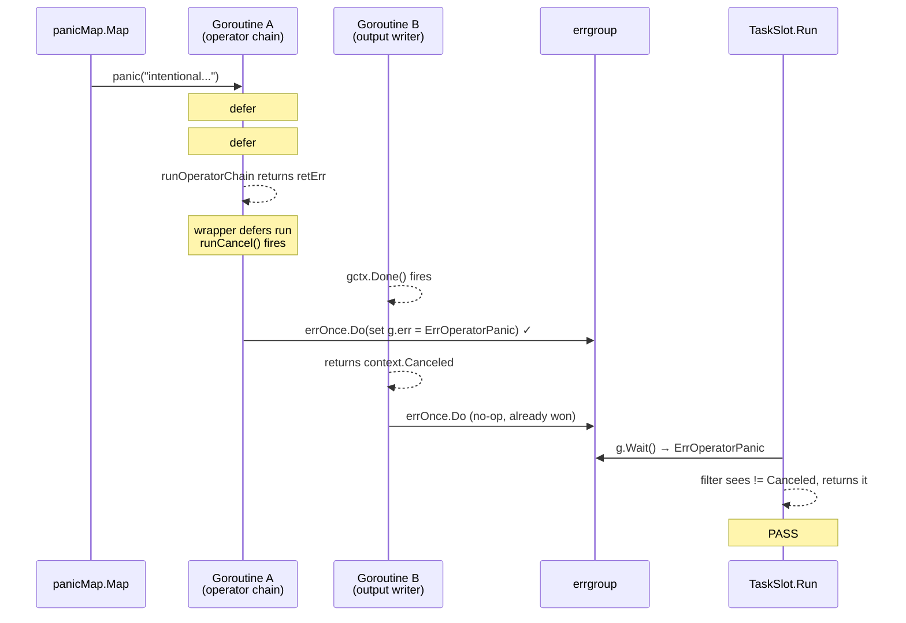
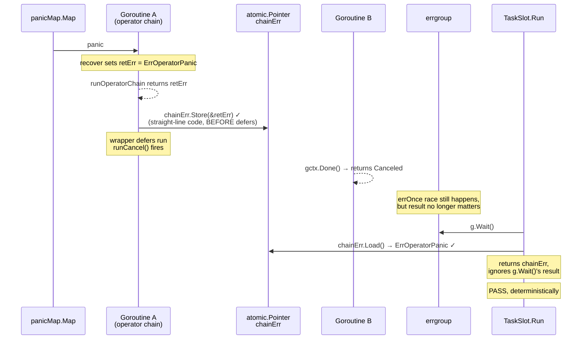

# WIP-24 — TaskSlot.Run masks operator-chain errors via errgroup race

> **Status:** implemented in this commit. Fix lives in
> `internal/engine/task_slot.go`; doc captures the analysis so the
> reasoning isn't lost.

## Symptom

`TestTaskSlot_OperatorPanic` (`internal/engine/task_slot_test.go:209`)
fails intermittently under `-race` with:

```
--- FAIL: TestTaskSlot_OperatorPanic (0.00s)
    task_slot_test.go:231: expected ErrOperatorPanic, got: <nil>
```

The log line `[ERROR] operator_chain.go:69 | operator chain panic`
*does* appear on every failed run, proving the panic was caught — yet
`TaskSlot.Run` returns `nil` instead of an `ErrOperatorPanic`-wrapped
error. The bug isn't recovery; it's that the recovered error gets
masked by `context.Canceled` somewhere between the chain goroutine
and the test.

## Root cause

A goroutine race inside `errgroup`, made worse by an over-broad
`context.Canceled → nil` filter at the end of `Run()`.

### The cast

`TaskSlot.Run` (`internal/engine/task_slot.go:47`) launches several
goroutines under one `errgroup.Group`:

| Goroutine | What it does | How it returns under cancellation |
|---|---|---|
| **A** — operator chain | Runs `runOperatorChain`. On panic, recovers, sets `retErr = ErrOperatorPanic`. Defers `runCancel()`. | Returns `ErrOperatorPanic` |
| **B** — output writer(s) | Selects on `gctx.Done()`. One per output stream. | Returns `context.Canceled` |
| **C** — watermark propagator / input readers | Same — selects on `gctx.Done()`. | Returns `context.Canceled` |

Two facts about `errgroup` make this load-bearing:

1. **`errgroup.Wait()` returns whichever goroutine wins `errOnce.Do`
   first.** Subsequent errors are silently dropped.
2. The chain goroutine has **`defer runCancel()`** in its wrapper —
   meaning the moment the chain function body exits (panic recovered or
   not), every other goroutine's `gctx` is already cancelled.

### The two timelines

When the operator panics, both A and B end up with non-nil errors
nearly simultaneously. Whichever one reaches `errOnce.Do` first wins.

#### Lucky timeline — A wins (test passes)



#### Unlucky timeline — B wins (test fails)

```mermaid
sequenceDiagram
    participant Op as panicMap.Map
    participant Chain as Goroutine A<br/>(operator chain)
    participant Writer as Goroutine B<br/>(output writer)
    participant EG as errgroup
    participant Run as TaskSlot.Run

    Op->>Chain: panic("intentional...")
    Note over Chain: defer #2 runs (close ops)
    Note over Chain: defer #1 runs (recover)<br/>retErr = ErrOperatorPanic
    Chain-->>Chain: runOperatorChain returns retErr
    Note over Chain: wrapper defers run<br/>runCancel() fires
    Writer-->>Writer: gctx.Done() fires
    Note over Chain: -race injects scheduler<br/>perturbation; A is preempted
    Writer-->>Writer: returns context.Canceled
    Writer->>EG: errOnce.Do(set g.err = context.Canceled) ✓
    Chain->>EG: errOnce.Do (no-op, already lost)
    Run->>EG: g.Wait() → context.Canceled
    Note over Run: filter: err == Canceled → return nil
    Note over Run: FAIL: expected ErrOperatorPanic, got nil
```

The race is asymmetric: A has more work to do (one extra defer plus a
return) between firing `runCancel()` and reaching `errOnce.Do`. With
`-race` injecting synchronization checks at every memory access, A
gets preempted just often enough that B wins maybe 1 in 50 runs — too
rare for local flake-detection but common enough to bite in CI.

### Why the filter is wrong

```go
err := g.Wait()
if err == context.Canceled {
    return nil      // ← masks the real error
}
return err
```

The filter exists for the **clean-exit** path: when the chain returns
`nil` and `runCancel()` propagates, every other goroutine returns
`context.Canceled` and `g.err` ends up as `Canceled`. We want that to
surface as success. But the filter can't distinguish between:

- Chain returned `nil` → other goroutines got Canceled → `g.err == Canceled` (filter correct)
- Chain returned `ErrOperatorPanic` → another goroutine raced past `errOnce` with Canceled → `g.err == Canceled` (filter masks the real error)

Both conditions look identical from the outside.

## Fix

Capture the chain's terminal error in a side-channel **before**
`runCancel()` fires. `Run()` prefers it over `errgroup.Wait()`'s
verdict, sidestepping the errOnce race entirely.



The store happens in straight-line code, **before any defer fires**, so
by the time `runCancel()` propagates and other goroutines start exiting,
`chainErr` is already durable. `Run()` reads it back after `g.Wait()`
and prefers it over whatever `g.err` ended up being.

`g.Wait()` is still called — we still want to wait for every goroutine
to exit before returning, otherwise we'd leak goroutines. We just
don't trust its error verdict on the chain's behalf.

## Code change

`internal/engine/task_slot.go`:

```go
import (
    "errors"      // new
    "sync/atomic" // new
)

// inside Run():
var chainErr atomic.Pointer[error]

g.Go(func() error {
    defer producerWg.Done()
    defer runCancel()
    if dlqCh != nil { defer close(dlqCh) }

    err := runOperatorChain(...)
    if err != nil {
        chainErr.Store(&err)
    }
    return err
})

// ... at the end of Run():
err := g.Wait()
// Prefer the chain's error — UNLESS the chain itself was cancelled
// because a peer goroutine errored first. In that case errgroup
// already has the peer's real error; surfacing chainErr would
// mask it with our own ctx.Canceled.
if e := chainErr.Load(); e != nil && !errors.Is(*e, context.Canceled) {
    return *e
}
if err == context.Canceled {
    return nil
}
return err
```

The `!errors.Is(*e, context.Canceled)` guard is non-obvious but
load-bearing. It distinguishes "chain hit a real error of its own"
from "chain bowed out because a peer's error cancelled gctx" — only
the first should override errgroup's verdict.

## Why this is correct

- **Atomicity:** `atomic.Pointer[error].Store` is a single atomic write.
  No torn reads.
- **Happens-before:** the store sequences before `defer runCancel()`
  (Go statement order). Every goroutine that subsequently observes
  `gctx.Done()` does so via channel receive (`<-gctx.Done()`), which
  itself synchronises-with the cancellation triggered by `runCancel()`.
  Transitively, any goroutine that returns `Canceled` does so after
  the chain's `Store` is visible. So when `Run()` calls `chainErr.Load()`
  *after* `g.Wait()`, it sees the latest value.
- **Race detector clean:** no shared mutable state outside the atomic.
- **Backwards compatible with success path:** if the chain returns
  `nil`, `chainErr.Load()` returns nil and the existing
  `Canceled → nil` filter still applies.
- **Doesn't mask peer errors:** the `!errors.Is(*e, context.Canceled)`
  guard ensures that when a peer goroutine (e.g. source reader) errors
  first and the chain bows out via `gctx.Done()`, the peer's real
  error reaches the caller via `g.Wait()` instead of being masked by
  the chain's `Canceled` verdict. `TestTaskSlot_SourceReadError_FailsTask`
  exercises this path.

## Verification

```sh
# Repro the flake (without the fix, fails ~1 in 50 runs):
go test -race -count=200 -run TestTaskSlot_OperatorPanic ./internal/engine/...

# With the fix: 200 consecutive passes.
go test -race -count=200 -run TestTaskSlot_OperatorPanic ./internal/engine/...

# Full engine package, no regressions:
go test -race -count=1 ./internal/engine/...
```

## Critical files

- `internal/engine/task_slot.go` (lines 191-201 chain goroutine,
  218-224 Wait+filter)
- `internal/engine/operator_chain.go` (lines 65-71 the recover defer)
- `internal/engine/task_slot_test.go:209` (`TestTaskSlot_OperatorPanic`,
  the test that exposed this)

## Out of scope

- Other places `errgroup.Wait()`'s result is consumed without a
  side-channel; could have similar latent races. Audit separately.
- Replacing the manual `runCancel()` defer with `errgroup`'s built-in
  cancel-on-first-error. Equivalent in steady state but changes
  behaviour when the chain returns `nil` (intentional shutdown of
  peers) — out of scope here.
