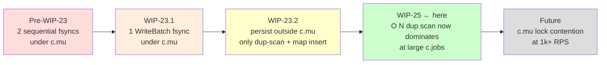
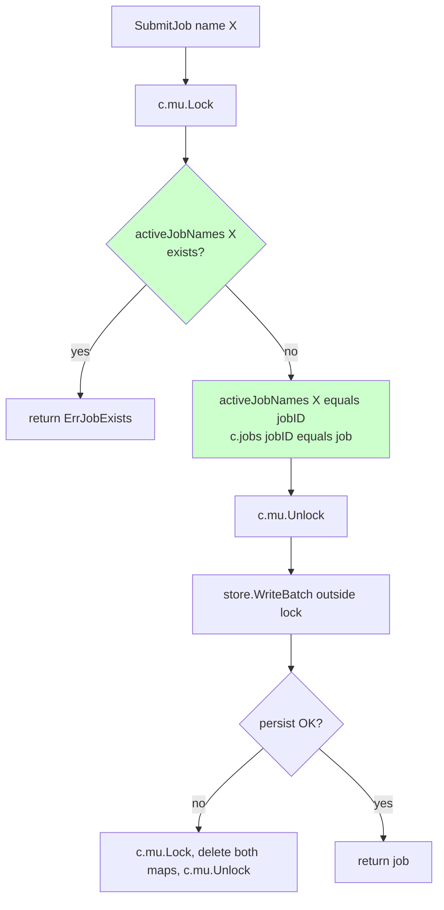

# WIP-25 — SubmitJob duplicate-name check is O(N) under c.mu

> **Status:** implemented in this commit. Doc captures the analysis so
> the bottleneck migration after WIP-23 is recorded.

## Symptom

After WIP-23 (single WriteBatch + persist outside `c.mu`), HTTP submit
p99 was at the Pebble fsync floor (~10-30 ms) up to ~100 RPS. A 500 RPS
load test surfaced the next ceiling: HTTP `POST /api/v1/jobs` p99
spiked from 50 ms to **4.7 s** once accumulated CREATED jobs hit ~50 k.

```
Time     RPS    CREATED jobs    HTTP p99    Goroutines
20:09    500    27,523          50 ms       112
20:10    320    50,959          0.94 s      443
20:11    245    69,670          4.52 s      442    <-- spike
20:12    0      74,227          4.69 s       43
```

Pebble actually got *faster* during the spike (write_batch p99
49 ms → 9 ms via concurrent commit batching). GC was invisible
(STW < 0.001%). CPU was at 0.7 cores. The bottleneck was none of the
usual suspects.

## Root cause

`SubmitJob` does an O(N) linear scan of `c.jobs` for duplicate-name
detection, **under `c.mu.Lock()`**:

```go
// internal/coordinator/job_manager.go (pre-WIP-25)
c.mu.Lock()
for _, j := range c.jobs {
    if j.Name == name && !j.Status.IsTerminal() {
        c.mu.Unlock()
        return nil, ErrJobExists
    }
}
c.jobs[job.ID] = job
c.mu.Unlock()
```

`c.jobs` accumulates terminal jobs forever — there is no cleanup. With
500 RPS arriving and 4 worker slots draining at ~1 job/sec, CREATED jobs
pile up linearly with the test duration. At N = 70 000:

- 30-50 ns per comparison × 70 000 entries ≈ **2-3 ms per submit**, all
  serialised on `c.mu.Lock()`.
- 500 concurrent submits × 2 ms each ≈ **1 s of cumulative lock-queue
  depth** under steady state. The 4.7 s p99 is the tail of that queue.
- Goroutines pile to 443: each is a blocked HTTP handler waiting for
  the lock.

This is a textbook **bottleneck migration** — fixing one thing exposes
the next.



Each fix surfaced the next bottleneck. WIP-25 closes the dup-scan gap;
the next ceiling will likely be raw `c.mu` contention from many
concurrent goroutines competing for the lock itself, addressable later
with sharded state or `sync.Map`.

## Fix

Maintain a secondary map `activeJobNames map[string]string` (name →
jobID) populated only with **non-terminal** jobs. The dup check
becomes O(1):



Lifecycle invariant: a name is in `activeJobNames` if and only if a job
with that name exists in `c.jobs` AND its status is non-terminal.
Maintained at three sites:

1. **`SubmitJob`** — insert on reservation, delete on persist failure
   (rollback).
2. **`transitionJob`** — delete when transitioning to a terminal status
   (FINISHED, FAILED, CANCELED). Same site that records the WIP-25 job
   duration histogram.
3. **`recover()`** — rebuild the map from disk, including only
   non-terminal jobs.

## Code change

`internal/coordinator/coordinator.go`:

```go
type Coordinator struct {
    ...
    jobs           map[string]*JobMeta
    activeJobNames map[string]string  // new — name → jobID for non-terminal jobs
    ...
}

func New(...) *Coordinator {
    return &Coordinator{
        ...
        jobs:           make(map[string]*JobMeta),
        activeJobNames: make(map[string]string),
    }
}
```

`internal/coordinator/job_manager.go` `SubmitJob`:

```go
c.mu.Lock()
if _, exists := c.activeJobNames[name]; exists {
    c.mu.Unlock()
    return nil, fmt.Errorf("%w: active job with name %q", ErrJobExists, name)
}
c.activeJobNames[name] = job.ID
c.jobs[job.ID] = job
c.mu.Unlock()

if err := c.store.WriteBatch(...); err != nil {
    c.mu.Lock()
    delete(c.jobs, job.ID)
    delete(c.activeJobNames, name)
    c.mu.Unlock()
    return nil, ...
}
```

`internal/coordinator/job_state_machine.go` `transitionJob`:

```go
if to.IsTerminal() {
    job.FinishedAt = now
    delete(c.activeJobNames, job.Name)  // free the name
}
```

`internal/coordinator/coordinator.go` `recover()`:

```go
c.jobs = state.jobs
c.activeJobNames = make(map[string]string, len(state.jobs))
for _, j := range state.jobs {
    if !j.Status.IsTerminal() {
        c.activeJobNames[j.Name] = j.ID
    }
}
```

## Why this is correct

- **Atomicity:** all map mutations happen under `c.mu.Lock()` (or
  `c.mu.RLock` for reads, but no readers exist outside SubmitJob).
- **Invariant maintained on every transition:** the only way a job
  enters `activeJobNames` is via SubmitJob; the only way it leaves is
  via SubmitJob rollback or `transitionJob` → terminal. Recovery
  rebuilds from the same source of truth (Pebble).
- **Pause/resume preserves reservation:** `JobPaused` is non-terminal,
  so the name stays reserved. Resume → `JobDeploying` (non-terminal)
  also keeps it. Only FINISHED/FAILED/CANCELED frees the name —
  matching the existing `!j.Status.IsTerminal()` semantic of the old
  linear scan.
- **No new contention:** a single map lookup is sub-microsecond. The
  dup check now takes ~50 ns regardless of how many jobs have ever
  been submitted.

## Verification

Existing tests cover the contract:

- `TestSubmitJob_*` in `internal/coordinator/job_manager_test.go` —
  duplicate-name rejection, parallelism, persistence.
- `TestSubmitJob_ConcurrentDuplicateName` — the load-bearing race test
  for the dup-check; confirmed pass under `-race -count=200`.
- `TestRecovery_*` in `internal/coordinator/recovery_test.go` —
  rebuild from disk; confirmed pass.

To verify the perf impact end-to-end:

```sh
cd examples/observability-stack
docker compose down -v && docker compose up -d --build coordinator worker prometheus grafana
docker rm -f wire-k6-graph-init wire-k6 2>/dev/null
RPS=500 PRE_VUS=500 MAX_VUS=2000 DURATION=2m docker compose --profile k6 run --rm k6
```

Expected after WIP-25:
- HTTP submit p99 stays in the disk-fsync band (~10-30 ms) regardless
  of how many CREATED jobs accumulate.
- `c.jobs` count climbs the same way (worker is still 4-slot bound),
  but no longer affects submit latency.
- Goroutine peak drops sharply because handlers no longer queue on the
  scan.

## Critical files

- `internal/coordinator/coordinator.go` (struct + `New` + `recover`)
- `internal/coordinator/job_manager.go` (`SubmitJob` dup check + rollback)
- `internal/coordinator/job_state_machine.go` (terminal cleanup)
- `internal/coordinator/recovery.go` (delivers `state.jobs` to `recover`)

## Out of scope

- Periodic GC of terminal jobs from `c.jobs`. Once `activeJobNames` is
  bounded, terminal jobs in `c.jobs` only cost memory, not latency.
  Worth a separate WIP for very long-lived coordinators.
- Replacing the linear scans inside `ListJobs` and `scheduleTick`. These
  are not on the submit hot path; both are O(N) but bounded by current
  job count, and `scheduleTick` already coalesces.
- Sharded `c.mu` to remove the lock-acquire serialisation seen at very
  high RPS. That's the next bottleneck this exposes; address when it
  bites.
