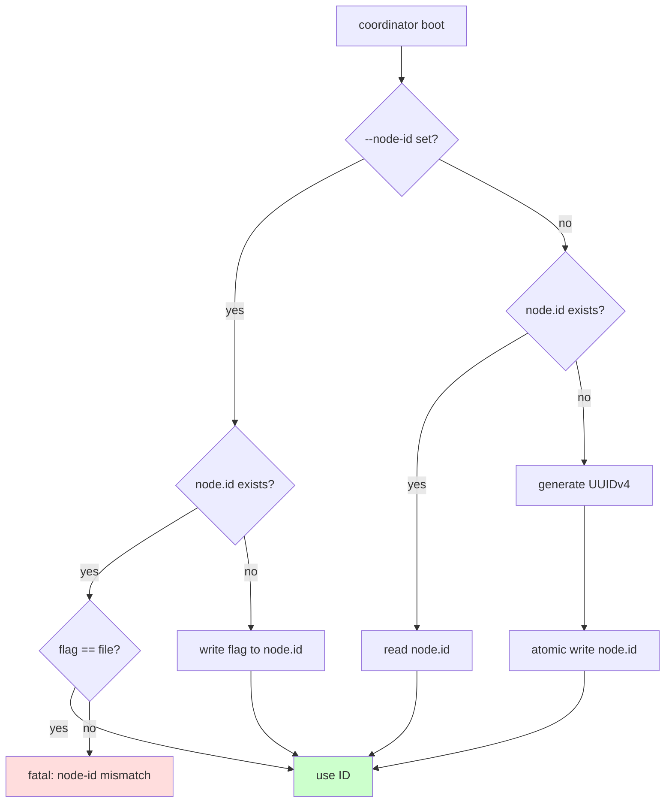
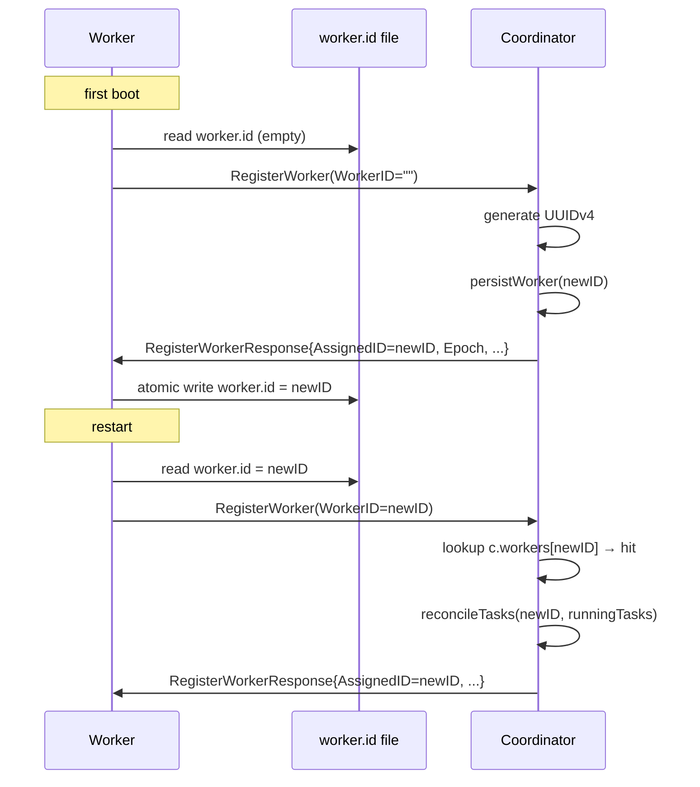

# WIP-26 — Stable node identity (coordinator + worker)

> **Status:** deferred. Fix not yet implemented; this doc captures the
> root cause and the agreed-upon approach so it can be picked up when
> the single-node identity story actually starts to bite (multi-process
> dev, container restarts with shifting hostnames, or the first time we
> ship multi-coordinator).

## Symptom

Both `cmd/main.go` and `internal/worker/worker.go` derive their node
identity the same way:

```go
// cmd/main.go — coordinator
nodeID := wireCfg.Node.ID
if nodeID == "" {
    nodeID, _ = os.Hostname()
    if nodeID == "" {
        nodeID = "wire-node-1"
    }
}
```

```go
// internal/worker/worker.go:71-78
workerID := w.cfg.WorkerID
if workerID == "" {
    workerID, _ = os.Hostname()
    if workerID == "" {
        workerID = "wire-worker-1"
    }
}
```

This works for the happy single-host dev path and breaks in three ways
in any non-trivial deployment:

1. **Hostname collisions on a shared host.** Two coordinators (or two
   workers) booted on the same machine with no `--node-id` /
   `--worker-id` resolve to the same identity. The data directory
   collides first, but the deeper problem is that the leader-election
   `Campaign(ctx, nodeID)` call in
   `internal/coordinator/coordinator.go:155` and the worker registry
   keyed by `WorkerID` in `internal/coordinator/coordinator.go:509`
   (`c.workers[worker.ID] = worker`) both assume IDs are unique.

2. **Hostname instability across restarts.** In container/k8s
   deployments, pod hostnames can change on restart. `<DataDir>` may
   persist (PVC), but the node that mounts it sees a new ID — orphaning
   the old worker entry in the coordinator (`c.workers[oldID]` lingers
   until heartbeat timeout) and confusing the leader-info comparison
   `isSelf := nodeID == c.nodeID` in `coordinator.go:641`.

3. **The `wire-node-1` / `wire-worker-1` fallback is a constant.** The
   `-1` suffix reads as "node 1 of N", but every node that falls into
   this branch becomes the *same* `wire-node-1`. Three nodes that all
   fail `os.Hostname()` end up with identical IDs and silently fight
   over the election key / worker registry slot.

The current refactor (`cmd/main.go`) preserves this behaviour verbatim
in `resolveCoordinatorNodeID`; this WIP captures the policy change, not
a code-organisation change.

## Root cause

Identity is being **derived from environment on every boot** rather
than **persisted on first boot and read back thereafter**. The
environment-derived value isn't guaranteed unique (multiple processes
per host) or stable (container hostname churn), but every consumer
downstream — election, worker registry, log labels, metrics labels
(`wire-<mode>` service-name in `cmd/main.go:84`) — assumes both.

Wire's architecture today is single-active-coordinator (filelock
election is active/standby, noop is single-node), so there's no peer
set to *discover* an ID from. The right primitive is per-node
persistent identity, not a discovery protocol.

For workers, the coordinator is already the source of truth — workers
register over RPC via `HandleRegisterWorker`
(`internal/coordinator/rpc_handlers.go:15`) calling
`Coordinator.RegisterWorker` (`internal/coordinator/reconcile.go:28`).
The fix is to flip the assignment direction: coordinator assigns the
ID, worker caches it.

## Fix plan

Two-layer fix matching the two identity domains. Both layers fail
closed: never invent a deterministic constant.

### Layer 1 — Coordinator: persist a UUID to `<DataDir>/node.id`

On first boot, generate a UUIDv4 and atomically write it to
`<DataDir>/node.id`. On every subsequent boot, read it back. CLI
override (`--node-id`) remains supported for testing and for operators
who want a friendly label, but the file is the source of truth — a
mismatch between flag and file is an error, not silent override.



Atomic write = write to `<DataDir>/node.id.tmp`, fsync, rename. Same
pattern used everywhere in PebbleDB internals.

### Layer 2 — Worker: coordinator-assigned ID, cached to `<DataDir>/worker.id`

Currently the worker sends its (locally-derived) `WorkerID` to the
coordinator via `RegisterWorkerRequest`
(`internal/coordinator/reconcile.go:11`) and the coordinator trusts it.
Flip this:

1. On first boot, if `<DataDir>/worker.id` is empty and `--worker-id`
   isn't set, the worker sends `RegisterWorkerRequest{WorkerID: ""}`.
2. The coordinator, in `RegisterWorker`
   (`reconcile.go:28`), treats an empty `WorkerID` as a request for
   assignment, generates a UUIDv4, persists `WorkerMeta` under it
   (`persistWorker` at `coordinator.go:499`), and returns the assigned
   ID in `RegisterWorkerResponse`.
3. The worker writes the assigned ID to `<DataDir>/worker.id` atomically
   and uses it for all subsequent heartbeats, watch streams, and
   reconnects.
4. On reconnect (worker restart), `worker.id` already exists; worker
   sends the cached ID; coordinator looks it up in `c.workers` and
   continues the existing entry (this is the path that hits
   `reconcileTasks` at `reconcile.go:88`).



The response field `AssignedID` is new; today's
`RegisterWorkerResponse` (`reconcile.go:20`) only carries `Epoch`,
`TasksToCancel`, `MissingTasks`. Wire encoding is msgpack via
`protocol.EncodeMsgPack`, so adding a field is backwards-compatible at
the codec level.

### Code change

`internal/coordinator/identity.go` (new):

```go
package coordinator

import (
    "crypto/rand"
    "encoding/hex"
    "errors"
    "fmt"
    "os"
    "path/filepath"

    "github.com/google/uuid"
)

const NodeIDFile = "node.id"

// LoadOrGenerateNodeID reads <dataDir>/node.id, generating and
// persisting a new UUIDv4 if the file does not exist. If override is
// non-empty, it must match the persisted ID (or be written on first
// boot). Returns the resolved ID.
func LoadOrGenerateNodeID(dataDir, override string) (string, error) {
    path := filepath.Join(dataDir, NodeIDFile)
    existing, err := os.ReadFile(path)
    switch {
    case err == nil:
        id := string(bytesTrim(existing))
        if override != "" && override != id {
            return "", fmt.Errorf("node-id mismatch: flag %q != %s %q",
                override, path, id)
        }
        return id, nil
    case errors.Is(err, os.ErrNotExist):
        id := override
        if id == "" {
            id = uuid.NewString()
        }
        if err := atomicWrite(path, []byte(id+"\n")); err != nil {
            return "", err
        }
        return id, nil
    default:
        return "", fmt.Errorf("read %s: %w", path, err)
    }
}
```

`cmd/main.go` `resolveCoordinatorNodeID` becomes:

```go
nodeID, err := coordinator.LoadOrGenerateNodeID(
    wireCfg.Node.DataDir, wireCfg.Node.ID)
if err != nil {
    return fmt.Errorf("resolve node id: %w", err)
}
```

`internal/coordinator/reconcile.go` `RegisterWorker`:

```go
if req.WorkerID == "" {
    req.WorkerID = uuid.NewString()
}
// ... existing flow, with req.WorkerID now guaranteed non-empty.

return &RegisterWorkerResponse{
    AssignedID:    req.WorkerID,    // new field
    Epoch:         currentEpoch,
    TasksToCancel: result.TasksToCancel,
    MissingTasks:  result.MissingTasks,
}, nil
```

`internal/worker/worker.go` (`Run`, replacing lines 71-79):

```go
workerID, err := loadOrPromptWorkerID(w.cfg.DataDir, w.cfg.WorkerID)
if err != nil {
    return fmt.Errorf("worker id: %w", err)
}
// workerID may be "" on first boot — coordinator will assign one.

regResp, err := w.client.RegisterWorker(ctx, &rpc.RegisterWorkerRequest{
    WorkerID:       workerID,
    Address:        w.cfg.ListenAddr,
    TaskSlotsTotal: w.cfg.TaskSlots,
})
if err != nil { ... }

if workerID == "" {
    if err := persistWorkerID(w.cfg.DataDir, regResp.AssignedID); err != nil {
        return fmt.Errorf("persist worker id: %w", err)
    }
}
w.cfg.WorkerID = regResp.AssignedID
```

Note: `worker.Config` doesn't currently carry a `DataDir`. That's a
prerequisite — either add `WorkerConfig.DataDir` to the schema or
reuse `Node.DataDir` and document that workers and coordinators must
have distinct data directories. Recommended: add `worker.data_dir` to
`config.WorkerConfig` (default `data/worker`).

### Validation changes

`internal/config/validate.go`:

- Coordinator mode: do **not** require `node.id` to be non-empty
  (`LoadOrGenerateNodeID` handles it). Continue to require
  `node.data_dir`.
- Worker mode: require `worker.data_dir` (new). Continue not to require
  `worker.worker_id` — empty means "ask coordinator".

## Why this is correct

- **No collisions.** UUIDv4 collision probability is effectively zero;
  the deterministic `wire-node-1` fallback is gone.
- **Stable across restarts.** Identity lives next to the data it
  describes (in `DataDir`). If `DataDir` survives, identity survives;
  if `DataDir` is wiped, both go together — which is the right
  invariant.
- **Stable across hostname changes.** Container restarts that change
  the pod hostname no longer rotate identity.
- **CLI override still works for ops.** Operators can pass
  `--node-id=coord-a` for human-readable logs; the override is written
  on first boot and locked in thereafter. Mismatch fails fast rather
  than silently overriding the persisted value.
- **Worker registration becomes idempotent across restarts.** A
  restarted worker presents the cached ID, hits the existing
  `c.workers[id]` entry, and goes through the existing
  `reconcileTasks` path — no orphaned worker entries, no double-counts.
- **No new dependency.** `github.com/google/uuid` is already a
  transitive dep (Pebble uses it); add it as a direct import.

## Verification

1. **Unit tests** (`internal/coordinator/identity_test.go`):
   - First boot writes `node.id` containing a parseable UUIDv4.
   - Second boot reads the same value back.
   - `--node-id=X` on first boot writes X; on second boot with
     `--node-id=X` returns X; on second boot with `--node-id=Y` returns
     a "mismatch" error.
   - File-system errors (read-only `DataDir`, partial write) propagate.

2. **Integration test** (extend
   `internal/coordinator/coordinator_integration_test.go`):
   - Boot coordinator, register worker with empty ID, assert
     `AssignedID` is a UUID, assert `<workerDataDir>/worker.id` was
     written with that value.
   - Restart worker process (same `DataDir`), assert it presents the
     cached ID and the coordinator routes to the same `WorkerMeta`
     entry without creating a duplicate.
   - Hostname-rotation simulation: change `os.Hostname()` between
     restarts (or just rely on the cached file path proving hostname is
     no longer consulted).

3. **Manual smoke**: boot two coordinator processes pointing at the
   *same* `DataDir` — should still collide (PebbleDB lock), but error
   message must be the lock error, not a node-id surprise. Boot two
   coordinator processes with *different* `DataDir`s — each gets its
   own UUID, no collision.

## Critical files

- `internal/coordinator/identity.go` (new — `LoadOrGenerateNodeID`,
  atomic-write helper).
- `cmd/main.go` (`resolveCoordinatorNodeID` → call into
  `coordinator.LoadOrGenerateNodeID`).
- `internal/coordinator/reconcile.go` (`RegisterWorkerRequest`,
  `RegisterWorker`, `RegisterWorkerResponse.AssignedID`).
- `internal/worker/worker.go` (`Run` — replace lines 71-79, add
  cache-write after first registration).
- `internal/config/config.go` (`WorkerConfig.DataDir` new field).
- `internal/config/validate.go` (require `worker.data_dir`).
- `internal/config/defaults.go` (default `worker.data_dir =
  "data/worker"`).
- `internal/config/flags.go` (wire `--worker-data-dir`).

## Out of scope

- **Multi-coordinator / Raft.** When Wire grows to N active
  coordinators, this WIP's `node.id` file remains correct as the local
  identity, but cluster membership becomes a separate problem —
  operators supply node IDs explicitly via `--join` and the leader
  commits `AddVoter` through Raft. Don't conflate the two; this WIP
  only covers the per-node identity primitive.
- **Migration of existing deployments.** If anyone has a long-lived
  deployment running with `node.id == os.Hostname()`, the first boot
  after this lands will generate a *new* UUID and orphan the old
  worker entries in the coordinator state. Provide a `--node-id=<old
  hostname>` one-shot to seed the file on first boot post-upgrade.
  Document, don't automate.
- **Removing the `--worker-id` flag.** Keep it for testing and for
  operators who want labeled workers (`--worker-id=ingest-east-1`).
  Same first-boot-wins semantics as `--node-id`.
- **Cross-node ID uniqueness enforcement** beyond UUID collision
  probability (1 in 2^122). If an operator manually copies a
  `worker.id` file between hosts, they get what they asked for; not
  worth defending against.
