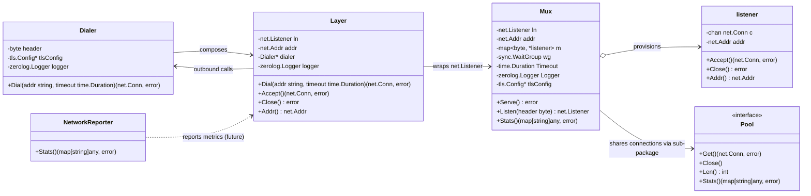
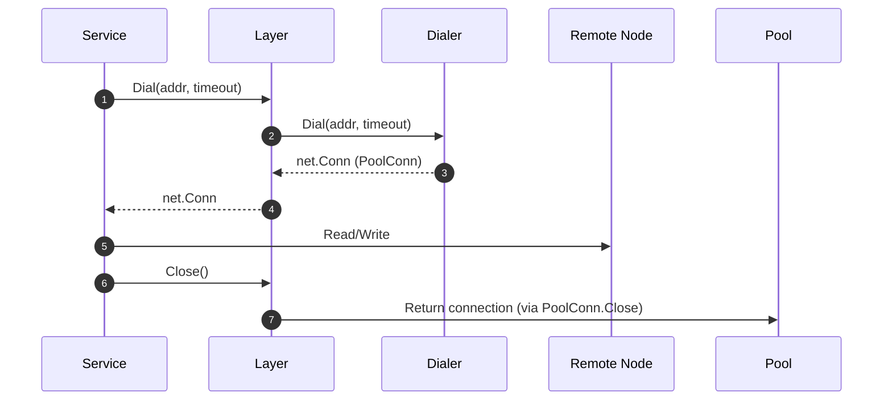
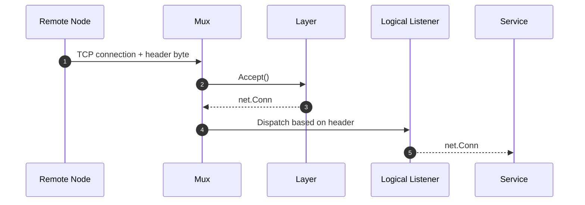

# TCP Transport Layer (`internal/tcp`)

The TCP package provides the primitives that Wire uses for node-to-node
communication. It combines connection dialing, listener multiplexing, and
connection pooling so higher-level services (cluster, Raft, HTTP) can share a
single physical port while keeping protocol concerns isolated.

## Package Layout

- `dialer.go` – Builds outbound connections annotated with protocol headers and
  optional TLS.
- `mux.go` – Accepts inbound connections and routes them to logical listeners
  based on a header byte.
- `network.go` – (Future) network interface telemetry exporter.
- `error.go` – Sentinel error values shared across the transport layer.
- `pool/` – Connection pooling implementation (documented in the nested
  `README.md`).

## Core Entities

## Connection Flow

### Outbound

### Inbound

## Operational Guidance

1. **Listeners and Headers** – Each logical protocol (RAFT, cluster RPC, HTTP)
   registers a unique header via `Mux.Listen(header)`. Attempting to reuse a
   header triggers a panic with the conflicting value.
2. **Dialing** – Wrap outbound dials with context-aware timeouts. The `Dialer`
   logs both attempts and failures, while the `Layer` adds higher-level context.
3. **Pooling** – Pair `Layer.Dial` with the connection pool to keep hot sockets
   alive. Refer to `pool/README.md` for pooling semantics.
4. **Shutdown** – Call `Layer.Close()` during service teardown. It drains the
   listener and emits structured logs so operators can diagnose stuck sockets.
5. **TLS Configuration** – The dialer and mux constructors are designed to
   accept TLS settings (once the TODOs are completed). Maintain parity between
   client and server certificates to avoid handshake failures.

## Extending the Package

- **Implement TODOs** – Many functions are scaffolding; fill them in with
  production-grade logic before depending on them in new services.
- **Add Metrics** – Populate `stats` (expvar map) and `NetworkReporter.Stats`
  with live data so the HTTP status endpoint can report transport health.
- **Testing** – Introduce integration tests that dial through the mux, exercise
  TLS, and validate header routing.

The TCP transport is the backbone for Wire’s distributed coordination. Treat
these components as critical infrastructure: keep documentation current,
ensure logs are actionable, and prefer explicit error handling over silent
failures.
