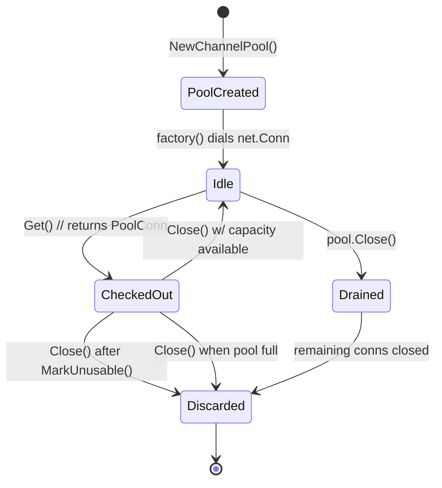

# TCP Connection Pool (`internal/tcp/pool`)

This package provides a lightweight pool for TCP connections so callers can
reuse expensive `net.Conn` instances instead of continuously dialing remote
services.  It backs the cluster client and other internode callers that need a
small, thread-safe pool with bounded capacity and simple statistics.

## Key Types

- `Pool` (interface, defined in `pool.go`) – Public contract exposed to callers.
  It provides `Get`, `Close`, `Len`, and `Stats`.
- `channelPool` (implementation, `channel.go`) – Stores idle connections in a
  buffered channel, dials new ones with a `ConnFactory`, and tracks open
  sockets.
- `PoolConn` (wrapper, `conn.go`) – Thin shim around a `net.Conn` that overrides
  `Close()` so the pool can reclaim or discard the connection.
- `ConnFactory` – Caller-supplied function that creates fresh `net.Conn`
  instances when the pool is empty.
- Sentinel errors (`errors.go`) – Shared error values describing invalid input
  or pool state (`errFactoryNotDefined`, `errInvalidPoolSize`, `errConnNotDefined`,
  `ErrClosed`).

## Lifecycle Overview



- **Creation** – `NewChannelPool` validates the supplied `ConnFactory`, creates
  the buffered channel sized by `maxConns`, and seeds bookkeeping counters.
- **Checkout (`Get`)** – Attempts to grab an idle connection from the channel.
  If none are available, it calls the factory to dial a new `net.Conn`, wraps it
  in `PoolConn`, increments `nOpenConns`, and returns it.
- **Usage** – Callers interact with the returned connection like any other
  `net.Conn`.  Internally, `PoolConn.Close()` decides whether to put the socket
  back into the channel or close it based on `MarkUnusable()` and pool capacity.
- **Return** – When `Close()` succeeds and the channel has space, the connection
  goes back to the idle queue.  If the channel is full or the pool has been
  closed, the underlying socket is torn down and the open-connection counter is
  decremented.
- **Shutdown** – `channelPool.Close()` locks the pool, closes the channel, drains
  any remaining connections (closing each underlying `net.Conn`), nils the
  factory, and resets counters.

## Module API

| Symbol | Location | Description |
| --- | --- | --- |
| `type Pool interface` | `pool.go` | Public API (`Get`, `Close`, `Len`, `Stats`). |
| `type ConnFactory func() (net.Conn, error)` | `channel.go` | Caller-supplied dialer hook. |
| `func NewChannelPool(maxConns int, factory ConnFactory) (Pool, error)` | `channel.go` | Constructs a pool with bounded capacity. |
| `func (p *PoolConn) Close() error` | `conn.go` | Returns the connection to the pool or closes it. |
| `func (p *PoolConn) MarkUnusable()` | `conn.go` | Flags the wrapper so a subsequent `Close()` discards the socket. |
| `func (c *channelPool) Len() int` | `channel.go` | Idle connection count. |
| `func (c *channelPool) LenUsedConnections() int` | `channel.go` | Currently open connections. |
| `func (c *channelPool) Stats() (map[string]any, error)` | `channel.go` | Snapshot of pool metrics (`idle`, `openConnections`, `maxOpenConnections`). |

## Usage Example

```go
factory := func() (net.Conn, error) {
    return net.Dial("tcp", "cluster-node:1234")
}
pool, err := pool.NewChannelPool(8, factory)
if err != nil {
    log.Fatal(err)
}

defer pool.Close()

conn, err := pool.Get()
if err != nil {
    log.Fatal(err)
}

// Use conn like any other net.Conn
_, err = conn.Write(payload)
if err != nil {
    if pc, ok := conn.(*pool.PoolConn); ok {
        pc.MarkUnusable()
    }
}
conn.Close() // returns to pool unless marked unusable
```

## Testing

`channel_test.go` spins up a local TCP listener and exercises concurrent
`Get`/`Close`, pool exhaustion, unusable connections, and statistics queries.
`conn_test.go` verifies that `PoolConn` satisfies the `net.Conn` interface and
obeys the pool-discard semantics.

---

This README captures the intended design of the connection pool; review the
source files alongside the tests if you plan to modify pooling semantics or add
new metrics.
